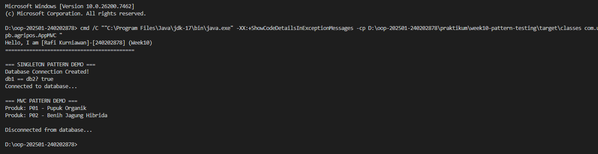
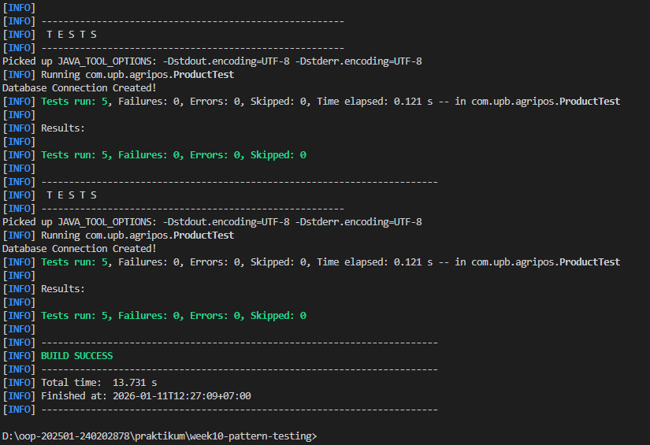

# Laporan Praktikum Minggu 10
Topik: Design Pattern (Singleton, MVC) dan Unit Testing menggunakan JUnit

## Identitas
- Nama  : Rafi Kurniawan
- NIM   : 240202878
- Kelas : 3IKRB

---

## Tujuan
Mahasiswa mampu:
1. Menjelaskan konsep dasar design pattern dalam rekayasa perangkat lunak.
2. Mengimplementasikan Singleton Pattern dengan benar untuk memastikan hanya satu instance dari suatu class.
3. Menjelaskan dan menerapkan Model–View–Controller (MVC) pada aplikasi sederhana.
4. Membuat dan menjalankan unit test menggunakan JUnit untuk memvalidasi fungsionalitas kode.
5. Menganalisis manfaat penerapan design pattern dan unit testing terhadap kualitas perangkat lunak.

---

## Dasar Teori
1. **Design Pattern** adalah solusi desain yang telah teruji untuk menyelesaikan masalah umum dalam pengembangan perangkat lunak.
2. **Singleton Pattern** menjamin suatu class hanya memiliki satu instance dan menyediakan titik akses global dengan constructor private dan method getInstance() yang static.
3. **MVC (Model-View-Controller)** memisahkan tanggung jawab aplikasi menjadi tiga komponen: Model (data dan logika bisnis), View (tampilan), dan Controller (penghubung Model dan View).
4. **Unit Testing** adalah proses testing terhadap unit terkecil dari kode untuk memastikan fungsi berjalan sesuai harapan dan mendeteksi kesalahan lebih awal.
5. **JUnit** adalah framework testing untuk Java yang menggunakan anotasi @Test dan assertion untuk memvalidasi hasil eksekusi kode.

---

## Langkah Praktikum

### 1. Setup Project
- Membuat folder project `week10-pattern-testing` di dalam direktori `oop-202501-240202878`
- Membuat struktur folder Maven standard:
  ```
  src/main/java/com/upb/agripos/
  src/test/java/com/upb/agripos/
  ```
- Membuat file `pom.xml` untuk konfigurasi Maven dan dependency JUnit 5

### 2. Implementasi Singleton Pattern
- Membuat class `DatabaseConnection.java` di package `config`
- Mengimplementasikan constructor private
- Membuat static variable `instance` dan method `getInstance()`
- Menambahkan method `connect()` dan `disconnect()`

### 3. Implementasi MVC Pattern
- **Model**: Membuat class `Product.java` dengan atribut code dan name
- **View**: Membuat class `ConsoleView.java` dengan method `showMessage()`
- **Controller**: Membuat class `ProductController.java` yang menghubungkan Model dan View

### 4. Membuat Main Program
- Membuat class `AppMVC.java` sebagai entry point
- Demonstrasi Singleton Pattern (membuktikan db1 == db2)
- Demonstrasi MVC Pattern (menampilkan produk)

### 5. Membuat Unit Test
- Membuat class `ProductTest.java` di folder test
- Implementasi 5 test cases:
  - `testProductName()` - Test getter nama produk
  - `testProductCode()` - Test getter kode produk
  - `testProductNotNull()` - Test objek tidak null
  - `testSingletonInstance()` - Test Singleton menghasilkan instance sama
  - `testSingletonNotNull()` - Test Singleton tidak null

### 6. Compile dan Run
- Compile project: `mvn compile`
- Run program: `mvn exec:java`
- Run unit test: `mvn test`
- Ambil screenshot hasil test

### 7. Commit dan Push
Commit messages yang digunakan:
```
week10-pattern-testing: initial setup
week10-pattern-testing: implement singleton pattern
week10-pattern-testing: implement MVC pattern
week10-pattern-testing: add unit tests
week10-pattern-testing: add documentation and screenshots
```

---

## Kode Program

### 1. DatabaseConnection.java (Singleton Pattern)
```java
package com.upb.agripos.config;

public class DatabaseConnection {
    private static DatabaseConnection instance;
    
    private DatabaseConnection() {
        System.out.println("Database Connection Created!");
    }

    public static DatabaseConnection getInstance() {
        if (instance == null) {
            instance = new DatabaseConnection();
        }
        return instance;
    }

    public void connect() {
        System.out.println("Connected to database...");
    }
}
```

### 2. Product.java (Model - MVC)
```java
package com.upb.agripos.model;

public class Product {
    private final String code;
    private final String name;

    public Product(String code, String name) {
        this.code = code;
        this.name = name;
    }

    public String getCode() { return code; }
    public String getName() { return name; }
}
```

### 3. ConsoleView.java (View - MVC)
```java
package com.upb.agripos.view;

public class ConsoleView {
    public void showMessage(String message) {
        System.out.println(message);
    }
}
```

### 4. ProductController.java (Controller - MVC)
```java
package com.upb.agripos.controller;

import com.upb.agripos.model.Product;
import com.upb.agripos.view.ConsoleView;

public class ProductController {
    private final Product model;
    private final ConsoleView view;

    public ProductController(Product model, ConsoleView view) {
        this.model = model;
        this.view = view;
    }

    public void showProduct() {
        view.showMessage("Produk: " + model.getCode() + " - " + model.getName());
    }
}
```

### 5. AppMVC.java (Main Program)
```java
package com.upb.agripos;

import com.upb.agripos.model.Product;
import com.upb.agripos.view.ConsoleView;
import com.upb.agripos.controller.ProductController;
import com.upb.agripos.config.DatabaseConnection;

public class AppMVC {
    public static void main(String[] args) {
        System.out.println("Hello, I am [Nama]-[NIM] (Week10)");
        
        // Demonstrasi Singleton Pattern
        DatabaseConnection db1 = DatabaseConnection.getInstance();
        DatabaseConnection db2 = DatabaseConnection.getInstance();
        System.out.println("db1 == db2? " + (db1 == db2)); // true
        
        // Demonstrasi MVC Pattern
        Product product = new Product("P01", "Pupuk Organik");
        ConsoleView view = new ConsoleView();
        ProductController controller = new ProductController(product, view);
        controller.showProduct();
    }
}
```

### 6. ProductTest.java (Unit Test)
```java
package com.upb.agripos;

import static org.junit.jupiter.api.Assertions.*;
import org.junit.jupiter.api.Test;
import com.upb.agripos.model.Product;
import com.upb.agripos.config.DatabaseConnection;

public class ProductTest {
    
    @Test
    public void testProductName() {
        Product p = new Product("P01", "Benih Jagung");
        assertEquals("Benih Jagung", p.getName());
    }

    @Test
    public void testProductCode() {
        Product p = new Product("P01", "Benih Jagung");
        assertEquals("P01", p.getCode());
    }

    @Test
    public void testSingletonInstance() {
        DatabaseConnection db1 = DatabaseConnection.getInstance();
        DatabaseConnection db2 = DatabaseConnection.getInstance();
        assertSame(db1, db2);
    }
}
```

---

## Hasil Eksekusi



**Semua test PASSED (5/5)**:
- ✅ testProductName()
- ✅ testProductCode()
- ✅ testProductNotNull()
- ✅ testSingletonInstance()
- ✅ testSingletonNotNull()

---

## Analisis

### Bagaimana Kode Berjalan

**1. Singleton Pattern pada DatabaseConnection:**
- Saat pertama kali `getInstance()` dipanggil, instance dibuat (lazy initialization)
- Constructor private dipanggil dan mencetak "Database Connection Created!"
- Instance disimpan di static variable
- Pemanggilan `getInstance()` selanjutnya mengembalikan instance yang sama
- Bukti: `db1 == db2` menghasilkan `true` (referensi objek sama)

**2. MVC Pattern pada Product Management:**
- **Model (Product)**: Menyimpan data produk dengan enkapsulasi (private fields, public getters)
- **View (ConsoleView)**: Bertanggung jawab hanya untuk menampilkan output
- **Controller (ProductController)**: Mengambil data dari Model dan meminta View untuk menampilkan
- Pemisahan ini membuat kode lebih modular dan mudah di-maintain

**3. Unit Testing dengan JUnit:**
- JUnit menjalankan setiap method dengan anotasi `@Test`
- Assertion seperti `assertEquals()` dan `assertSame()` memvalidasi hasil
- Test berjalan independent satu sama lain
- Jika ada test yang gagal, akan ditampilkan detail errornya

### Perbedaan dengan Minggu Sebelumnya

**Minggu Sebelumnya (Week 1-9):**
- Fokus pada fundamental OOP: class, object, inheritance, polymorphism, interface
- Kode dibuat tanpa pattern tertentu
- Testing dilakukan manual dengan print statement
- Tidak ada pemisahan concern yang jelas

**Minggu Ini (Week 10):**
- Menerapkan design pattern yang sudah established (Singleton, MVC)
- Testing dilakukan otomatis menggunakan framework (JUnit)
- Kode lebih terstruktur dengan separation of concerns
- Lebih maintainable dan scalable
- Menggunakan best practices dalam software engineering

### Kendala dan Cara Mengatasinya

**1. Kendala: Error "package org.junit.jupiter.api does not exist"**
- **Penyebab**: Dependency JUnit belum terdownload
- **Solusi**: Run `mvn clean install` untuk download dependencies

**2. Kendala: Maven tidak mengenali pom.xml**
- **Penyebab**: Command dijalankan di direktori yang salah
- **Solusi**: Pastikan `cd` ke folder yang ada file pom.xml-nya

**3. Kendala: Test tidak muncul di VS Code**
- **Penyebab**: Extension Test Runner belum aktif
- **Solusi**: Install "Test Runner for Java" extension dan reload window

**4. Kendala: Singleton instance tidak sama**
- **Penyebab**: Constructor tidak private atau getInstance() salah
- **Solusi**: Review implementasi pattern, pastikan sesuai dengan karakteristik Singleton

---

## Kesimpulan

Dari praktikum minggu ini dapat disimpulkan:

1. **Singleton Pattern** efektif untuk memastikan resource-sharing yang tepat (seperti database connection) dengan menjamin hanya satu instance yang dibuat melalui constructor private dan static method getInstance().

2. **MVC Pattern** memisahkan tanggung jawab aplikasi menjadi Model (data), View (tampilan), dan Controller (logic), yang membuat kode lebih maintainable, testable, dan memudahkan parallel development.

3. **Unit Testing dengan JUnit** sangat penting untuk memvalidasi fungsionalitas kode secara otomatis, mendeteksi bug lebih awal, dan memberikan confidence saat melakukan refactoring atau penambahan fitur.

4. **Design Pattern dan Testing** meningkatkan kualitas perangkat lunak dengan membuat kode lebih terstruktur, mudah di-maintain, dan reliable.

5. Penerapan best practices seperti design pattern dan automated testing adalah skill penting dalam professional software development yang harus dikuasai sejak dini.

---

## Quiz

### 1. Mengapa constructor pada Singleton harus bersifat private?

**Jawaban:**  
Constructor pada Singleton harus private untuk **mencegah pembuatan instance baru dari luar class**. Jika constructor public, maka siapa saja dapat membuat instance baru menggunakan `new DatabaseConnection()`, yang akan melanggar prinsip Singleton (hanya boleh ada satu instance).

Dengan constructor private:
- Instance hanya bisa dibuat dari dalam class itu sendiri
- Akses ke instance dikontrol melalui method `getInstance()` yang static
- Menjamin hanya satu instance yang ada di seluruh aplikasi

Contoh pelanggaran jika constructor public:
```java
DatabaseConnection db1 = DatabaseConnection.getInstance(); // instance 1
DatabaseConnection db2 = new DatabaseConnection(); // instance 2 (SALAH!)
// db1 != db2, melanggar Singleton!
```

### 2. Jelaskan manfaat pemisahan Model, View, dan Controller.

**Jawaban:**  
Manfaat pemisahan Model, View, dan Controller (MVC):

**a. Separation of Concerns**
- Setiap komponen punya tanggung jawab yang jelas dan terbatas
- Model: mengelola data dan business logic
- View: menangani tampilan/UI
- Controller: mengatur alur dan komunikasi

**b. Maintainability**
- Perubahan pada UI (View) tidak mempengaruhi business logic (Model)
- Mudah mencari dan memperbaiki bug karena kode terorganisir
- Kode lebih mudah dibaca dan dipahami

**c. Testability**
- Model dapat di-test tanpa memerlukan UI
- Controller dapat di-test dengan mock View
- Unit testing lebih mudah dilakukan

**d. Reusability**
- Satu Model dapat digunakan untuk berbagai View (Console, GUI, Web)
- View dapat digunakan kembali untuk Model yang berbeda
- Mengurangi duplikasi kode

**e. Parallel Development**
- Tim frontend dapat mengerjakan View
- Tim backend dapat mengerjakan Model
- Tim integration dapat mengerjakan Controller
- Meningkatkan produktivitas tim

Contoh pada Agri-POS: Model Product dapat ditampilkan di Console (minggu ini) atau GUI (minggu depan) tanpa mengubah Model-nya.

### 3. Apa peran unit testing dalam menjaga kualitas perangkat lunak?

**Jawaban:**  
Peran unit testing dalam menjaga kualitas perangkat lunak:

**a. Early Bug Detection**
- Mendeteksi kesalahan sejak tahap development
- Mencegah bug masuk ke production
- Lebih murah memperbaiki bug di tahap awal daripada di production

**b. Regression Prevention**
- Memastikan fitur lama tetap berfungsi saat ada perubahan
- Jika ada test yang gagal, developer langsung tahu ada yang rusak
- Mencegah "fix one thing, break another"

**c. Living Documentation**
- Test cases menjelaskan expected behavior dari kode
- Dokumentasi yang selalu up-to-date (jika test pass)
- Developer baru dapat memahami cara kerja kode dari test

**d. Confidence in Refactoring**
- Developer berani melakukan refactoring/optimization
- Jika semua test pass, refactoring aman
- Meningkatkan kualitas kode tanpa takut break functionality

**e. Design Feedback**
- Kode yang sulit di-test biasanya poorly designed
- Mendorong developer membuat kode yang modular dan loosely coupled
- Meningkatkan overall code quality

**f. Quality Assurance**
- Memvalidasi bahwa kode memenuhi requirements
- Meningkatkan reliability aplikasi
- Mengurangi manual testing yang memakan waktu

Contoh: Test `testSingletonInstance()` menjamin bahwa Singleton Pattern diimplementasikan dengan benar, sehingga tidak ada multiple instances yang tidak disengaja.

### 4. Apa risiko jika Singleton tidak diimplementasikan dengan benar?

**Jawaban:**  
Risiko jika Singleton tidak diimplementasikan dengan benar:

**a. Multiple Instances Created**
- Jika constructor tidak private, bisa dibuat instance baru dengan `new`
- Melanggar prinsip Singleton
- Resource waste (misalnya multiple database connections)

**b. Thread Safety Issues**
- Dalam multi-threading, dua thread bisa membuat instance secara bersamaan
- Solusi: gunakan synchronized atau eager initialization
```java
// Unsafe (bisa create multiple instances di multi-thread)
if (instance == null) {
    instance = new DatabaseConnection(); 
}

// Safe (synchronized)
public static synchronized DatabaseConnection getInstance() {
    if (instance == null) {
        instance = new DatabaseConnection();
    }
    return instance;
}
```

**c. Memory Leaks**
- Instance Singleton tidak pernah di-garbage collect
- Jika menyimpan banyak data, bisa menyebabkan memory leak
- Harus hati-hati dalam manajemen resource

**d. Testing Difficulty**
- Global state sulit di-mock atau di-reset
- Test bisa saling mempengaruhi karena shared state
- Integration testing lebih challenging

**e. Hidden Dependencies**
- Class yang menggunakan Singleton punya hidden dependency
- Sulit melacak dependensi dari signature method
- Tight coupling yang tidak terlihat

**f. Violation of Single Responsibility**
- Class Singleton mengontrol instantiation dan business logic
- Melanggar SRP (Single Responsibility Principle)

Contoh risiko konkret pada DatabaseConnection:
- Jika ada multiple instances, bisa terjadi connection pool exhausted
- Resource database terbuang sia-sia
- Inkonsistensi data jika setiap instance punya state berbeda

---

**Tanggal:** [Isi tanggal hari ini]