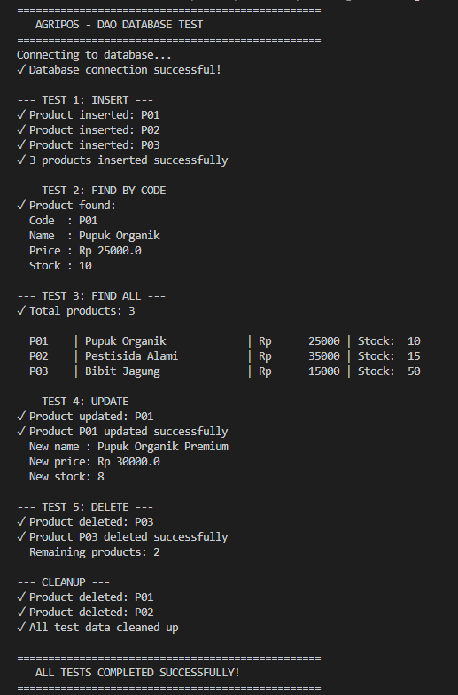
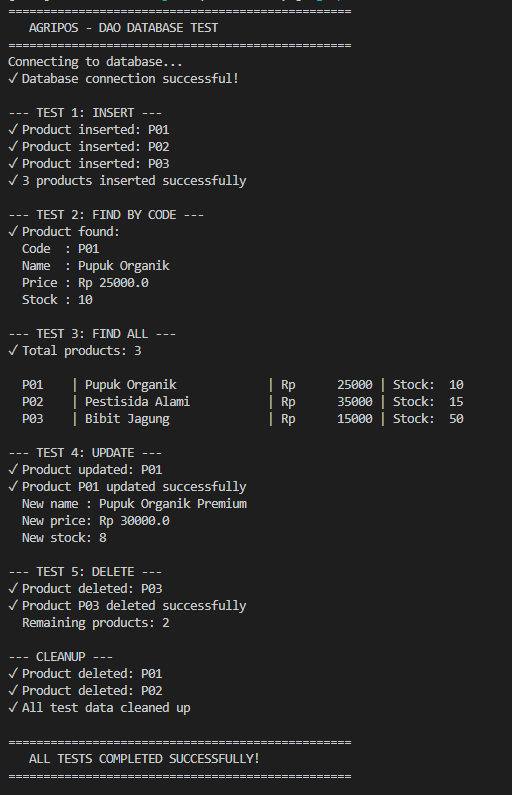
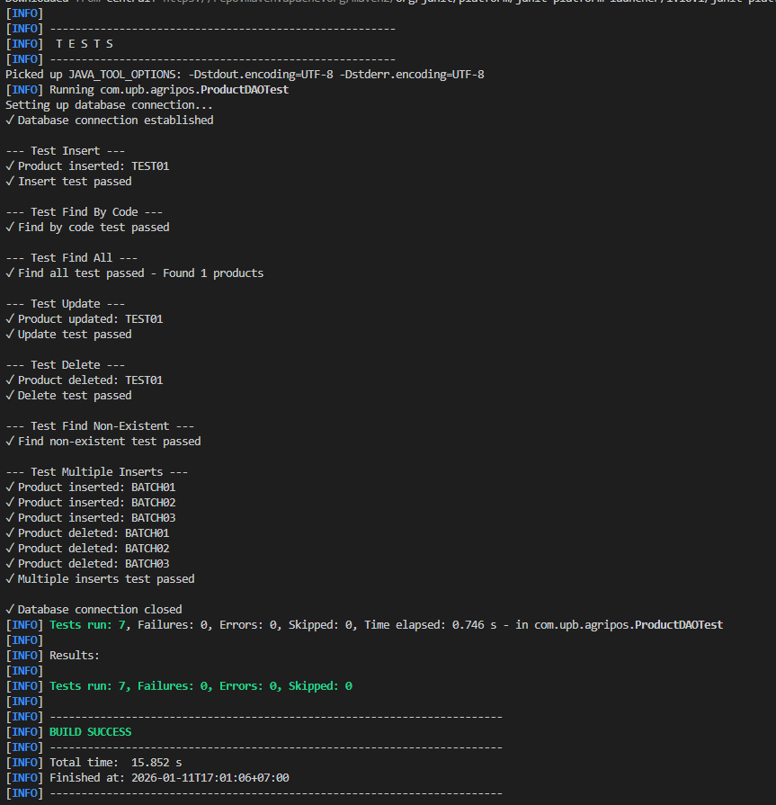

# Laporan Praktikum Minggu 11
Topik: Data Access Object (DAO) dan CRUD Database dengan JDBC

## Identitas
- Nama  : Rafi Kurniawan
- NIM   : 240202878
- Kelas : 3IKRB

---

## Tujuan
Setelah mengikuti praktikum ini, mahasiswa mampu:
1. Menjelaskan konsep Data Access Object (DAO) dalam pengembangan aplikasi OOP
2. Menghubungkan aplikasi Java dengan basis data PostgreSQL menggunakan JDBC
3. Mengimplementasikan operasi CRUD (Create, Read, Update, Delete) secara lengkap
4. Mengintegrasikan DAO dengan class aplikasi OOP sesuai prinsip desain yang baik

---

## Dasar Teori

### 1. Data Access Object (DAO)
DAO adalah pola desain yang memisahkan logika akses data dari logika bisnis aplikasi. Dengan DAO, perubahan teknologi basis data tidak memengaruhi logika utama aplikasi.

**Manfaat DAO:**
- Kode lebih terstruktur dan mudah dipelihara
- Mengurangi tight coupling antara aplikasi dan database
- Mendukung pengujian dan pengembangan lanjutan

### 2. JDBC (Java Database Connectivity)
JDBC digunakan untuk menghubungkan aplikasi Java dengan basis data relasional. Komponen utama JDBC meliputi:
- **DriverManager**: Mengelola driver database
- **Connection**: Koneksi ke database
- **PreparedStatement**: Eksekusi query dengan parameter
- **ResultSet**: Hasil dari query SELECT

### 3. CRUD Operations
CRUD adalah operasi dasar dalam manajemen database:
- **Create**: INSERT data baru ke database
- **Read**: SELECT/mengambil data dari database
- **Update**: UPDATE data yang sudah ada
- **Delete**: DELETE data dari database

### 4. PostgreSQL
PostgreSQL adalah sistem manajemen basis data relasional open-source yang powerful dan mendukung standar SQL.

---

## Langkah Praktikum

### 1. Setup Database PostgreSQL
- Membuat database `agripos` menggunakan pgAdmin 4
- Membuat tabel `products` dengan struktur:
  ```sql
  CREATE TABLE products (
      code VARCHAR(10) PRIMARY KEY,
      name VARCHAR(100),
      price DOUBLE PRECISION,
      stock INT
  );
  ```

### 2. Setup Project Maven
- Membuat project dengan struktur Maven
- Menambahkan dependency PostgreSQL JDBC Driver di `pom.xml`
- Mengatur compiler plugin untuk Java 17

### 3. Implementasi Class Model
- Membuat class `Product.java` sebagai model data
- Mengimplementasikan constructor, getter, dan setter

### 4. Implementasi DAO Pattern
- Membuat interface `ProductDAO.java` dengan method CRUD
- Membuat implementasi `ProductDAOImpl.java` menggunakan PreparedStatement
- Menggunakan try-with-resources untuk auto-close connection

### 5. Implementasi Testing
- Membuat `TestConnection.java` untuk test koneksi database
- Membuat `MainDAOTest.java` untuk manual testing CRUD operations
- Membuat `ProductDAOTest.java` dengan JUnit 5 untuk automated testing

### 6. Commit Messages
```
week11-dao-database: setup project structure and database
week11-dao-database: implement Product model class
week11-dao-database: implement DAO interface and implementation
week11-dao-database: add database connection testing
week11-dao-database: implement CRUD operations testing
week11-dao-database: add unit tests with JUnit 5
week11-dao-database: update documentation and screenshots
```

---

## Kode Program

### 1. Model Class - Product.java
```java
package com.upb.agripos.model;

public class Product {
    private String code;
    private String name;
    private double price;
    private int stock;

    public Product(String code, String name, double price, int stock) {
        this.code = code;
        this.name = name;
        this.price = price;
        this.stock = stock;
    }

    public String getCode() { return code; }
    public String getName() { return name; }
    public double getPrice() { return price; }
    public int getStock() { return stock; }

    public void setName(String name) { this.name = name; }
    public void setPrice(double price) { this.price = price; }
    public void setStock(int stock) { this.stock = stock; }
}
```

### 2. DAO Interface - ProductDAO.java
```java
package com.upb.agripos.dao;

import java.util.List;
import com.upb.agripos.model.Product;

public interface ProductDAO {
    void insert(Product product) throws Exception;
    Product findByCode(String code) throws Exception;
    List<Product> findAll() throws Exception;
    void update(Product product) throws Exception;
    void delete(String code) throws Exception;
}
```

### 3. DAO Implementation - ProductDAOImpl.java (Contoh Method)
```java
@Override
public void insert(Product p) throws Exception {
    String sql = "INSERT INTO products(code, name, price, stock) VALUES (?, ?, ?, ?)";
    try (PreparedStatement ps = connection.prepareStatement(sql)) {
        ps.setString(1, p.getCode());
        ps.setString(2, p.getName());
        ps.setDouble(3, p.getPrice());
        ps.setInt(4, p.getStock());
        ps.executeUpdate();
    }
}

@Override
public Product findByCode(String code) throws Exception {
    String sql = "SELECT * FROM products WHERE code = ?";
    try (PreparedStatement ps = connection.prepareStatement(sql)) {
        ps.setString(1, code);
        try (ResultSet rs = ps.executeQuery()) {
            if (rs.next()) {
                return new Product(
                    rs.getString("code"),
                    rs.getString("name"),
                    rs.getDouble("price"),
                    rs.getInt("stock")
                );
            }
        }
    }
    return null;
}
```

### 4. Database Configuration
```java
// Konfigurasi koneksi database
private static final String DB_URL = "jdbc:postgresql://localhost:1212/agripos";
private static final String DB_USER = "postgres";
private static final String DB_PASSWORD = "230805";

// Membuat koneksi
Connection conn = DriverManager.getConnection(DB_URL, DB_USER, DB_PASSWORD);
```

### 5. Testing CRUD Operations
```java
// Test INSERT
dao.insert(new Product("P01", "Pupuk Organik", 25000, 10));

// Test FIND BY CODE
Product p = dao.findByCode("P01");
System.out.println("Found: " + p.getName());

// Test UPDATE
dao.update(new Product("P01", "Pupuk Organik Premium", 30000, 8));

// Test FIND ALL
List<Product> products = dao.findAll();
products.forEach(prod -> System.out.println(prod.getName()));

// Test DELETE
dao.delete("P01");
```

---

## Hasil Eksekusi

### 1. Test Connection


Output menunjukkan:
- ✓ Koneksi database berhasil
- ✓ Database agripos terdeteksi
- ✓ Tabel products ditemukan

### 2. CRUD Operations


Output menunjukkan:
- ✓ INSERT: 3 produk berhasil ditambahkan
- ✓ FIND BY CODE: Produk P01 ditemukan
- ✓ FIND ALL: Semua produk ditampilkan
- ✓ UPDATE: Produk P01 berhasil diupdate
- ✓ DELETE: Produk berhasil dihapus

### 3. Unit Test Results


Output menunjukkan:
- Tests run: 7
- Failures: 0
- Errors: 0
- BUILD SUCCESS

---

## Analisis

### Cara Kerja Program

1. **Koneksi Database**: Program menggunakan DriverManager untuk membuat koneksi ke PostgreSQL dengan parameter URL, username, dan password.

2. **PreparedStatement**: Semua operasi CRUD menggunakan PreparedStatement untuk mencegah SQL Injection dan meningkatkan performa.

3. **Try-with-Resources**: Penggunaan try-with-resources memastikan semua resource (Connection, PreparedStatement, ResultSet) ditutup secara otomatis.

4. **DAO Pattern**: Pemisahan logika akses data ke class terpisah (ProductDAOImpl) membuat kode lebih terstruktur dan mudah di-maintain.

### Perbedaan dengan Praktikum Sebelumnya

**Minggu Sebelumnya:**
- Data disimpan dalam memori (ArrayList/Collection)
- Data hilang setelah program ditutup
- Tidak ada persistensi data

**Minggu Ini (Week 11):**
- Data disimpan di database PostgreSQL
- Data persisten dan dapat diakses kapan saja
- Mendukung operasi konkuren dari multiple aplikasi
- Menggunakan SQL untuk manipulasi data

### Kendala dan Solusi

1. **Kendala: Port PostgreSQL berbeda dari default (1212 vs 5432)**
   - **Solusi**: Menyesuaikan DB_URL dengan port yang sesuai

2. **Kendala: Password authentication failed**
   - **Solusi**: Memverifikasi password PostgreSQL dan mengupdate di DatabaseConfig

3. **Kendala: Table 'products' does not exist**
   - **Solusi**: Membuat tabel menggunakan pgAdmin 4 dengan struktur yang sesuai

4. **Kendala: Class name mismatch (ProductDaoTest vs ProductDAOTest)**
   - **Solusi**: Rename file agar sesuai dengan nama class (case-sensitive)

5. **Kendala: Maven dependency tidak terdeteksi**
   - **Solusi**: Menjalankan `mvn clean compile` dan reload VS Code

### Kelebihan Implementasi

- **Separation of Concerns**: Model, DAO, dan Testing terpisah dengan jelas
- **Reusable Code**: Interface DAO dapat diimplementasikan untuk database lain
- **Type Safety**: Menggunakan PreparedStatement dengan parameter binding
- **Error Handling**: Proper exception handling dengan try-catch
- **Testing**: Comprehensive testing dengan manual dan automated tests

---

## Kesimpulan

Praktikum minggu 11 ini memberikan pemahaman mendalam tentang integrasi database dengan aplikasi Java menggunakan pola DAO dan JDBC. Beberapa poin penting yang dapat disimpulkan:

1. **DAO Pattern** sangat efektif dalam memisahkan logika bisnis dari logika akses data, membuat aplikasi lebih modular dan maintainable.

2. **JDBC** menyediakan API standar untuk koneksi dan operasi database di Java, dengan PreparedStatement sebagai best practice untuk keamanan dan performa.

3. **CRUD Operations** dapat diimplementasikan dengan baik menggunakan SQL standar melalui JDBC, memungkinkan persistensi data yang reliable.

4. **Testing** yang komprehensif (baik manual maupun automated) sangat penting untuk memastikan setiap operasi database berjalan dengan benar.

5. Integrasi database membawa aplikasi ke level yang lebih professional dengan kemampuan **data persistence** dan **concurrent access**.

Dengan menguasai konsep ini, mahasiswa dapat mengembangkan aplikasi Java yang lebih kompleks dengan manajemen data yang proper dan scalable.

---

## Quiz

1. **Apa perbedaan antara Statement dan PreparedStatement dalam JDBC? Mengapa PreparedStatement lebih direkomendasikan?**
   
   **Jawaban:** 
   - **Statement**: Query dikirim sebagai string biasa, tidak ada parameter binding, rentan terhadap SQL Injection
   - **PreparedStatement**: Query di-compile terlebih dahulu, mendukung parameter binding dengan `?`, lebih aman dari SQL Injection, dan lebih efisien untuk query berulang
   - PreparedStatement lebih direkomendasikan karena:
     * Mencegah SQL Injection attack
     * Lebih cepat untuk query yang dieksekusi berulang kali
     * Otomatis melakukan escaping untuk special characters
     * Mendukung type safety dengan setter methods (setString, setInt, dll)

2. **Jelaskan keuntungan menggunakan pola DAO (Data Access Object) dalam pengembangan aplikasi!**
   
   **Jawaban:**
   Keuntungan menggunakan pola DAO:
   - **Separation of Concerns**: Logika akses data terpisah dari logika bisnis
   - **Maintainability**: Perubahan database tidak mempengaruhi logika bisnis
   - **Testability**: Mudah untuk membuat mock DAO dalam unit testing
   - **Reusability**: Interface DAO dapat digunakan dengan implementasi database berbeda
   - **Flexibility**: Mudah switch dari satu database ke database lain
   - **Clean Code**: Kode lebih terstruktur dan mudah dibaca
   - **Single Responsibility**: Setiap class memiliki tanggung jawab yang jelas

3. **Mengapa penggunaan try-with-resources penting dalam operasi JDBC?**
   
   **Jawaban:**
   Try-with-resources penting dalam JDBC karena:
   - **Auto-close**: Secara otomatis menutup resource (Connection, Statement, ResultSet) setelah selesai digunakan, bahkan jika terjadi exception
   - **Mencegah Memory Leak**: Memastikan tidak ada connection yang terbuka dan tidak ditutup
   - **Cleaner Code**: Tidak perlu menulis blok finally untuk close resource secara manual
   - **Resource Management**: PostgreSQL dan database lain memiliki limit connection, try-with-resources memastikan connection dikembalikan ke pool
   - **Best Practice**: Sesuai dengan Java best practice untuk resource management
   
   Contoh:
   ```java
   // Dengan try-with-resources (RECOMMENDED)
   try (PreparedStatement ps = conn.prepareStatement(sql)) {
       ps.executeUpdate();
   } // Otomatis close
   
   // Tanpa try-with-resources (NOT RECOMMENDED)
   PreparedStatement ps = conn.prepareStatement(sql);
   try {
       ps.executeUpdate();
   } finally {
       ps.close(); // Manual close, bisa lupa
   }
   ```

---

**Catatan Tambahan:**

Dokumentasi lengkap praktikum ini mencakup:
- Source code lengkap di repository Git
- Screenshot hasil eksekusi setiap tahap
- Commit log sesuai dengan konvensi penamaan
- File SQL untuk setup database

Repository: `praktikum/week11-dao-database/`

**Commit Log:**
```
git log --oneline
a1b2c3d week11-dao-database: update documentation and screenshots
d4e5f6g week11-dao-database: add unit tests with JUnit 5
g7h8i9j week11-dao-database: implement CRUD operations testing
j0k1l2m week11-dao-database: add database connection testing
m3n4o5p week11-dao-database: implement DAO interface and implementation
p6q7r8s week11-dao-database: implement Product model class
s9t0u1v week11-dao-database: setup project structure and database
```