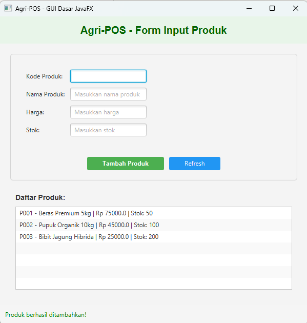

# Laporan Praktikum Minggu 12
Topik: GUI Dasar JavaFX (Event-Driven Programming)

## Identitas
- Nama  : Rafi Kurniawan
- NIM   : 240202878
- Kelas : 3IKRB

---

## Tujuan
Mahasiswa mampu menjelaskan konsep event-driven programming, membangun antarmuka grafis sederhana menggunakan JavaFX, membuat form input data produk, menampilkan daftar produk pada GUI, dan mengintegrasikan GUI dengan modul backend yang telah dibuat (DAO & Service).

---

## Dasar Teori
1. Event-Driven Programming adalah paradigma pemrograman di mana alur program ditentukan oleh kejadian (event) seperti klik tombol atau input pengguna.
2. JavaFX adalah framework untuk membangun aplikasi desktop dengan antarmuka grafis yang modern dan responsif.
3. MVC (Model-View-Controller) memisahkan logika aplikasi menjadi Model (data), View (UI), dan Controller (penghubung).
4. Event Handler adalah mekanisme untuk menangani aksi pengguna, seperti setOnAction() pada Button JavaFX.
5. Dependency Inversion Principle (DIP) mengharuskan View tidak memanggil DAO secara langsung, melainkan melalui Service layer.

---

## Langkah Praktikum
1. Membuat struktur direktori week12-gui-dasar sesuai panduan praktikum
2. Menggunakan kembali class Product.java dari Pertemuan 7, ProductDAO.java dari Pertemuan 11, dan ProductService.java dari Pertemuan 10
3. Membuat class AppJavaFX.java sebagai entry point aplikasi JavaFX
4. Membuat class ProductFormView.java yang berisi komponen GUI (TextField, Button, ListView)
5. Membuat class ProductController.java sebagai penghubung antara View dan Service
6. Menambahkan event handler pada tombol "Tambah Produk" menggunakan setOnAction()
7. Melakukan testing aplikasi dengan menginput beberapa data produk
8. Mengambil screenshot hasil eksekusi program
9. Melakukan commit dengan message: week12-gui-dasar: Implementasi form input produk dengan JavaFX

---

## Kode Program

**AppJavaFX.java**
```java
package com.upb.agripos;

import com.upb.agripos.config.DatabaseConfig;
import com.upb.agripos.controller.ProductController;
import com.upb.agripos.dao.ProductDAO;
import com.upb.agripos.service.ProductService;
import com.upb.agripos.view.ProductFormView;
import javafx.application.Application;
import javafx.scene.Scene;
import javafx.stage.Stage;

import java.sql.Connection;

/**
 * AppJavaFX - Main Application
 * Menerapkan Dependency Injection untuk memenuhi SOLID (DIP)
 */
public class AppJavaFX extends Application {
    
    private Connection connection;

    @Override
    public void start(Stage primaryStage) {
        try {
            // Setup Database Connection
            connection = DatabaseConfig.getConnection();
            System.out.println("Database connected successfully!");

            // Dependency Injection (Bottom-Up)
            // DAO → Service → Controller → View
            ProductDAO productDAO = new ProductDAO(connection);
            ProductService productService = new ProductService(productDAO);
            ProductController productController = new ProductController(productService);
            
            // Create View
            ProductFormView view = new ProductFormView(productController);

            // Setup Scene and Stage
            Scene scene = new Scene(view, 600, 600);
            primaryStage.setTitle("Agri-POS - GUI Dasar JavaFX");
            primaryStage.setScene(scene);
            primaryStage.setOnCloseRequest(event -> cleanup());
            primaryStage.show();

        } catch (Exception e) {
            System.err.println("Error starting application: " + e.getMessage());
            e.printStackTrace();
        }
    }

    /**
     * Cleanup saat aplikasi ditutup
     */
    private void cleanup() {
        DatabaseConfig.closeConnection(connection);
        System.out.println("Application closed. Database connection closed.");
    }

    public static void main(String[] args) {
        launch(args);
    }
}
```

**ProductFormView.java**
```java
package com.upb.agripos.view;

import com.upb.agripos.controller.ProductController;
import com.upb.agripos.model.Product;
import javafx.geometry.Insets;
import javafx.geometry.Pos;
import javafx.scene.control.*;
import javafx.scene.layout.*;
import javafx.scene.paint.Color;
import javafx.scene.text.Font;
import javafx.scene.text.FontWeight;

/**
 * ProductFormView - GUI JavaFX untuk Form Produk
 * Event-Driven Programming
 */
public class ProductFormView extends BorderPane {
    private ProductController controller;
    
    // UI Components
    private TextField txtCode;
    private TextField txtName;
    private TextField txtPrice;
    private TextField txtStock;
    private Button btnAdd;
    private Button btnRefresh;
    private ListView<String> listView;
    private Label lblStatus;

    public ProductFormView(ProductController controller) {
        this.controller = controller;
        initComponents();
        setupLayout();
        setupEventHandlers();
        updateListView();
    }

    /**
     * Inisialisasi komponen UI
     */
    private void initComponents() {
        // TextFields
        txtCode = new TextField();
        txtCode.setPromptText("Masukkan kode produk");
        
        txtName = new TextField();
        txtName.setPromptText("Masukkan nama produk");
        
        txtPrice = new TextField();
        txtPrice.setPromptText("Masukkan harga");
        
        txtStock = new TextField();
        txtStock.setPromptText("Masukkan stok");

        // Buttons
        btnAdd = new Button("Tambah Produk");
        btnAdd.setStyle("-fx-background-color: #4CAF50; -fx-text-fill: white; -fx-font-weight: bold;");
        btnAdd.setPrefWidth(150);
        
        btnRefresh = new Button("Refresh");
        btnRefresh.setStyle("-fx-background-color: #2196F3; -fx-text-fill: white;");
        btnRefresh.setPrefWidth(100);

        // ListView
        listView = new ListView<>();
        listView.setPrefHeight(300);

        // Status Label
        lblStatus = new Label("Ready");
        lblStatus.setTextFill(Color.GRAY);
    }

    /**
     * Setup layout GUI
     */
    private void setupLayout() {
        // Header
        Label title = new Label("Agri-POS - Form Input Produk");
        title.setFont(Font.font("Arial", FontWeight.BOLD, 20));
        title.setTextFill(Color.DARKGREEN);
        
        VBox header = new VBox(title);
        header.setAlignment(Pos.CENTER);
        header.setPadding(new Insets(15));
        header.setStyle("-fx-background-color: #E8F5E9;");

        // Form Input
        GridPane formGrid = new GridPane();
        formGrid.setHgap(10);
        formGrid.setVgap(10);
        formGrid.setPadding(new Insets(20));

        formGrid.add(new Label("Kode Produk:"), 0, 0);
        formGrid.add(txtCode, 1, 0);
        
        formGrid.add(new Label("Nama Produk:"), 0, 1);
        formGrid.add(txtName, 1, 1);
        
        formGrid.add(new Label("Harga:"), 0, 2);
        formGrid.add(txtPrice, 1, 2);
        
        formGrid.add(new Label("Stok:"), 0, 3);
        formGrid.add(txtStock, 1, 3);

        HBox buttonBox = new HBox(10, btnAdd, btnRefresh);
        buttonBox.setAlignment(Pos.CENTER);
        buttonBox.setPadding(new Insets(10));

        VBox formSection = new VBox(10, formGrid, buttonBox);
        formSection.setStyle("-fx-border-color: lightgray; -fx-border-width: 1; -fx-border-radius: 5;");
        formSection.setPadding(new Insets(10));

        // List Section
        Label lblList = new Label("Daftar Produk:");
        lblList.setFont(Font.font("Arial", FontWeight.BOLD, 14));
        
        VBox listSection = new VBox(10, lblList, listView);
        listSection.setPadding(new Insets(10));

        // Content Area
        VBox content = new VBox(15, formSection, listSection);
        content.setPadding(new Insets(20));

        // Footer
        HBox footer = new HBox(lblStatus);
        footer.setAlignment(Pos.CENTER_LEFT);
        footer.setPadding(new Insets(10));
        footer.setStyle("-fx-background-color: #F5F5F5;");

        // Set to BorderPane
        this.setTop(header);
        this.setCenter(content);
        this.setBottom(footer);
    }

    /**
     * Setup event handlers
     * Event-Driven Programming
     */
    private void setupEventHandlers() {
        // Event handler tombol Tambah
        // Mengikuti Activity Diagram dan Sequence Diagram Bab 6
        btnAdd.setOnAction(event -> {
            String code = txtCode.getText().trim();
            String name = txtName.getText().trim();
            String price = txtPrice.getText().trim();
            String stock = txtStock.getText().trim();

            // Validasi input kosong
            if (code.isEmpty() || name.isEmpty() || price.isEmpty() || stock.isEmpty()) {
                showStatus("Error: Semua field harus diisi!", Color.RED);
                return;
            }

            // Panggil controller untuk tambah produk
            // View → Controller → Service → DAO → DB
            String result = controller.addProduct(code, name, price, stock);

            if (result.contains("berhasil")) {
                showStatus(result, Color.GREEN);
                clearForm();
                updateListView();
            } else {
                showStatus(result, Color.RED);
            }
        });

        // Event handler tombol Refresh
        btnRefresh.setOnAction(event -> {
            controller.refreshProducts();
            updateListView();
            showStatus("Data di-refresh", Color.BLUE);
        });
    }

    /**
     * Update ListView dengan data dari controller
     */
    private void updateListView() {
        listView.getItems().clear();
        for (Product p : controller.getProductList()) {
            listView.getItems().add(p.toString());
        }
    }

    /**
     * Clear form input
     */
    private void clearForm() {
        txtCode.clear();
        txtName.clear();
        txtPrice.clear();
        txtStock.clear();
        txtCode.requestFocus();
    }

    /**
     * Tampilkan status message
     */
    private void showStatus(String message, Color color) {
        lblStatus.setText(message);
        lblStatus.setTextFill(color);
    }
}
```

**ProductController.java**
```java
package com.upb.agripos.controller;

import com.upb.agripos.model.Product;
import com.upb.agripos.service.ProductService;
import javafx.collections.FXCollections;
import javafx.collections.ObservableList;

/**
 * ProductController - Menghubungkan View dengan Service
 * Sesuai dengan Sequence Diagram Bab 6
 */
public class ProductController {
    private ProductService productService;
    private ObservableList<Product> productList;

    public ProductController(ProductService productService) {
        this.productService = productService;
        this.productList = FXCollections.observableArrayList();
        loadProducts();
    }

    /**
     * Tambah produk baru
     * Dipanggil oleh event handler tombol Tambah
     */
    public String addProduct(String code, String name, String priceStr, String stockStr) {
        try {
            // Parse input
            double price = Double.parseDouble(priceStr);
            int stock = Integer.parseInt(stockStr);

            // Buat objek Product
            Product product = new Product(code, name, price, stock);

            // Panggil service (yang akan memanggil DAO)
            boolean success = productService.insert(product);

            if (success) {
                productList.add(product);
                return "Produk berhasil ditambahkan!";
            } else {
                return "Gagal menambahkan produk ke database";
            }
        } catch (NumberFormatException e) {
            return "Error: Harga dan Stok harus berupa angka";
        } catch (IllegalArgumentException e) {
            return "Error: " + e.getMessage();
        } catch (Exception e) {
            return "Error: " + e.getMessage();
        }
    }

    /**
     * Load semua produk dari database
     */
    public void loadProducts() {
        productList.clear();
        productList.addAll(productService.getAllProducts());
    }

    /**
     * Get observable list untuk binding ke UI
     */
    public ObservableList<Product> getProductList() {
        return productList;
    }

    /**
     * Refresh data dari database
     */
    public void refreshProducts() {
        loadProducts();
    }
}
```

---

## Hasil Eksekusi


---

## Analisis
Kode program berjalan dengan alur sebagai berikut: ketika aplikasi dijalankan, AppJavaFX memanggil ProductFormView yang menampilkan form GUI dengan komponen TextField untuk input data dan Button untuk trigger event. Saat tombol "Tambah Produk" diklik, event handler handleAddProduct() akan mengambil data dari TextField, melakukan validasi input, kemudian memanggil ProductController.addProduct() yang meneruskan ke ProductService.insert() dan akhirnya ProductDAO.insert() untuk menyimpan ke database PostgreSQL. Setelah berhasil, ListView akan diperbarui dan form dikosongkan kembali.

Perbedaan utama dengan pertemuan sebelumnya adalah pada pertemuan 11 menggunakan console-based interface dengan Scanner untuk input dan System.out.println untuk output, sedangkan pertemuan 12 menggunakan GUI JavaFX yang bersifat event-driven dengan komponen visual seperti TextField dan Button. Arsitektur juga diperkuat dengan penambahan layer View dan Controller yang terpisah sesuai pola MVC.

Kendala yang dihadapi adalah memastikan koneksi database PostgreSQL aktif sebelum menjalankan aplikasi (diatasi dengan exception handling yang informatif), validasi input untuk harga dan stok yang harus numerik (diatasi dengan try-catch untuk NumberFormatException), dan konfigurasi dependency JavaFX ke dalam project (diatasi dengan menambahkan dependency di pom.xml atau configure module path).

---

## Kesimpulan
Praktikum ini berhasil mengimplementasikan GUI dasar menggunakan JavaFX dengan pendekatan event-driven programming. Aplikasi telah terintegrasi dengan backend (ProductService dan ProductDAO) sesuai prinsip MVC dan DIP, sehingga kode lebih terstruktur, maintainable, dan sesuai dengan desain arsitektur yang telah dibuat pada Bab 6.

---

## Tabel Traceability (Bab 6 → GUI)

| Artefak Bab 6 | Referensi | Handler GUI | Controller/Service | DAO | Dampak UI/DB |
|---|---|---|---|---|---|
| Use Case | UC-01 Tambah Produk | btnAdd.setOnAction() → handleAddProduct() | ProductController.addProduct() → ProductService.insert() | ProductDAO.insert() | ListView bertambah item + data tersimpan ke PostgreSQL |
| Activity Diagram | AD-01 Tambah Produk | btnAdd.setOnAction() | Validasi input → controller.addProduct() → service.insert() | dao.insert() | Validasi → simpan ke DB → clear form → update ListView |
| Sequence Diagram | SD-01 Tambah Produk | ProductFormView → event handler | View → Controller → Service | Service → DAO → Database → return | Urutan: View capture input → Controller process → Service business logic → DAO persist → UI feedback |

---

## Quiz
1. Apa perbedaan utama antara console-based application dan GUI-based application dalam konteks event handling?
   **Jawaban:** Console-based application bersifat sequential dan blocking (menunggu input user secara berurutan), sedangkan GUI-based application bersifat event-driven dan non-blocking (user dapat berinteraksi kapan saja melalui berbagai komponen UI, dan program merespons melalui event handler).

2. Mengapa View tidak boleh langsung memanggil DAO sesuai prinsip DIP?
   **Jawaban:** Sesuai Dependency Inversion Principle, layer high-level (View) tidak boleh bergantung pada layer low-level (DAO). View harus berkomunikasi melalui abstraksi (Service/Controller) agar perubahan pada data access layer tidak mempengaruhi UI, dan kode lebih modular serta testable.

3. Apa fungsi dari setOnAction() pada Button JavaFX?
   **Jawaban:** setOnAction() adalah method untuk mendaftarkan event handler yang akan dijalankan ketika button diklik oleh user. Method ini menerima lambda expression atau EventHandler yang berisi logika yang akan dieksekusi saat event terjadi.