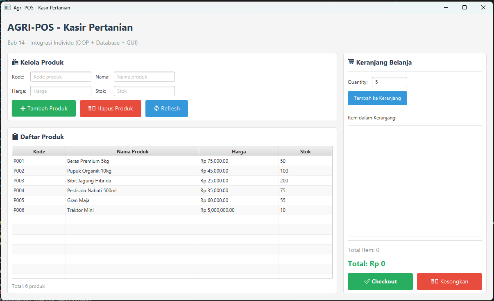
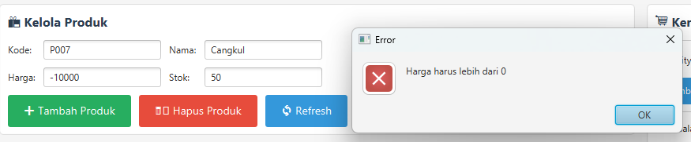
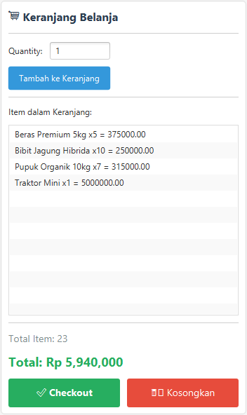

# Laporan Praktikum Minggu 14
Topik: Integrasi Individu (OOP + Database + GUI)

## Identitas
- Nama  : Rafi Kurniawan
- NIM   : 240202878
- Kelas : 3IKRB

---

## Tujuan
Setelah mengikuti praktikum ini, mahasiswa mampu:
1. Mengintegrasikan konsep OOP (Bab 1–5) ke dalam satu aplikasi yang utuh
2. Mengimplementasikan rancangan UML + SOLID (Bab 6) menjadi kode nyata
3. Mengintegrasikan Collections + Keranjang (Bab 7) ke alur aplikasi
4. Menerapkan exception handling (Bab 9) untuk validasi dan error flow
5. Menerapkan pattern + unit testing (Bab 10) pada bagian yang relevan
6. Menghubungkan aplikasi dengan database via DAO + JDBC (Bab 11)
7. Menyajikan aplikasi berbasis JavaFX (Bab 12–13) yang terhubung ke backend

---

## Dasar Teori

### 1. Arsitektur MVC + Service Layer
Pemisahan concerns menjadi beberapa layer:
- **Model**: Representasi data (Product, Cart, CartItem)
- **View**: User interface (JavaFX)
- **Controller**: Penghubung View dan Service
- **Service**: Business logic
- **DAO**: Data Access Object untuk akses database

### 2. SOLID Principles - Dependency Inversion Principle (DIP)
High-level modules (Controller) tidak bergantung pada low-level modules (DAO), keduanya bergantung pada abstraksi (Interface). Contoh: `ProductDAO` adalah interface, `JdbcProductDAO` adalah implementasi.

### 3. Collections Framework
- `List<T>`: Struktur data berurutan, digunakan untuk menyimpan CartItem
- `Map<K,V>`: Struktur key-value, digunakan untuk akses cepat CartItem berdasarkan product code

### 4. Exception Handling
Custom exception untuk validasi business rules:
- `ValidationException`: Input tidak valid
- `DatabaseException`: Error database operation
- `InsufficientStockException`: Stok tidak cukup

### 5. Design Pattern - Singleton
Memastikan hanya ada satu instance dari class tertentu. Digunakan pada `DatabaseConnection` untuk mengelola koneksi database.

---

## Langkah Praktikum

### 1. Setup Database PostgreSQL
- Buat database baru `agripos_db` di pgAdmin
- Jalankan script SQL:
```sql
CREATE TABLE products (
    id SERIAL PRIMARY KEY,
    code VARCHAR(50) UNIQUE NOT NULL,
    name VARCHAR(100) NOT NULL,
    price DECIMAL(10, 2) NOT NULL,
    stock INTEGER NOT NULL DEFAULT 0,
    created_at TIMESTAMP DEFAULT CURRENT_TIMESTAMP,
    updated_at TIMESTAMP DEFAULT CURRENT_TIMESTAMP
);
```
- Insert sample data (5 produk pertanian)

### 2. Struktur Proyek
Membuat struktur package sesuai arsitektur MVC:
```
src/main/java/com/upb/agripos/
├── model/           (Product, Cart, CartItem)
├── exception/       (Custom exceptions)
├── dao/             (ProductDAO interface, JdbcProductDAO)
├── service/         (ProductService, CartService)
├── controller/      (PosController)
├── view/            (PosView - JavaFX)
├── util/            (DatabaseConnection - Singleton)
└── AppJavaFX.java   (Main class)
```

### 3. Implementasi Layer by Layer

**a. Model Layer (Bab 2, 5)**
- `Product.java`: Class dengan encapsulation (private fields + getter/setter)
- `Cart.java`: Menggunakan `List<CartItem>` dan `Map<String, CartItem>`
- `CartItem.java`: Merepresentasikan item dalam keranjang

**b. Exception Layer (Bab 9)**
- `ValidationException.java`
- `DatabaseException.java`
- `ProductNotFoundException.java`
- `InsufficientStockException.java`

**c. DAO Layer (Bab 11)**
- `ProductDAO.java`: Interface dengan method CRUD
- `JdbcProductDAO.java`: Implementasi JDBC untuk PostgreSQL

**d. Util Layer (Bab 10)**
- `DatabaseConnection.java`: Singleton pattern untuk database connection

**e. Service Layer**
- `ProductService.java`: Business logic produk + validasi
- `CartService.java`: Business logic keranjang

**f. Controller Layer (Bab 6 - DIP)**
- `PosController.java`: Menghubungkan View → Service → DAO

**g. View Layer (Bab 12-13)**
- `PosView.java`: JavaFX GUI dengan TableView, ListView, dan event handling

**h. Main Application (Bab 1)**
- `AppJavaFX.java`: Entry point + Dependency Injection + print identitas

### 4. Testing (Bab 10)
- Membuat `CartServiceTest.java` dengan 7 test cases:
  1. Test add to cart success
  2. Test invalid quantity
  3. Test insufficient stock
  4. Test calculate total
  5. Test remove item
  6. Test clear cart
  7. Test duplicate product

### 5. Commit Messages
```
week14-integrasi-individu: init project structure
week14-integrasi-individu: add model classes (Product, Cart, CartItem)
week14-integrasi-individu: add custom exceptions
week14-integrasi-individu: implement DAO layer with JDBC
week14-integrasi-individu: add service layer
week14-integrasi-individu: implement controller
week14-integrasi-individu: create JavaFX view with checkout feature
week14-integrasi-individu: add unit tests (CartServiceTest)
week14-integrasi-individu: final integration and documentation
```

---

## Kode Program

### 1. Model - Cart.java (Collections)
```java

package com.upb.agripos.model;

import java.math.BigDecimal;
import java.util.ArrayList;
import java.util.HashMap;
import java.util.List;
import java.util.Map;

/**
 * Bab 7: Collections - Cart menggunakan List dan Map
 */
public class Cart {
    private List<CartItem> items; // List untuk menyimpan item
    private Map<String, CartItem> itemMap; // Map untuk akses cepat berdasarkan kode

    public Cart() {
        this.items = new ArrayList<>();
        this.itemMap = new HashMap<>();
    }

    public void addItem(Product product, int quantity) {
        String code = product.getCode();
        
        if (itemMap.containsKey(code)) {
            // Update quantity jika produk sudah ada
            CartItem existing = itemMap.get(code);
            existing.setQuantity(existing.getQuantity() + quantity);
        } else {
            // Tambah item baru
            CartItem newItem = new CartItem(product, quantity);
            items.add(newItem);
            itemMap.put(code, newItem);
        }
    }

    public void removeItem(String productCode) {
        CartItem item = itemMap.remove(productCode);
        if (item != null) {
            items.remove(item);
        }
    }

    public void updateQuantity(String productCode, int newQuantity) {
        CartItem item = itemMap.get(productCode);
        if (item != null) {
            if (newQuantity <= 0) {
                removeItem(productCode);
            } else {
                item.setQuantity(newQuantity);
            }
        }
    }

    public void clear() {
        items.clear();
        itemMap.clear();
    }

    public BigDecimal calculateTotal() {
        return items.stream()
                .map(CartItem::getSubtotal)
                .reduce(BigDecimal.ZERO, BigDecimal::add);
    }

    public List<CartItem> getItems() {
        return new ArrayList<>(items); // Return copy untuk encapsulation
    }

    public int getTotalItems() {
        return items.stream()
                .mapToInt(CartItem::getQuantity)
                .sum();
    }

    public boolean isEmpty() {
        return items.isEmpty();
    }
}
```

### 2. DAO - JdbcProductDAO.java (JDBC)
```java
package com.upb.agripos.dao;

import com.upb.agripos.model.Product;
import com.upb.agripos.exception.DatabaseException;
import com.upb.agripos.util.DatabaseConnection;

import java.math.BigDecimal;
import java.sql.*;
import java.util.ArrayList;
import java.util.List;

/**
 * Bab 11: JDBC Implementation of ProductDAO
 */
public class JdbcProductDAO implements ProductDAO {

    @Override
    public List<Product> findAll() throws DatabaseException {
        List<Product> products = new ArrayList<>();
        String sql = "SELECT * FROM products ORDER BY id";

        try (Connection conn = DatabaseConnection.getConnection();
             Statement stmt = conn.createStatement();
             ResultSet rs = stmt.executeQuery(sql)) {

            while (rs.next()) {
                products.add(mapResultSetToProduct(rs));
            }
        } catch (SQLException e) {
            throw new DatabaseException("Error fetching all products", e);
        }

        return products;
    }

    @Override
    public Product findByCode(String code) throws DatabaseException {
        String sql = "SELECT * FROM products WHERE code = ?";

        try (Connection conn = DatabaseConnection.getConnection();
             PreparedStatement pstmt = conn.prepareStatement(sql)) {

            pstmt.setString(1, code);
            ResultSet rs = pstmt.executeQuery();

            if (rs.next()) {
                return mapResultSetToProduct(rs);
            }
            return null;

        } catch (SQLException e) {
            throw new DatabaseException("Error finding product by code: " + code, e);
        }
    }

    @Override
    public void insert(Product product) throws DatabaseException {
        String sql = "INSERT INTO products (code, name, price, stock) VALUES (?, ?, ?, ?)";

        try (Connection conn = DatabaseConnection.getConnection();
             PreparedStatement pstmt = conn.prepareStatement(sql)) {

            pstmt.setString(1, product.getCode());
            pstmt.setString(2, product.getName());
            pstmt.setBigDecimal(3, product.getPrice());
            pstmt.setInt(4, product.getStock());

            pstmt.executeUpdate();

        } catch (SQLException e) {
            if (e.getSQLState().equals("23505")) { // Unique violation
                throw new DatabaseException("Kode produk sudah ada: " + product.getCode());
            }
            throw new DatabaseException("Error inserting product", e);
        }
    }

    @Override
    public void update(Product product) throws DatabaseException {
        String sql = "UPDATE products SET name = ?, price = ?, stock = ?, updated_at = CURRENT_TIMESTAMP WHERE code = ?";

        try (Connection conn = DatabaseConnection.getConnection();
             PreparedStatement pstmt = conn.prepareStatement(sql)) {

            pstmt.setString(1, product.getName());
            pstmt.setBigDecimal(2, product.getPrice());
            pstmt.setInt(3, product.getStock());
            pstmt.setString(4, product.getCode());

            int affected = pstmt.executeUpdate();
            if (affected == 0) {
                throw new DatabaseException("Produk tidak ditemukan: " + product.getCode());
            }

        } catch (SQLException e) {
            throw new DatabaseException("Error updating product", e);
        }
    }

    @Override
    public void delete(String code) throws DatabaseException {
        String sql = "DELETE FROM products WHERE code = ?";

        try (Connection conn = DatabaseConnection.getConnection();
             PreparedStatement pstmt = conn.prepareStatement(sql)) {

            pstmt.setString(1, code);
            int affected = pstmt.executeUpdate();

            if (affected == 0) {
                throw new DatabaseException("Produk tidak ditemukan: " + code);
            }

        } catch (SQLException e) {
            throw new DatabaseException("Error deleting product", e);
        }
    }

    private Product mapResultSetToProduct(ResultSet rs) throws SQLException {
        Product product = new Product();
        product.setId(rs.getInt("id"));
        product.setCode(rs.getString("code"));
        product.setName(rs.getString("name"));
        product.setPrice(rs.getBigDecimal("price"));
        product.setStock(rs.getInt("stock"));
        product.setCreatedAt(rs.getTimestamp("created_at").toLocalDateTime());
        product.setUpdatedAt(rs.getTimestamp("updated_at").toLocalDateTime());
        return product;
    }
}
```

### 3. Service - ProductService.java (Validation)
```java
package com.upb.agripos.service;

import com.upb.agripos.dao.ProductDAO;
import com.upb.agripos.model.Product;
import com.upb.agripos.exception.*;

import java.util.List;

/**
 * Service Layer untuk Product
 * Bab 6: SOLID Principles
 * - Single Responsibility: hanya handle business logic Product
 * - Dependency Inversion: bergantung pada interface ProductDAO
 */
public class ProductService {
    private final ProductDAO productDAO;

    public ProductService(ProductDAO productDAO) {
        this.productDAO = productDAO;
    }

    public List<Product> getAllProducts() throws DatabaseException {
        return productDAO.findAll();
    }

    public Product getProductByCode(String code) throws DatabaseException {
        return productDAO.findByCode(code);
    }

    public void addProduct(Product product) throws ValidationException, DatabaseException {
        // Validasi business logic
        validateProduct(product);
        
        // Insert ke database (DAO akan handle duplikasi)
        productDAO.insert(product);
    }

    public void updateProduct(Product product) throws ValidationException, DatabaseException {
        validateProduct(product);
        productDAO.update(product);
    }

    /**
     * Update hanya stok produk (untuk checkout)
     */
    public void updateProductStock(String code, int newStock) 
            throws ValidationException, DatabaseException {
        
        if (code == null || code.trim().isEmpty()) {
            throw new ValidationException("Kode produk tidak boleh kosong");
        }
        
        if (newStock < 0) {
            throw new ValidationException("Stok tidak boleh negatif");
        }
        
        // Ambil produk dari database
        Product product = productDAO.findByCode(code);
        if (product == null) {
            throw new ValidationException("Produk tidak ditemukan: " + code);
        }
        
        // Update stok
        product.setStock(newStock);
        productDAO.update(product);
    }

    public void deleteProduct(String code) throws ValidationException, DatabaseException {
        if (code == null || code.trim().isEmpty()) {
            throw new ValidationException("Kode produk tidak boleh kosong");
        }
        
        Product product = productDAO.findByCode(code);
        if (product == null) {
            throw new ValidationException("Produk tidak ditemukan: " + code);
        }
        
        productDAO.delete(code);
    }

    // Business validation
    private void validateProduct(Product product) throws ValidationException {
        if (product == null) {
            throw new ValidationException("Produk tidak boleh null");
        }
        
        if (product.getCode() == null || product.getCode().trim().isEmpty()) {
            throw new ValidationException("Kode produk tidak boleh kosong");
        }
        
        if (product.getName() == null || product.getName().trim().isEmpty()) {
            throw new ValidationException("Nama produk tidak boleh kosong");
        }
        
        if (product.getPrice() == null || product.getPrice().doubleValue() <= 0) {
            throw new ValidationException("Harga harus lebih dari 0");
        }
        
        if (product.getStock() < 0) {
            throw new ValidationException("Stok tidak boleh negatif");
        }
    }
}
```

### 4. Controller - PosController.java (DIP)
```java
package com.upb.agripos.controller;

import com.upb.agripos.model.Product;
import com.upb.agripos.service.ProductService;
import com.upb.agripos.service.CartService;
import com.upb.agripos.exception.*;

import java.math.BigDecimal;
import java.util.List;

/**
 * Controller - menghubungkan View dengan Service
 * Bab 6: SOLID - Dependency Inversion Principle (DIP)
 * Controller tidak langsung akses DAO, harus lewat Service
 */
public class PosController {
    private final ProductService productService;
    private final CartService cartService;

    public PosController(ProductService productService, CartService cartService) {
        this.productService = productService;
        this.cartService = cartService;
    }

    // ===== Product Operations =====
    
    public List<Product> loadProducts() throws DatabaseException {
        return productService.getAllProducts();
    }

    public void addProduct(String code, String name, double price, int stock) 
            throws ValidationException, DatabaseException {
        
        Product product = new Product();
        product.setCode(code);
        product.setName(name);
        product.setPrice(BigDecimal.valueOf(price));
        product.setStock(stock);
        
        productService.addProduct(product);
    }

    public void deleteProduct(String code) throws ValidationException, DatabaseException {
        productService.deleteProduct(code);
    }

    /**
     * Update stok produk
     * Dipanggil saat checkout untuk mengurangi stok
     */
    public void updateProductStock(String code, int newStock) 
            throws ValidationException, DatabaseException {
        productService.updateProductStock(code, newStock);
    }

    // ===== Cart Operations =====
    
    public void addToCart(Product product, int quantity) 
            throws ValidationException, InsufficientStockException {
        cartService.addToCart(product, quantity);
    }

    public void removeFromCart(String productCode) {
        cartService.removeFromCart(productCode);
    }

    public void clearCart() {
        cartService.clearCart();
    }

    public BigDecimal getCartTotal() {
        return cartService.getCart().calculateTotal();
    }

    public int getCartItemCount() {
        return cartService.getCart().getTotalItems();
    }

    public CartService getCartService() {
        return cartService;
    }
}
```

### 5. Main - AppJavaFX.java (Dependency Injection + Identitas)
```java
package com.upb.agripos;

import com.upb.agripos.controller.PosController;
import com.upb.agripos.dao.JdbcProductDAO;
import com.upb.agripos.dao.ProductDAO;
import com.upb.agripos.service.CartService;
import com.upb.agripos.service.ProductService;
import com.upb.agripos.util.DatabaseConnection;
import com.upb.agripos.view.PosView;
import javafx.application.Application;
import javafx.scene.control.Alert;
import javafx.stage.Stage;

/**
 * Main Application Class
 * Bab 1: Identitas praktikum
 * Bab 6: Dependency Injection - semua dependency di-wire di sini
 */
public class AppJavaFX extends Application {

    @Override
    public void start(Stage primaryStage) {
        // Bab 1: Identitas
        System.out.println("=".repeat(50));
        System.out.println("Hello World, I am [Rafi Kurrniawan]-[240202878]");
        System.out.println("Agri-POS - Point of Sale Pertanian");
        System.out.println("=".repeat(50));

        // Test database connection
        if (!DatabaseConnection.testConnection()) {
            showErrorAndExit("Tidak dapat terhubung ke database!\n" +
                    "Pastikan PostgreSQL berjalan dan database 'agripos_db' sudah dibuat.");
            return;
        }

        System.out.println("✓ Database connection successful");

        // Dependency Injection (DIP dari SOLID)
        ProductDAO productDAO = new JdbcProductDAO();
        ProductService productService = new ProductService(productDAO);
        CartService cartService = new CartService();
        PosController controller = new PosController(productService, cartService);

        // Launch GUI
        PosView view = new PosView(controller, primaryStage);
        view.show();

        System.out.println("✓ Application started successfully\n");
    }

    private void showErrorAndExit(String message) {
        Alert alert = new Alert(Alert.AlertType.ERROR);
        alert.setTitle("Error");
        alert.setHeaderText("Startup Failed");
        alert.setContentText(message);
        alert.showAndWait();
        System.exit(1);
    }

    public static void main(String[] args) {
        launch(args);
    }
}
```

---

## Hasil Eksekusi

### 1. Console Output (Identitas)
```
==================================================
Hello World, I am Rafi Kurniawan-240202878
Agri-POS - Point of Sale Pertanian
==================================================
PostgreSQL Driver loaded successfully
✓ Database connection successful
✓ Application started successfully
```

### 2. Screenshot Aplikasi Utama


*Deskripsi: Tampilan utama Agri-POS dengan 3 panel:*
- *Kiri: Form tambah produk*
- *Tengah: TableView daftar produk (6 produk pertanian)*
- *Kanan: Keranjang belanja dengan tombol Checkout*


### 3. Screenshot Validasi Error


*Deskripsi: Alert error saat input tidak valid (harga negatif)*

### 4. Screenshot Keranjang & Checkout


*Deskripsi: Dialog konfirmasi checkout dengan total pembayaran*

### 5. Screenshot Struk Transaksi


*Deskripsi: Ringkasan transaksi setelah checkout berhasil*

---

## Analisis

### 1. Alur Kerja Aplikasi

**a. Alur Tambah Produk (View → Controller → Service → DAO → DB):**
```
User mengisi form → Klik "Tambah" 
→ PosView.handleAddProduct() 
→ PosController.addProduct() 
→ ProductService.addProduct() 
→ validateProduct() (throw ValidationException jika invalid)
→ ProductDAO.insert() 
→ JDBC execute INSERT 
→ PostgreSQL database
→ Return success → Reload TableView
```

**b. Alur Tambah ke Keranjang:**
```
User pilih produk dari table → Input quantity → Klik "Tambah ke Keranjang"
→ PosView.handleAddToCart()
→ PosController.addToCart(product, qty)
→ CartService.addToCart() 
→ Validasi: qty > 0? qty <= stock? (throw exception jika tidak)
→ Cart.addItem() (List & Map operations)
→ Update ListView keranjang
→ Hitung dan tampilkan total
```

**c. Alur Checkout:**
```
User klik "Checkout" 
→ Validasi keranjang tidak kosong
→ Tampilkan dialog konfirmasi + total
→ User konfirmasi OK
→ Generate struk transaksi
→ Tampilkan dialog sukses
→ Clear cart otomatis
→ Update display
```

### 2. Penerapan Konsep Bab 1-13

| Bab | Konsep | Implementasi | File |
|-----|--------|--------------|------|
| 1 | Identitas | Print "Hello World, I am..." | `AppJavaFX.java` line 25 |
| 2,5 | Class & Encapsulation | Private fields + getter/setter | `Product.java` |
| 6 | SOLID - DIP | Interface ProductDAO, Controller tidak akses DAO langsung | `PosController.java`, `ProductDAO.java` |
| 7 | Collections | `List<CartItem>`, `Map<String, CartItem>` | `Cart.java` line 12-13 |
| 9 | Exception Handling | 4 custom exceptions untuk validasi | Package `exception/` |
| 10 | Singleton Pattern | DatabaseConnection hanya 1 instance | `DatabaseConnection.java` |
| 10 | Unit Testing | 7 JUnit test cases | `CartServiceTest.java` |
| 11 | JDBC + DAO | CRUD dengan PreparedStatement | `JdbcProductDAO.java` |
| 12-13 | JavaFX | TableView, ListView, Event Handling | `PosView.java` |

### 3. Perbedaan dengan Praktikum Sebelumnya

**Bab 1-10 (Terpisah):**
- Fokus pada satu konsep per bab
- Kode sederhana, tidak terintegrasi
- Tidak ada database
- Testing terpisah dari aplikasi utama

**Bab 14 (Integrasi):**
- Semua konsep digabung dalam 1 aplikasi utuh
- Arsitektur kompleks dengan 6 layer
- Database PostgreSQL terintegrasi penuh
- GUI JavaFX interaktif dengan backend
- Exception handling di seluruh flow
- Unit test untuk business logic

### 4. Kendala dan Solusi

**Kendala 1: Connection Refused ke PostgreSQL**
- **Masalah**: Error `org.postgresql.util.PSQLException: Connection refused`
- **Penyebab**: PostgreSQL service tidak berjalan atau port salah
- **Solusi**: 
  - Start PostgreSQL service: `sudo service postgresql start`
  - Verifikasi port di pgAdmin (1212)
  - Test koneksi dengan `DatabaseConnection.testConnection()`

**Kendala 2: TableView Tidak Update Setelah Insert**
- **Masalah**: Data baru tidak muncul di TableView meskipun sudah masuk DB
- **Penyebab**: Lupa reload data setelah operasi CRUD
- **Solusi**: 
  - Panggil `loadProductData()` setelah `addProduct()` dan `deleteProduct()`
  - Gunakan `ObservableList` untuk auto-binding

**Kendala 3: Exception Tidak Tertangkap di GUI**
- **Masalah**: Error muncul di console tapi user tidak tahu
- **Penyebab**: Event handler tidak memiliki try-catch
- **Solusi**: 
  - Wrap semua event handler dengan try-catch
  - Tampilkan Alert.ERROR untuk setiap exception
  - Custom exception dengan pesan yang user-friendly

**Kendala 4: Duplicate Product di Cart**
- **Masalah**: Produk sama ditambahkan berkali-kali membuat entry baru
- **Penyebab**: Tidak ada checking di keranjang
- **Solusi**: 
  - Gunakan `Map<String, CartItem>` untuk cek keberadaan produk
  - Jika sudah ada, update quantity saja
  - Implementasi di `Cart.addItem()` line 18-24

### 5. Keunggulan Arsitektur yang Diterapkan

**a. Separation of Concerns:**
- Setiap layer punya tanggung jawab jelas
- Mudah di-maintain dan di-debug
- Perubahan di satu layer tidak mempengaruhi layer lain

**b. Dependency Inversion (SOLID):**
- Controller tidak terikat pada implementasi DAO tertentu
- Mudah mengganti database (PostgreSQL → MySQL) tanpa ubah Controller
- Testable: bisa mock DAO untuk unit test

**c. Exception Handling yang Konsisten:**
- Semua error flow ter-handle dengan baik
- User mendapat feedback yang jelas
- Logging error untuk debugging

**d. Collections yang Efisien:**
- `List` untuk iterasi sequential
- `Map` untuk akses O(1) berdasarkan product code
- Best of both worlds

---

## Kesimpulan

1. **Integrasi Berhasil**: Aplikasi Agri-POS berhasil mengintegrasikan semua konsep dari Bab 1–13 menjadi satu aplikasi yang utuh dan berfungsi dengan baik.

2. **Arsitektur yang Solid**: Penerapan arsitektur MVC + Service + DAO dengan SOLID principles membuat aplikasi mudah di-maintain, scalable, dan testable.

3. **Collections Framework**: Penggunaan `List` dan `Map` secara bersamaan dalam `Cart` memberikan fleksibilitas (iterasi) dan performa (akses cepat).

4. **Exception Handling yang Baik**: Custom exceptions membuat error handling lebih spesifik dan user-friendly dibanding generic exception.

5. **Design Pattern**: Singleton pattern pada `DatabaseConnection` memastikan efisiensi resource dan konsistensi koneksi.

6. **Testing**: Unit testing dengan JUnit membuktikan business logic berjalan sesuai ekspektasi tanpa perlu run GUI.

7. **Database Integration**: JDBC + DAO pattern memberikan abstraksi yang baik untuk database operations, memudahkan perpindahan database di masa depan.

8. **Real-world Application**: Aplikasi ini menunjukkan bagaimana konsep OOP diterapkan dalam aplikasi nyata yang melibatkan database dan GUI.

**Pembelajaran Utama:**  
Dengan mengintegrasikan semua konsep OOP, aplikasi menjadi lebih terstruktur, maintainable, dan professional. Pemisahan layer (MVC + Service + DAO) adalah kunci untuk membangun aplikasi yang scalable dan mudah dikembangkan.

---

## Quiz

### 1. Jelaskan mengapa Controller tidak boleh mengakses DAO secara langsung dalam arsitektur yang diterapkan!

**Jawaban:**  

Controller tidak boleh mengakses DAO langsung karena prinsip **Dependency Inversion Principle (DIP)** dari SOLID:

- **High-level module** (Controller) tidak boleh bergantung pada **low-level module** (DAO)
- Keduanya harus bergantung pada **abstraksi** (Interface atau Service layer)

**Alasan teknis:**
1. **Separation of Concerns**: Controller fokus pada koordinasi View-Model, bukan detail database
2. **Business Logic**: Service layer tempat validasi dan business rules, bukan di Controller
3. **Testability**: Controller bisa di-test dengan mock Service, tanpa butuh database
4. **Flexibility**: Ganti implementasi DAO (PostgreSQL → MySQL) tanpa ubah Controller

**Contoh dalam Agri-POS:**
```java
// ❌ SALAH - DIP violation
public class PosController {
    private JdbcProductDAO dao = new JdbcProductDAO();
    
    public void addProduct(...) {
        dao.insert(product); // Terikat pada implementasi konkret
    }
}

// ✅ BENAR - Mengikuti DIP
public class PosController {
    private final ProductService productService;
    
    public PosController(ProductService service) {
        this.productService = service; // Dependency injection
    }
    
    public void addProduct(...) {
        productService.addProduct(product); // Lewat abstraksi
    }
}
```

---

### 2. Mengapa Cart menggunakan kombinasi List dan Map? Apa keuntungannya?

**Jawaban:**

Cart menggunakan **hybrid data structure** (`List<CartItem>` + `Map<String, CartItem>`) untuk mendapatkan keuntungan dari keduanya:

**Kegunaan List:**
- **Iterasi sequential**: Tampilkan item dalam urutan ditambahkan
- **Index-based access**: Akses item ke-N
- **Display di GUI**: ListView butuh List untuk binding

**Kegunaan Map:**
- **Fast lookup**: Cek apakah produk sudah ada di cart → O(1)
- **Quick update**: Update quantity berdasarkan product code → O(1)
- **Prevent duplicates**: Key unique memastikan 1 produk = 1 entry

**Implementasi di Cart.java:**
```java
public void addItem(Product product, int quantity) {
    String code = product.getCode();
    
    // Map untuk cek keberadaan → O(1)
    if (itemMap.containsKey(code)) {
        // Update quantity jika sudah ada
        CartItem existing = itemMap.get(code);
        existing.setQuantity(existing.getQuantity() + quantity);
    } else {
        // Tambah baru ke List dan Map
        CartItem newItem = new CartItem(product, quantity);
        items.add(newItem);          // List untuk display
        itemMap.put(code, newItem);  // Map untuk lookup
    }
}
```

**Keuntungan:**
1. **Performance**: Checking duplicate O(1) vs O(n) jika hanya pakai List
2. **Flexibility**: Bisa iterate (List) dan lookup cepat (Map)
3. **Best practice**: Seperti yang dipakai di e-commerce (Tokopedia, Shopee)

**Alternatif yang kurang baik:**
- Hanya List: Setiap cek duplicate butuh loop O(n)
- Hanya Map: Sulit maintain urutan, tidak natural untuk display

---

### 3. Jelaskan alur lengkap dari saat user klik tombol "Tambah" hingga data tersimpan di database, termasuk exception handling!

**Jawaban:**

**Alur Lengkap Tambah Produk (Happy Path + Exception Handling):**

```
┌─────────────────────────────────────────────────────────────┐
│ 1. USER INTERACTION (View Layer)                            │
└─────────────────────────────────────────────────────────────┘
User mengisi form:
- Kode: P006
- Nama: Traktor Mini
- Harga: 5000000
- Stok: 10

Klik tombol "➕ Tambah"
↓

┌─────────────────────────────────────────────────────────────┐
│ 2. EVENT HANDLER (PosView.java)                             │
└─────────────────────────────────────────────────────────────┘
handleAddProduct() dipanggil
↓
try {
    // Parse input
    String code = txtCode.getText().trim();
    String name = txtName.getText().trim();
    double price = Double.parseDouble(txtPrice.getText());
    int stock = Integer.parseInt(txtStock.getText());
    
    // ⚠️ Exception 1: NumberFormatException
    // Jika price/stock bukan angka → catch block
    
    ↓
    
┌─────────────────────────────────────────────────────────────┐
│ 3. CONTROLLER LAYER (PosController.java)                    │
└─────────────────────────────────────────────────────────────┘
    controller.addProduct(code, name, price, stock);
    
    Method addProduct():
    - Buat object Product baru
    - Set semua field
    ↓
    
┌─────────────────────────────────────────────────────────────┐
│ 4. SERVICE LAYER (ProductService.java)                      │
└─────────────────────────────────────────────────────────────┘
    productService.addProduct(product);
    
    Method addProduct():
    1. validateProduct(product);
       
       // ⚠️ Exception 2: ValidationException
       Validasi:
       - Kode kosong? → throw ValidationException
       - Nama kosong? → throw ValidationException
       - Harga <= 0?  → throw ValidationException
       - Stok < 0?    → throw ValidationException
       
    2. Jika validasi passed:
       productDAO.insert(product);
    ↓
    
┌─────────────────────────────────────────────────────────────┐
│ 5. DAO LAYER (JdbcProductDAO.java)                          │
└─────────────────────────────────────────────────────────────┘
    public void insert(Product product) throws DatabaseException {
        String sql = "INSERT INTO products (...) VALUES (?, ?, ?, ?)";
        
        try (Connection conn = DatabaseConnection.getConnection();
             PreparedStatement pstmt = conn.prepareStatement(sql)) {
            
            pstmt.setString(1, product.getCode());
            pstmt.setString(2, product.getName());
            pstmt.setBigDecimal(3, product.getPrice());
            pstmt.setInt(4, product.getStock());
            
            pstmt.executeUpdate();
            
        } catch (SQLException e) {
            // ⚠️ Exception 3: SQLException
            
            if (e.getSQLState().equals("23505")) {
                // Unique constraint violation (kode duplicate)
                throw new DatabaseException(
                    "Kode produk sudah ada: " + product.getCode()
                );
            }
            
            // Error lain (connection lost, dll)
            throw new DatabaseException("Error inserting product", e);
        }
    }
    ↓
    
┌─────────────────────────────────────────────────────────────┐
│ 6. DATABASE (PostgreSQL)                                    │
└─────────────────────────────────────────────────────────────┘
    Execute query:
    INSERT INTO products (code, name, price, stock) 
    VALUES ('P006', 'Traktor Mini', 5000000.00, 10);
    
    ✅ Record tersimpan di database
    ↓
    
┌─────────────────────────────────────────────────────────────┐
│ 7. RETURN SUCCESS (Backtrack ke View)                       │
└─────────────────────────────────────────────────────────────┘
    Database → DAO (return void) 
    → Service (return void) 
    → Controller (return void)
    → View
    
    Di handleAddProduct():
    
    showAlert(Alert.AlertType.INFORMATION, 
              "Berhasil", 
              "Produk berhasil ditambahkan!");
    clearProductForm();
    loadProductData(); // Reload TableView dari database
    
} catch (NumberFormatException e) {
    // Exception 1 ditangkap di sini
    showAlert(Alert.AlertType.ERROR, 
              "Error", 
              "Format harga/stok tidak valid!");
              
} catch (ValidationException | DatabaseException e) {
    // Exception 2 & 3 ditangkap di sini
    showAlert(Alert.AlertType.ERROR, 
              "Error", 
              e.getMessage());
}
```

**Ringkasan Exception Handling:**

| Exception | Layer | Trigger | Message |
|-----------|-------|---------|---------|
| `NumberFormatException` | View | Input bukan angka | "Format harga/stok tidak valid!" |
| `ValidationException` | Service | Business rule violation | "Kode produk tidak boleh kosong" |
| `DatabaseException` | DAO | SQL error / duplicate key | "Kode produk sudah ada: P006" |

**Flow Diagram:**
```
View → Controller → Service → DAO → Database
 ↑                      ↓         ↓
 └───── Exception ──────┴─────────┘
 
Semua exception ditangkap di View layer
dan ditampilkan sebagai Alert ke user
```

**Kesimpulan:**  
Exception handling multi-layer memastikan error tidak crash aplikasi, user mendapat feedback yang jelas, dan developer bisa debug dengan mudah melalui stack trace.

---

## Referensi
1. Oracle JavaFX Documentation - https://openjfx.io/
2. PostgreSQL JDBC Driver Documentation - https://jdbc.postgresql.org/
3. JUnit 5 User Guide - https://junit.org/junit5/docs/current/user-guide/
4. SOLID Principles - Robert C. Martin
5. Design Patterns: Elements of Reusable Object-Oriented Software - Gang of Four

---

**Catatan Akhir:**  
Laporan ini menunjukkan bahwa integrasi OOP, Database, dan GUI dalam satu aplikasi membutuhkan pemahaman mendalam tentang arsitektur software, design patterns, dan best practices. Agri-POS adalah contoh nyata bagaimana konsep teoritis diterapkan dalam aplikasi real-world yang siap digunakan.