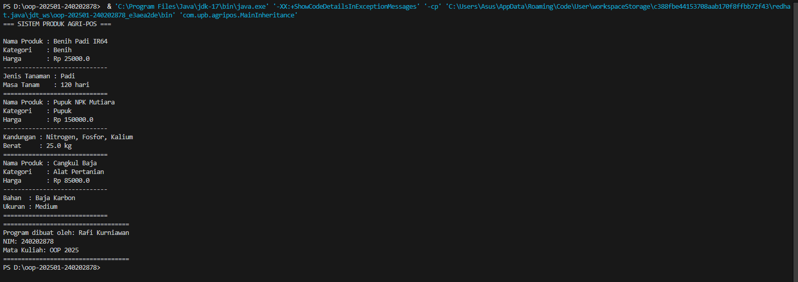

# Laporan Praktikum Minggu 1 (sesuaikan minggu ke berapa?)
Topik: Inheritance

## Identitas
- Nama  : Rafi Kurniawan
- NIM   : 240202878
- Kelas : 3IKRB

---

## Tujuan
- Menghindari duplikasi
- Perubahan cukup di superclass
- Menunjukkan hubungan antar kelas

---

## Dasar Teori
Tuliskan ringkasan teori singkat (3–5 poin) yang mendasari praktikum.  
Contoh: 
1. Inheritance (pewarisan) adalah konsep dalam Object-Oriented Programming (OOP) yang memungkinkan suatu kelas (subclass) mewarisi atribut dan metode dari kelas lain (superclass).
2. Tujuan utama inheritance adalah menghindari duplikasi kode dengan cara menulis logika umum di kelas induk, sehingga bisa digunakan kembali oleh kelas turunan.
3. Inheritance membentuk hubungan hierarki “is-a” (adalah sebuah), misalnya Mobil adalah sebuah Kendaraan.
4. Konsep ini mendukung polymorphism, yaitu kemampuan objek berbeda untuk merespons cara yang sama dengan perilaku yang sesuai kelasnya.
5. Dengan inheritance, program menjadi lebih terstruktur, mudah dikembangkan, dan mudah dipelihara, karena perubahan pada kelas induk dapat otomatis berpengaruh ke kelas turunannya.

---

## Langkah Praktikum
1. Menyiapkan Lingkungan Pemrograman  
2. Membuat Kelas Induk (Superclass)
3. Membuat Kelas Turunan (Subclass)
4. Menguji Pewarisan
5. Mengamati dan Menganalisis Hasil Output

---

## Kode Program
```java
// Produk
package com.upb.agripos.model;

public class Produk {
    protected String nama;
    protected double harga;
    protected String kategori;

    public Produk(String nama, double harga, String kategori) {
        this.nama = nama;
        this.harga = harga;
        this.kategori = kategori;
    }

    public void tampilkanInfo() {
        System.out.println("Nama Produk : " + nama);
        System.out.println("Kategori    : " + kategori);
        System.out.println("Harga       : Rp " + harga);
        System.out.println("-----------------------------");
    }
}
```
```java
// Benih
package com.upb.agripos.model;

public class Benih extends Produk {
    private String jenisTanaman;
    private int masaTanam; // dalam hari

    public Benih(String nama, double harga, String jenisTanaman, int masaTanam) {
        super(nama, harga, "Benih");
        this.jenisTanaman = jenisTanaman;
        this.masaTanam = masaTanam;
    }

    @Override
    public void tampilkanInfo() {
        super.tampilkanInfo();
        System.out.println("Jenis Tanaman : " + jenisTanaman);
        System.out.println("Masa Tanam    : " + masaTanam + " hari");
        System.out.println("=============================");
    }
}
```
```java
// Pupuk
package com.upb.agripos.model;

public class Pupuk extends Produk {
    private String kandungan;
    private double berat; // dalam kilogram

    public Pupuk(String nama, double harga, String kandungan, double berat) {
        super(nama, harga, "Pupuk");
        this.kandungan = kandungan;
        this.berat = berat;
    }

    @Override
    public void tampilkanInfo() {
        super.tampilkanInfo();
        System.out.println("Kandungan : " + kandungan);
        System.out.println("Berat     : " + berat + " kg");
        System.out.println("=============================");
    }
}
```
```java
// Alat Pertanian
package com.upb.agripos.model;

public class AlatPertanian extends Produk {
    private String bahan;
    private String ukuran;

    public AlatPertanian(String nama, double harga, String bahan, String ukuran) {
        super(nama, harga, "Alat Pertanian");
        this.bahan = bahan;
        this.ukuran = ukuran;
    }

    @Override
    public void tampilkanInfo() {
        super.tampilkanInfo();
        System.out.println("Bahan  : " + bahan);
        System.out.println("Ukuran : " + ukuran);
        System.out.println("=============================");
    }
}
```
```java
// CreditBy
package com.upb.agripos.util;

public class CreditBy {
    public static void tampilkanCredit() {
        System.out.println("===================================");
        System.out.println("Program dibuat oleh: Rafi Kurniawan");
        System.out.println("NIM: 240202878");
        System.out.println("Mata Kuliah: OOP 2025");
        System.out.println("===================================");
    }
}
```
```java
// MainInheritance
package com.upb.agripos;

import com.upb.agripos.model.*;
import com.upb.agripos.util.CreditBy;

public class MainInheritance {
    public static void main(String[] args) {
        System.out.println("=== SISTEM PRODUK AGRI-POS ===\n");

        Produk benih = new Benih("Benih Padi IR64", 25000, "Padi", 120);
        Produk pupuk = new Pupuk("Pupuk NPK Mutiara", 150000, "Nitrogen, Fosfor, Kalium", 25);
        Produk alat = new AlatPertanian("Cangkul Baja", 85000, "Baja Karbon", "Medium");

        benih.tampilkanInfo();
        pupuk.tampilkanInfo();
        alat.tampilkanInfo();

        CreditBy.tampilkanCredit();
    }
}
```

---

## Hasil Eksekusi


---

## Analisis
- Pada program ini, terdapat kelas induk (ProdukPertanian) yang memiliki atribut umum seperti nama dan harga, serta metode info() untuk menampilkan data produk.
Kemudian dibuat beberapa kelas turunan (Benih, Pupuk, AlatPertanian, dll) yang mewarisi atribut dan metode dari kelas induk.  
- Minggu kemarin: Membuat beberapa kelas terpisah tanpa hubungan
  Minggu ini: Menerapkan hubungan antar kelas dengan inheritance
- Kendala pada package

---

## Kesimpulan
1. Inheritance (pewarisan) memungkinkan suatu kelas (subclass) untuk mewarisi atribut dan metode dari kelas lain (superclass), sehingga kode menjadi lebih efisien dan terstruktur.
2. Dengan konsep pewarisan, programmer dapat menghindari duplikasi kode karena fungsi umum cukup ditulis sekali di kelas induk dan dapat digunakan oleh semua kelas turunan.
3. Praktikum ini menunjukkan bahwa subclass dapat memperluas atau memodifikasi perilaku superclass melalui method overriding serta memanggil konstruktor induk menggunakan super().
4. Dibandingkan dengan minggu sebelumnya yang hanya membuat kelas terpisah, pendekatan inheritance memberikan organisasi program yang lebih logis, mendukung hubungan “is-a” (adalah sebuah).
5. Secara keseluruhan, penerapan inheritance membantu memudahkan pengembangan, pemeliharaan, dan pengelolaan sistem dalam pemrograman berorientasi objek.

---

## Quiz
1. Apa keuntungan menggunakan inheritance dibanding membuat class terpisah tanpa hubungan? 
   **Jawaban:** …  
   Menghindari duplikasi kode, Memudahkan pemeliharaan (maintenance), Mendukung polymorphism, Dapat memperluas atau memodifikasi perilaku kelas induk.

2. Bagaimana cara subclass memanggil konstruktor superclass?
   **Jawaban:** …  
   menggunakan kata kunci super untuk memanggil konstruktor milik kelas induk (superclass).

3. Berikan contoh kasus di POS pertanian selain Benih, Pupuk, dan Alat Pertanian yang bisa dijadikan subclass.
   **Jawaban:** …  
   Pestisida, MediaTanam, SistemIrigasi, NutrisiTanaman, PakanTernak
