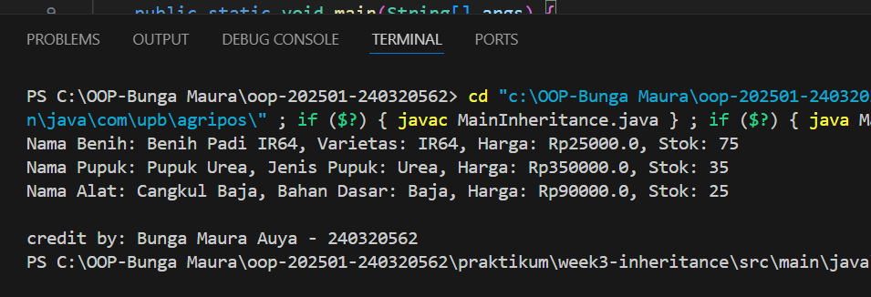

# Laporan Praktikum Minggu 3
Topik: Inheritance (Kategori Produk)

## Identitas
- Nama  : [Bunga Maura Aulya]
- NIM   : [240320562]
- Kelas : [3DSRA]

---

## Tujuan
- Mahasiswa mampu menjelaskan konsep inheritance (pewarisan class) dalam OOP.
- Mahasiswa mampu membuat superclass dan subclass untuk produk pertanian.
- Mahasiswa mampu mendemonstrasikan hierarki class melalui contoh kode.
- Mahasiswa mampu menggunakan super untuk memanggil konstruktor dan method parent class.
- Mahasiswa mampu membuat laporan praktikum yang menjelaskan perbedaan penggunaan inheritance dibanding class tunggal.

---

## Dasar Teori
Inheritance adalah mekanisme dalam OOP yang memungkinkan suatu class mewarisi atribut dan method dari class lain.
- Superclass: class induk yang mendefinisikan atribut umum.
- Subclass: class turunan yang mewarisi atribut/method superclass, dan dapat menambahkan atribut/method baru.
- super digunakan untuk memanggil konstruktor atau method superclass.
Dalam konteks Agri-POS, kita dapat membuat class Produk sebagai superclass, kemudian Benih, Pupuk, dan AlatPertanian sebagai subclass. Hal ini membuat kode lebih reusable dan terstruktur.

---

## Langkah Praktikum
1. Membuat Superclass Produk
   - Gunakan class Produk dari Bab 2 sebagai superclass.
2. Membuat Subclass
   - Benih.java → atribut tambahan: varietas.
   - Pupuk.java → atribut tambahan: jenis pupuk (Urea, NPK, dll).
   - AlatPertanian.java → atribut tambahan: material (baja, kayu, plastik).
3. Membuat Main Class
   - Instansiasi minimal satu objek dari tiap subclass.
   - Tampilkan data produk dengan memanfaatkan inheritance.
4. Menambahkan CreditBy
   - Panggil class CreditBy untuk menampilkan identitas mahasiswa.
5. Commit dan Push
   - Commit dengan pesan: week3-inheritance.

---

## Kode Program
(

```java
public class MainInheritance {
    public static void main(String[] args) {
        Benih b = new Benih("BNH-001","Benih Padi IR64", 25000, 75, "IR64");
        Pupuk p = new Pupuk("PPK-101", "Pupuk Urea", 350000, 35, "Urea");
        AlatPertanian a = new AlatPertanian("ALT-501", "Cangkul Baja", 90000, 25, "Baja");
        
        b.deskripsi();
        p.deskripsi();
        a.deskripsi();

        CreditBy.print("Bunga Maura Auya", "240320562");
    }
}
```
)
---

## Hasil Eksekusi
(Sertakagn screenshot hasil eksekusi program.  

)
---

## Analisis
(
- Jelaskan bagaimana kode berjalan.

      Program tersebut berjalan dimulai dari method main() dalam class MainInheritance, yang berfungsi sebagai titik awal eksekusi. Di dalamnya, dibuat tiga objek dari subclass Benih, Pupuk, dan AlatPertanian, masing-masing mewarisi atribut dan method dari superclass Produk. Saat objek dibuat, constructor di setiap subclass memanggil constructor superclass menggunakan super() untuk menginisialisasi atribut umum seperti kode, nama, harga, dan stok, kemudian menambahkan atribut khusus seperti varietas, jenis, dan material. Setelah itu, program memanggil method getter seperti getNama() dan getVarietas() untuk menampilkan informasi produk ke konsol. Jika terdapat method tambahan seperti deskripsi(), maka method tersebut akan menampilkan informasi lengkap tiap produk sesuai subclass-nya. Terakhir, method CreditBy.print() dipanggil untuk menampilkan identitas saya. Dengan demikian, program ini menggambarkan penerapan konsep pewarisan (inheritance) dan enkapsulasi dalam OOP secara nyata. 

- Apa perbedaan pendekatan minggu ini dibanding minggu sebelumnya.

      Perbedaan pendekatan minggu ini dibanding minggu sebelumnya terletak pada penerapan konsep inheritance (pewarisan). Jika minggu lalu program hanya menggunakan satu class Produk untuk merepresentasikan semua jenis produk pertanian, maka minggu ini setiap jenis produk — seperti Benih, Pupuk, dan AlatPertanian — dibuat dalam subclass masing-masing yang mewarisi atribut dan method dari class Produk. Dengan cara ini, setiap subclass bisa memiliki atribut dan perilaku khusus sesuai kebutuhannya (misalnya varietas untuk Benih, jenis untuk Pupuk, dan material untuk AlatPertanian). Pendekatan minggu ini membuat program lebih terstruktur, mudah dikembangkan, dan mencerminkan dunia nyata dengan lebih baik karena setiap jenis produk memiliki karakteristiknya sendiri tanpa harus menumpuk semua atribut di satu class saja.

- Kendala yang dihadapi dan cara mengatasinya.

      Kendala yang dihadapi dalam praktikum minggu ini adalah munculnya error karena struktur package dan penulisan import yang tidak sesuai. Awalnya, program tidak bisa dijalankan karena file class tidak berada pada jalur folder yang sesuai dengan deklarasi package-nya, sehingga sistem tidak dapat menemukan class yang di-import. Cara mengatasinya adalah dengan memastikan setiap file Java berada di dalam folder yang sesuai dengan nama package-nya, misalnya com.upb.agripos.model untuk class Produk, Benih, Pupuk, dan AlatPertanian. Selain itu, baris import juga harus disesuaikan agar mengarah ke package yang benar. Setelah struktur folder dan import diperbaiki, program dapat dikompilasi dan dijalankan tanpa error.
)
---

## Kesimpulan
(Praktikum minggu ini mengajarkan bagaimana konsep inheritance (pewarisan) dalam OOP dapat digunakan untuk membuat program yang lebih efisien dan terstruktur. Dengan membuat subclass seperti Benih, Pupuk, dan AlatPertanian yang mewarisi atribut dan method dari class Produk, kita dapat mengelola berbagai jenis produk dengan lebih mudah tanpa harus menulis ulang kode yang sama. Pendekatan ini membuat program lebih mudah dikembangkan, dirawat, dan diperluas untuk kebutuhan aplikasi POS yang lebih kompleks di masa depan.)

---

## Quiz
(
1. [Apa keuntungan menggunakan inheritance dibanding membuat class terpisah tanpa hubungan?]  
   **Jawaban:**  Keuntungan utama menggunakan inheritance dibanding membuat class terpisah tanpa hubungan adalah efisiensi dan kemudahan pengelolaan kode. Dengan inheritance, kita bisa menuliskan atribut dan method umum di satu class induk (misalnya Produk), lalu semua class turunan seperti Benih, Pupuk, dan AlatPertanian otomatis mewarisi fungsionalitas tersebut. Hal ini menghindari penulisan kode berulang (code duplication), membuat program lebih rapi, mudah diperbarui, dan mudah dikembangkan. Jadi, kalau nanti ada perubahan pada struktur dasar produk, cukup ubah di class induknya saja tanpa perlu mengedit satu per satu di tiap subclass.

2. [Bagaimana cara subclass memanggil konstruktor superclass?]  
   **Jawaban:** Subclass memanggil konstruktor superclass menggunakan keyword super(), yang ditempatkan di baris pertama konstruktor subclass. Keyword ini berfungsi untuk mengirim data atau nilai dari subclass ke konstruktor milik superclass agar atribut yang diwarisi dapat diinisialisasi dengan benar. Dengan cara ini, subclass tidak perlu menulis ulang kode inisialisasi yang sudah ada di superclass, sehingga program menjadi lebih efisien dan mudah dikelola.  

3. [Berikan contoh kasus di POS pertanian selain Benih, Pupuk, dan Alat Pertanian yang bisa dijadikan subclass.]  
   **Jawaban:** Contoh lain subclass di aplikasi POS pertanian selain Benih, Pupuk, dan Alat Pertanian adalah Pestisida. Subclass ini bisa digunakan untuk menyimpan informasi khusus yang tidak dimiliki produk lain, seperti jenis hama yang dapat dibasmi, bahan aktif yang digunakan, dan dosis pemakaian yang dianjurkan. Dengan cara ini, sistem POS dapat menampilkan data produk yang lebih spesifik dan relevan bagi petani atau pembeli. Selain itu, penggunaan subclass seperti Pestisida juga membuat program lebih fleksibel dan mudah dikembangkan karena setiap jenis produk dapat memiliki atribut dan perilaku unik tanpa harus menulis ulang seluruh struktur class dari awal.

)