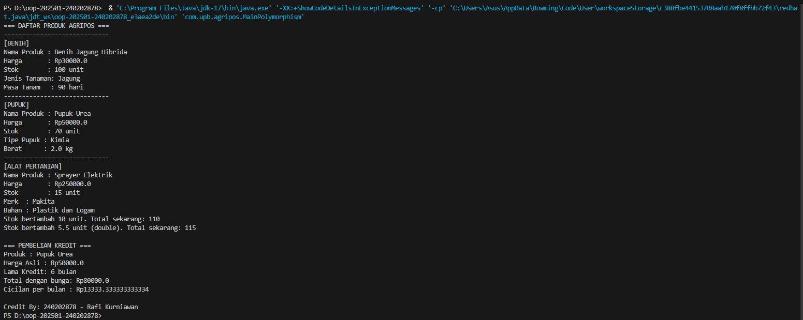

# Laporan Praktikum Minggu 4
Topik: Polymorphism

## Identitas
- Nama  : Rafi Kurniawan
- NIM   : 240202878
- Kelas : 3IKRB

---

## Tujuan
1. Memahami konsep Polymorphism dalam OOP (Object-Oriented Programming)
Mahasiswa mampu menjelaskan dan menerapkan bagaimana satu referensi superclass (Produk) dapat digunakan untuk berbagai objek subclass (Benih, Pupuk, AlatPertanian).

2. Mendemonstrasikan Method Overriding
Mahasiswa dapat menulis ulang (override) method getInfo() dari superclass di setiap subclass untuk menampilkan informasi sesuai jenis produk.

3. Mendemonstrasikan Method Overloading
Mahasiswa dapat membuat dua atau lebih method dengan nama sama tetapi parameter berbeda (contoh: tambahStok(int jumlah) dan tambahStok(double jumlah)).

4. Menunjukkan Konsep Dynamic Binding
Mahasiswa dapat melihat bagaimana Java secara otomatis memanggil method dari objek yang sesuai, meskipun variabelnya bertipe superclass.

5. Menghubungkan Konsep Polymorphism dengan Aplikasi Nyata (POS Agripos)
Mahasiswa dapat mengimplementasikan polymorphism dalam sistem sederhana untuk mengelola produk pertanian dengan berbagai jenis.

---

## Dasar Teori
1. Overriding
   Overriding adalah proses menulis ulang method dari superclass di subclass dengan isi yang berbeda.
   Tujuannya agar subclass memiliki perilaku khusus sesuai dengan kebutuhannya. 
2. Overloading
   Overloading adalah penggunaan nama method yang sama tetapi dengan parameter berbeda (jumlah atau tipe data berbeda).
   Tujuannya agar satu nama method dapat digunakan untuk berbagai kebutuhan.
3. Dynamic Binding
   Dynamic Binding adalah proses penentuan method yang dijalankan berdasarkan tipe objek sebenarnya (subclass), bukan tipe referensinya (superclass).
   Ini membuat polymorphism bersifat dinamis, karena method yang dipanggil dipilih saat runtime.
4. Penerapan dalam Studi Kasus AGRIPOS
   Dalam praktikum ini, sistem AGRIPOS digunakan sebagai contoh.
   Kelas Produk menjadi superclass, sedangkan Benih, Pupuk, dan AlatPertanian menjadi subclass.
   Masing-masing memiliki method getInfo() sendiri (overriding), dan method tambahStok() (overloading).
   Polymorphism terlihat ketika array Produk[] berisi berbagai jenis produk tetapi semua diproses dengan satu perulangan umum.
---

## Langkah Praktikum
1. Membuka Project Week 3 (Inheritance)
   - Gunakan struktur folder yang sudah dibuat pada minggu sebelumnya agar class tetap terhubung.
2. Menambahkan Package Baru
   - Buat package com.upb.agripos.util
   - Tambahkan class baru bernama CreditBy untuk menghitung pembelian kredit produk.
3. Menambahkan Class Baru: MainPolymorphism
   - Letakkan di package com.upb.agripos
   - Class ini berfungsi sebagai driver class untuk menampilkan konsep polymorphism.
4. Menulis Kode Utama
   - Buat array Produk[] daftarProduk yang berisi berbagai objek (Benih, Pupuk, AlatPertanian).
   - Lakukan perulangan for untuk menampilkan informasi setiap produk dengan getInfo().
   - Panggil method tambahStok() dengan tipe parameter berbeda (int dan double).
   - Gunakan CreditBy.beliKredit() untuk menampilkan simulasi pembelian kredit.
5. Menjalankan Program
   - Jalankan MainPolymorphism.java
   - Amati output di terminal: setiap objek menampilkan informasi berbeda sesuai kelasnya (hasil overriding).
   - Terdapat hasil penambahan stok (hasil overloading) dan perhitungan kredit produk.

---

## Kode Program
Tuliskan kode utama yang dibuat:  

```java
// Produk
package com.upb.agripos.model;

public class Produk {
    protected String nama;
    protected double harga;
    protected int stok;

    public Produk(String nama, double harga, int stok) {
        this.nama = nama;
        this.harga = harga;
        this.stok = stok;
    }

    // Getter
    public String getNama() { return nama; }
    public double getHarga() { return harga; }
    public int getStok() { return stok; }

    // ✅ Overloading
    public void tambahStok(int jumlah) {
        this.stok += jumlah;
        System.out.println("Stok bertambah " + jumlah + " unit. Total sekarang: " + stok);
    }

    public void tambahStok(double jumlah) {
        this.stok += (int) jumlah;
        System.out.println("Stok bertambah " + jumlah + " unit (double). Total sekarang: " + stok);
    }

    // ✅ Method yang akan dioverride
    public void getInfo() {
        System.out.println("Nama Produk : " + nama);
        System.out.println("Harga       : Rp" + harga);
        System.out.println("Stok        : " + stok + " unit");
    }
}

```java
// Benih
package com.upb.agripos.model;

public class Benih extends Produk {
    private String jenisTanaman;
    private int masaTanam;

    public Benih(String nama, double harga, int stok, String jenisTanaman, int masaTanam) {
        super(nama, harga, stok);
        this.jenisTanaman = jenisTanaman;
        this.masaTanam = masaTanam;
    }

    // ✅ Overriding
    @Override
    public void getInfo() {
        System.out.println("[BENIH]");
        super.getInfo();
        System.out.println("Jenis Tanaman: " + jenisTanaman);
        System.out.println("Masa Tanam   : " + masaTanam + " hari");
    }
}

```java
// Pupuk
package com.upb.agripos.model;

public class Pupuk extends Produk {
    private String tipe;
    private double berat;

    public Pupuk(String nama, double harga, int stok, String tipe, double berat) {
        super(nama, harga, stok);
        this.tipe = tipe;
        this.berat = berat;
    }

    @Override
    public void getInfo() {
        System.out.println("[PUPUK]");
        super.getInfo();
        System.out.println("Tipe Pupuk : " + tipe);
        System.out.println("Berat      : " + berat + " kg");
    }
}

```java
// Alat Pertanian
package com.upb.agripos.model;

public class AlatPertanian extends Produk {
    private String merk;
    private String bahan;

    public AlatPertanian(String nama, double harga, int stok, String merk, String bahan) {
        super(nama, harga, stok);
        this.merk = merk;
        this.bahan = bahan;
    }

    @Override
    public void getInfo() {
        System.out.println("[ALAT PERTANIAN]");
        super.getInfo();
        System.out.println("Merk  : " + merk);
        System.out.println("Bahan : " + bahan);
    }
}

```java
// CreditBy
package com.upb.agripos.util;

import com.upb.agripos.model.Produk;

public class CreditBy {
    public static void print(String nim, String nama) {
        System.out.println("\nCredit By: " + nim + " - " + nama);
    }

    public static void beliKredit(Produk p, int bulan) {
        double bunga = 0.1;
        double total = p.getHarga() + (p.getHarga() * bunga * bulan);
        double cicilan = total / bulan;

        System.out.println("\n=== PEMBELIAN KREDIT ===");
        System.out.println("Produk : " + p.getNama());
        System.out.println("Harga Asli : Rp" + p.getHarga());
        System.out.println("Lama Kredit: " + bulan + " bulan");
        System.out.println("Total dengan bunga: Rp" + total);
        System.out.println("Cicilan per bulan : Rp" + cicilan);
    }
}

 ```java
 // Main Polymorphism
 package com.upb.agripos;

import com.upb.agripos.model.*;
import com.upb.agripos.util.CreditBy;

public class MainPolymorphism {
    public static void main(String[] args) {
        Produk[] daftarProduk = {
            new Benih("Benih Jagung Hibrida", 30000, 100, "Jagung", 90),
            new Pupuk("Pupuk Urea", 50000, 70, "Kimia", 2.0),
            new AlatPertanian("Sprayer Elektrik", 250000, 15, "Makita", "Plastik dan Logam")
        };

        System.out.println("=== DAFTAR PRODUK AGRIPOS ===");
        for (Produk p : daftarProduk) {
            System.out.println("-----------------------------");
            p.getInfo(); // ✅ Dynamic Binding (otomatis panggil versi subclass)
        }

        // ✅ Overloading demo
        daftarProduk[0].tambahStok(10);
        daftarProduk[0].tambahStok(5.5);

        // ✅ Kredit demo
        CreditBy.beliKredit(daftarProduk[1], 6);
        CreditBy.print("240202878", "Rafi Kurniawan");
    }
}
```

---

## Hasil Eksekusi
(Sertakan screenshot hasil eksekusi program.  

)
---

## Analisis
- Kode berjalan dengan menggunakan konsep dynamic binding, di mana method yang dijalankan ditentukan oleh tipe objek aktual.
- Pendekatan minggu ini lebih menekankan pada perilaku objek (behavior) daripada pewarisan atribut.
- Kendala utama muncul karena akses atribut dan kesalahan package, yang berhasil diselesaikan dengan menambah getter dan memastikan struktur folder benar.

---

## Kesimpulan
1. Polymorphism memungkinkan objek-objek dari kelas turunan untuk diperlakukan sebagai objek dari kelas induk, namun tetap mempertahankan perilaku unik masing-masing kelas.
   Dengan cara ini, program menjadi lebih fleksibel, efisien, dan mudah dikembangkan.
2. Melalui penerapan method overriding, setiap subclass dapat memiliki implementasi berbeda terhadap method yang sama, sehingga menampilkan hasil sesuai jenis objek sebenarnya.
   Sedangkan method overloading memberikan kemampuan untuk menggunakan nama method yang sama dengan parameter berbeda.
3. Program praktikum berhasil menampilkan perilaku polymorphism dengan memanggil method getInfo() dari berbagai objek (Benih, Pupuk, AlatPertanian) yang disimpan dalam satu
   array bertipe Produk.
4. Dibandingkan minggu sebelumnya (inheritance), minggu ini menekankan pada perbedaan perilaku antar kelas, bukan sekadar pewarisan atribut.
5. Dari praktikum ini dapat disimpulkan bahwa polymorphism adalah salah satu konsep inti OOP yang meningkatkan reusabilitas, modularitas, dan fleksibilitas dalam pemrograman
   Java.
---

## Quiz
1. Apa perbedaan overloading dan overriding?   
   **Jawaban:** …  
   Overloading dan Overriding sama-sama menggunakan nama method yang sama, tetapi berbeda tujuannya:
   - Overloading terjadi dalam kelas yang sama, ketika dua atau lebih method memiliki nama sama namun parameter berbeda (baik jumlah maupun tipe datanya).
     ➤ Tujuannya untuk meningkatkan fleksibilitas dalam pemanggilan method.
   - Overriding terjadi antara kelas induk dan kelas turunan, ketika subclass menulis ulang method dari superclass dengan nama dan parameter yang sama namun dengan isi berbeda.
     ➤ Tujuannya untuk mengubah perilaku method agar sesuai dengan karakter subclass.

2. Bagaimana Java menentukan method mana yang dipanggil dalam dynamic binding?  
   **Jawaban:** …  
   Java menggunakan Dynamic Method Dispatch atau Dynamic Binding, yaitu mekanisme untuk menentukan method mana yang dipanggil berdasarkan tipe objek sebenarnya di waktu runtime, bukan berdasarkan tipe referensi variabel.
   Artinya: Walaupun objek disimpan dalam referensi bertipe superclass, Java tetap memanggil method yang sesuai dengan objek aslinya (subclass).

3. Berikan contoh kasus polymorphism dalam sistem POS selain produk pertanian.  
   **Jawaban:** …  
   Kasus: Sistem POS (Point of Sale) pada toko elektronik.
   Dalam sistem ini, terdapat berbagai jenis produk seperti Smartphone, Laptop, dan Aksesoris, yang semuanya merupakan turunan dari kelas ProdukElektronik.
