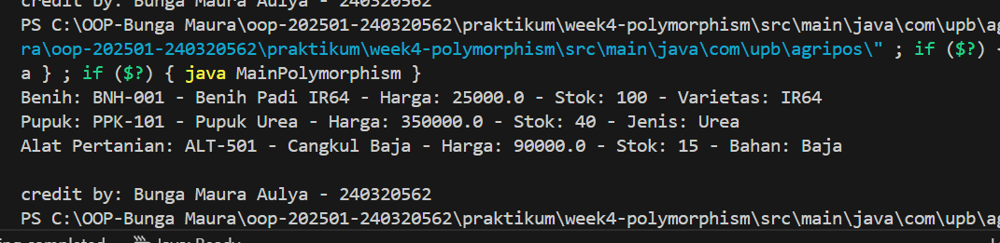

# Laporan Praktikum Minggu 4
Topik: Polymorphism (Info Produk)

## Identitas
- Nama  : [Bunga Maura Aulya]
- NIM   : [240320562]
- Kelas : [3DSRA]

---

## Tujuan
- Mahasiswa mampu **menjelaskan konsep polymorphism** dalam OOP.  
- Mahasiswa mampu **membedakan method overloading dan overriding**.  
- Mahasiswa mampu **mengimplementasikan polymorphism (overriding, overloading, dynamic binding)** dalam program.  
- Mahasiswa mampu **menganalisis contoh kasus polymorphism** pada sistem nyata (Agri-POS).  

---

## Dasar Teori
Polymorphism berarti “banyak bentuk” dan memungkinkan objek yang berbeda merespons panggilan method yang sama dengan cara yang berbeda.  
1. **Overloading** → mendefinisikan method dengan nama sama tetapi parameter berbeda.  
2. **Overriding** → subclass mengganti implementasi method dari superclass.  
3. **Dynamic Binding** → pemanggilan method ditentukan saat runtime, bukan compile time.  

Dalam konteks Agri-POS, misalnya:  
- Method `getInfo()` pada `Produk` dioverride oleh `Benih`, `Pupuk`, `AlatPertanian` untuk menampilkan detail spesifik.  
- Method `tambahStok()` bisa dibuat overload dengan parameter berbeda (int, double). 

---

## Langkah Praktikum
1. **Overloading**  
   - Tambahkan method `tambahStok(int jumlah)` dan `tambahStok(double jumlah)` pada class `Produk`.  

2. **Overriding**  
   - Tambahkan method `getInfo()` pada superclass `Produk`.  
   - Override method `getInfo()` pada subclass `Benih`, `Pupuk`, dan `AlatPertanian`.  

3. **Dynamic Binding**  
   - Buat array `Produk[] daftarProduk` yang berisi objek `Benih`, `Pupuk`, dan `AlatPertanian`.  
   - Loop array tersebut dan panggil `getInfo()`. Perhatikan bagaimana Java memanggil method sesuai jenis objek aktual.  

4. **Main Class**  
   - Buat `MainPolymorphism.java` untuk mendemonstrasikan overloading, overriding, dan dynamic binding.  

5. **CreditBy**  
   - Tetap panggil `CreditBy.print("<NIM>", "<Nama>")`.  

6. **Commit dan Push**  
   - Commit dengan pesan: `week4-polymorphism`.  

---

## Kode Program
(Tuliskan kode utama yang dibuat, contoh:  

```java
public class MainPolymorphism {
       public static void main(String[] args) {
           Produk[] daftarProduk = new Produk[]{
               new Benih("BNH-001", "Benih Padi IR64", 25000, 100, "IR64"),
               new Pupuk("PPK-101", "Pupuk Urea", 350000, 40, "Urea"),
               new AlatPertanian("ALT-501", "Cangkul Baja", 90000, 15, "Baja")
           };

           for (Produk p : daftarProduk) {
            String info = p.getInfo();
            System.out.println(p.getInfo());  // Dynamic binding
           }

           CreditBy.print("Bunga Maura Aulya", "240320562");
       }
   }
```
)
---

## Hasil Eksekusi
(Sertakan screenshot hasil eksekusi program.  

)
---

## Analisis
(
- Jelaskan bagaimana kode berjalan.  
   Program MainPolymorphism berjalan dengan konsep utama polymorphism dalam pemrograman berorientasi objek. Saat dijalankan, program pertama-tama membuat tiga objek dari subclass `Benih`, `Pupuk`, dan `AlatPertanian` yang semuanya merupakan turunan dari superclass Produk. Ketiga objek ini disimpan dalam satu array bertipe `Produk[]`, yang memungkinkan berbagai jenis produk diperlakukan secara umum menggunakan tipe induknya. Kemudian, program melakukan loop untuk setiap elemen dalam array dan memanggil method `getInfo()`. Karena method ini telah di-override pada masing-masing subclass, Java akan menjalankan versi `getInfo()` yang sesuai dengan tipe objek sebenarnya (inilah proses *dynamic binding*). Hasilnya, informasi tiap produk ditampilkan sesuai dengan jenisnya, bukan hanya versi umum dari superclass. Terakhir, method `CreditBy.print()` dipanggil untuk menampilkan identitas pembuat program di bagian akhir output.

- Apa perbedaan pendekatan minggu ini dibanding minggu sebelumnya.  
   Perbedaan pendekatan minggu ini dibanding minggu sebelumnya terletak pada konsep yang digunakan. Minggu lalu fokus pada inheritance, yaitu bagaimana class-class seperti `Benih`, `Pupuk`, dan `AlatPertanian` dapat mewarisi atribut dan method dari `class Produk` agar kode lebih efisien dan terstruktur. Sedangkan minggu ini menggunakan polymorphism, yaitu kemampuan objek-objek turunan tersebut untuk memiliki perilaku berbeda meskipun dipanggil dengan cara yang sama. Misalnya, saat memanggil method `getInfo()` pada array `Produk[]`, setiap objek (Benih, Pupuk, AlatPertanian) menampilkan informasi sesuai jenisnya masing-masing. Dengan demikian, polymorphism membuat program lebih fleksibel dan mudah dikembangkan.

- Kendala yang dihadapi dan cara mengatasinya.  
   Kendala yang dihadapi dalam praktikum minggu ini adalah munculnya error pada saat menjalankan program karena method `getInfo()` pada subclass belum sesuai dengan superclass, sehingga muncul pesan kesalahan `@Override` tidak dikenali. Selain itu, sempat terjadi kebingungan saat mengatur struktur folder dan package agar semua class dapat saling terhubung. Cara mengatasinya adalah dengan memastikan semua file berada pada package dan folder yang benar sesuai deklarasi package, serta menambahkan method `getInfo()` di superclass Produk terlebih dahulu sebelum melakukan overriding di subclass. Setelah struktur dan method diperbaiki, program dapat berjalan dengan benar dan menampilkan output sesuai konsep polymorphism.
)
---

## Kesimpulan
(Tuliskan kesimpulan dari praktikum minggu ini.  

Kesimpulan dari praktikum minggu ini adalah bahwa konsep polymorphism membuat program berorientasi objek menjadi lebih fleksibel dan efisien. Dengan polymorphism, satu referensi dari superclass dapat digunakan untuk memanggil method dari berbagai subclass yang berbeda sesuai jenis objeknya. Selain itu, penggunaan overloading dan overriding membantu pengembang membuat kode yang lebih dinamis dan mudah dikembangkan tanpa perlu menulis ulang banyak baris kode. Secara keseluruhan, polymorphism mempermudah pengelolaan berbagai jenis objek dalam sistem POS pertanian dengan struktur yang rapi dan mudah diperluas.)

---

## Quiz
1. Apa perbedaan overloading dan overriding?  
   **Jawaban:** Overloading terjadi ketika ada dua atau lebih method dengan nama yang sama, tetapi memiliki parameter yang berbeda (baik dari segi jumlah atau tipe datanya) dalam satu class. Tujuannya adalah memberikan fleksibilitas agar method bisa digunakan untuk berbagai jenis input tanpa membuat nama method baru.
   Sedangkan overriding terjadi ketika subclass menulis ulang method dari superclass dengan nama, parameter, dan tipe return yang sama, tetapi dengan isi (implementasi) yang berbeda. Tujuannya adalah menyesuaikan perilaku method agar sesuai dengan kebutuhan subclass tanpa mengubah struktur dasar dari superclass.

2. Bagaimana Java menentukan method mana yang dipanggil dalam dynamic binding?  
   **Jawaban:** Dalam dynamic binding, Java menentukan method mana yang dipanggil berdasarkan tipe objek sebenarnya (runtime type), bukan tipe referensinya (compile-time type). Artinya, meskipun sebuah variabel dideklarasikan sebagai tipe superclass (misalnya `Produk p`), jika objek yang disimpan di dalamnya adalah instance dari subclass (misalnya new `Benih()`), maka method yang dijalankan adalah milik subclass tersebut. Proses ini memungkinkan Java untuk menerapkan polymorphsim, di mana satu referensi bisa merujuk ke berbagai jenis objek, dan setiap objek dapat menjalankan versi method-nya sendiri sesuai dengan kelas aslinya.

3. Berikan contoh kasus polymorphism dalam sistem POS selain produk pertanian.  
   **Jawaban:** Contoh kasus polymorphism dalam sistem POS selain produk pertanian bisa ditemukan pada sistem kasir minimarket. Misalnya, ada superclass bernama Barang yang memiliki method `getInfo()`. Dari kelas ini, dibuat beberapa subclass seperti `Makanan`, `Minuman`, dan `PeralatanRumahTangga`.
   Masing-masing subclass dapat meng-override method `getInfo()` untuk menampilkan informasi yang berbeda sesuai jenis barangnya, misalnya `Makanan` menampilkan tanggal kedaluwarsa, `Minuman` menampilkan volume, dan `PeralatanRumahTangga` menampilkan bahan pembuatnya.
   Ketika sistem POS memproses semua barang melalui array `Barang[]` `daftarBarang`, method `getInfo()` yang dipanggil akan disesuaikan secara otomatis dengan tipe objek sebenarnya. Dengan demikian, kasir dapat menampilkan detail setiap barang dengan format yang tepat tanpa perlu menulis kode terpisah untuk setiap jenis barang.
