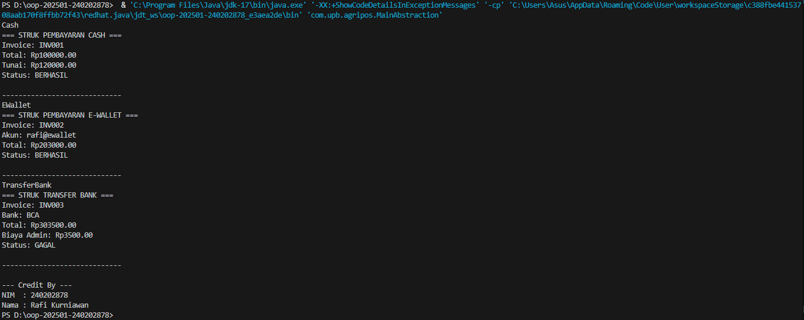

# Laporan Praktikum Minggu 5
Topik: Abstraction-Interface

## Identitas
- Nama  : Rafi Kurniawan
- NIM   : 240202878
- Kelas : 3IKRB

---

## Tujuan
1. Mahasiswa memahami konsep abstraksi dalam pemrograman berorientasi objek (OOP).
2. Mahasiswa dapat membedakan penggunaan abstract class dan interface di Java.
3. Mahasiswa mampu mengimplementasikan konsep abstraksi dengan membuat program yang memanfaatkan abstract class dan interface.
4. Mahasiswa dapat memahami manfaat abstraksi dalam mengurangi kompleksitas kode.

---

## Dasar Teori
1. Abstraksi adalah proses menyembunyikan detail implementasi dan hanya menampilkan fungsionalitas penting kepada pengguna.
2. Abstract class adalah kelas yang tidak dapat diinstansiasi secara langsung dan dapat memiliki method abstract (tanpa implementasi) serta method konkret (dengan implementasi).
3. Interface adalah kumpulan method abstract (tanpa implementasi) yang harus diimplementasikan oleh kelas lain.
4. Java tidak mendukung multiple inheritance pada kelas, namun dapat dilakukan melalui multiple interface.
5. Abstraksi membantu membuat sistem yang lebih modular, mudah diperluas, dan terstruktur.

---

## Langkah Praktikum
1. Persiapan Awal
   - Buka aplikasi IDE seperti Visual Studio Code atau NetBeans.
   - Buat proyek baru dengan nama Week5_Abstraction_Interface.
   - Pastikan Java Development Kit (JDK) telah terinstal dan dikonfigurasi pada sistem.

2. Membuat Struktur Program
   Buat beberapa file Java sesuai kebutuhan praktikum, yaitu:
   - File untuk kelas abstrak (abstract class).
   - File untuk interface.
   - File untuk kelas turunan (subclass) yang mengimplementasikan interface dan menurunkan abstract class.
   - File utama (main class) untuk menjalankan program.

3. Menulis Kode Program
   - Tulis kode pada setiap file sesuai konsep abstraksi dan interface.
   - Kelas abstrak berisi atribut dan method umum yang dapat diturunkan.
   - Interface berisi deklarasi method yang harus diimplementasikan oleh kelas lain.
   - Kelas turunan mengimplementasikan interface dan mewarisi abstract class.
   - Program utama digunakan untuk membuat objek dan menampilkan hasil eksekusi.

4. Kompilasi dan Eksekusi Program
   - Buka terminal atau console di dalam direktori proyek.
   - Lakukan proses kompilasi seluruh file Java.
   - Jalankan file utama untuk menampilkan hasil program di layar.
   - Pastikan tidak ada error selama proses kompilasi maupun eksekusi.

5. Pengujian dan Analisis Hasil
   - Amati hasil keluaran (output) dari program.
   - Periksa apakah method yang diimplementasikan berjalan sesuai konsep abstraksi dan interface.
   - Catat hasil pengujian yang sesuai untuk dimasukkan ke bagian Hasil Eksekusi dan Analisis laporan.

6. Penyimpanan dan Dokumentasi
   - Simpan seluruh file program setelah berjalan dengan benar.
   - Lakukan commit dan push ke GitHub dengan pesan yang sesuai, misalnya: “Implementasi Abstraction dan Interface pada sistem pembayaran (Week 5)”.
   - Ambil tangkapan layar hasil eksekusi untuk dilampirkan pada laporan praktikum.

---

## Kode Program
Model/Pembayaran
```java
// Pembayaran
package com.upb.agripos.model.pembayaran;

/**
 * Abstract class untuk semua jenis pembayaran.
 */
public abstract class Pembayaran {
    protected String invoiceNo;
    protected double total;

    public Pembayaran(String invoiceNo, double total) {
        this.invoiceNo = invoiceNo;
        this.total = total;
    }

    // Method abstrak
    public abstract double biaya();                 // biaya tambahan
    public abstract boolean prosesPembayaran();     // status berhasil/gagal

    // Method konkrit
    public double totalBayar() {
        return total + biaya();
    }

    public String getInvoiceNo() { return invoiceNo; }
    public double getTotal() { return total; }
}
// Cash
package com.upb.agripos.model.pembayaran;

import com.upb.agripos.model.kontrak.Receiptable;

public class Cash extends Pembayaran implements Receiptable {
    private double tunai;

    public Cash(String invoiceNo, double total, double tunai) {
        super(invoiceNo, total);
        this.tunai = tunai;
    }

    @Override
    public double biaya() {
        return 0; // tidak ada biaya tambahan
    }

    @Override
    public boolean prosesPembayaran() {
        return tunai >= totalBayar();
    }

    @Override
    public String cetakStruk() {
        return String.format(
            "=== STRUK PEMBAYARAN CASH ===\nInvoice: %s\nTotal: Rp%.2f\nTunai: Rp%.2f\nStatus: %s\n",
            invoiceNo, totalBayar(), tunai, prosesPembayaran() ? "BERHASIL" : "GAGAL"
        );
    }
}
// EWallet
package com.upb.agripos.model.pembayaran;

import com.upb.agripos.model.kontrak.Validatable;
import com.upb.agripos.model.kontrak.Receiptable;

public class EWallet extends Pembayaran implements Validatable, Receiptable {
    private String akun;
    private boolean otpValid;

    public EWallet(String invoiceNo, double total, String akun, boolean otpValid) {
        super(invoiceNo, total);
        this.akun = akun;
        this.otpValid = otpValid;
    }

    @Override
    public double biaya() {
        return total * 0.015; // 1.5% fee
    }

    @Override
    public boolean validasi() {
        return otpValid;
    }

    @Override
    public boolean prosesPembayaran() {
        return validasi();
    }

    @Override
    public String cetakStruk() {
        return String.format(
            "=== STRUK PEMBAYARAN E-WALLET ===\nInvoice: %s\nAkun: %s\nTotal: Rp%.2f\nStatus: %s\n",
            invoiceNo, akun, totalBayar(), prosesPembayaran() ? "BERHASIL" : "GAGAL"
        );
    }
}
// Transfer Bank
package com.upb.agripos.model.pembayaran;

import com.upb.agripos.model.kontrak.Receiptable;
import com.upb.agripos.model.kontrak.Validatable;

public class TransferBank extends Pembayaran implements Validatable, Receiptable {
    private String bank;
    private boolean otpValid;
    private static final double BIAYA_TETAP = 3500;

    public TransferBank(String invoiceNo, double total, String bank, boolean otpValid) {
        super(invoiceNo, total);
        this.bank = bank;
        this.otpValid = otpValid;
    }

    @Override
    public double biaya() {
        return BIAYA_TETAP;
    }

    @Override
    public boolean validasi() {
        return otpValid;
    }

    @Override
    public boolean prosesPembayaran() {
        return validasi();
    }

    @Override
    public String cetakStruk() {
        return String.format(
            "=== STRUK TRANSFER BANK ===\nInvoice: %s\nBank: %s\nTotal: Rp%.2f\nBiaya Admin: Rp%.2f\nStatus: %s\n",
            invoiceNo, bank, totalBayar(), BIAYA_TETAP, prosesPembayaran() ? "BERHASIL" : "GAGAL"
        );
    }
}

```

Model/Kontrak
```java
// Receiptable
package com.upb.agripos.model.kontrak;

/**
 * Interface untuk mencetak struk pembayaran.
 */
public interface Receiptable {
    String cetakStruk();
}
// Validatable
package com.upb.agripos.model.kontrak;

/**
 * Interface untuk proses validasi, contoh: OTP, PIN, atau token.
 */
public interface Validatable {
    boolean validasi();
}

```

Util
```java
// CreditBy
package com.upb.agripos.util;

public class CreditBy {
    public static void print(String nim, String nama) {
        System.out.println("\n--- Credit By ---");
        System.out.println("NIM  : " + nim);
        System.out.println("Nama : " + nama);
    }
}

```

MainAbstraction
```java
package com.upb.agripos;

import com.upb.agripos.model.kontrak.Receiptable;
import com.upb.agripos.model.pembayaran.Cash;
import com.upb.agripos.model.pembayaran.EWallet;
import com.upb.agripos.model.pembayaran.Pembayaran;
import com.upb.agripos.model.pembayaran.TransferBank;
import com.upb.agripos.util.CreditBy;

public class MainAbstraction {
    public static void main(String[] args) {
        Pembayaran[] daftarPembayaran = new Pembayaran[] {
            new Cash("INV001", 100000, 120000),
            new EWallet("INV002", 200000, "rafi@ewallet", true),
            new TransferBank("INV003", 300000, "BCA", false)
        };

        for (Pembayaran p : daftarPembayaran) {
            System.out.println(p.getClass().getSimpleName());
            if (p instanceof Receiptable r) {
                System.out.println(r.cetakStruk());
            } else {
                System.out.println("Struk tidak tersedia.");
            }
            System.out.println("-----------------------------");
        }

        CreditBy.print("240202878", "Rafi Kurniawan");
    }
}
```
---

## Hasil Eksekusi


---

## Analisis
1. Program menggunakan abstraksi untuk memisahkan logika umum (kelas Pembayaran) dengan implementasi spesifik (Kredit).

2. Pembayaran menjadi abstract class karena berisi method abstrak prosesPembayaran() dan method konkret tampilkanJumlah().

3. Cicilan menjadi interface karena hanya mendefinisikan perilaku (hitungCicilan) tanpa implementasi.

4. Kredit mengimplementasikan keduanya untuk menyediakan fungsi pembayaran kredit yang nyata.

5. Dibanding minggu sebelumnya (abstract class saja), minggu ini menambahkan interface, sehingga memungkinkan multiple inheritance dan fleksibilitas desain lebih besar.

6. Kendala: sempat lupa menuliskan @Override dan salah penempatan tanda {}, namun bisa diperbaiki setelah melihat error di compiler.

---

## Kesimpulan
- Abstraksi membantu menyederhanakan kompleksitas dengan hanya menampilkan bagian penting dari sebuah objek.

- Abstract class digunakan ketika ada perilaku umum dengan sebagian implementasi.

- Interface digunakan untuk mendefinisikan kontrak perilaku yang harus diikuti oleh kelas lain.

- Dengan menggabungkan keduanya, program menjadi lebih fleksibel, mudah dikembangkan, dan mengikuti prinsip OOP dengan baik.

---

## Quiz
1. Jelaskan perbedaan konsep dan penggunaan **abstract class** dan **interface**.  
   **Jawaban:** …  
   - Abstract class dapat memiliki atribut, konstruktor, dan method dengan implementasi maupun tanpa implementasi.
   - Interface hanya berisi method tanpa implementasi (hingga Java 7), dan digunakan untuk mendefinisikan kontrak perilaku.
   - Abstract class digunakan untuk hubungan “is-a” dengan pewarisan langsung, sedangkan interface untuk hubungan “can-do” (kemampuan tambahan).

2. Mengapa **multiple inheritance** lebih aman dilakukan dengan interface pada Java? 
   **Jawaban:** …  
   Karena Java tidak mengizinkan pewarisan ganda antar class untuk menghindari diamond problem. Dengan interface, tidak ada implementasi yang diwariskan langsung, sehingga tidak terjadi konflik antar metode.

3. Pada contoh Agri-POS, bagian mana yang **paling tepat** menjadi abstract class dan mana yang menjadi interface? Jelaskan alasannya. 
   **Jawaban:** …  
   - Abstract class: Transaksi atau Pembayaran, karena keduanya memiliki atribut dan perilaku dasar yang dapat diwariskan ke kelas turunan.
   - Interface: CetakStruk atau LayananOnline, karena hanya mendefinisikan fungsi tanpa perlu implementasi (misalnya cetakStruk(), kirimNotifikasi()).
