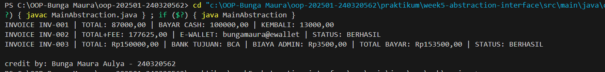

# Laporan Praktikum Minggu 5
Topik: Abstraction (Abstract Class & Interface)

## Identitas
- Nama  : [Bunga Maura Aulya]
- NIM   : [240320562]
- Kelas : [3DSRA]

---

## Tujuan
- Mahasiswa mampu **menjelaskan perbedaan abstract class dan interface**.
- Mahasiswa mampu **mendesain abstract class dengan method abstrak** sesuai kebutuhan kasus.
- Mahasiswa mampu **membuat interface dan mengimplementasikannya pada class**.
- Mahasiswa mampu **menerapkan multiple inheritance melalui interface** pada rancangan kelas.
- Mahasiswa mampu **mendokumentasikan kode** (komentar kelas/method, README singkat pada folder minggu).

---

## Dasar Teori
**Abstraksi** adalah proses menyederhanakan kompleksitas dengan menampilkan elemen penting dan menyembunyikan detail implementasi.
- **Abstract class**: tidak dapat diinstansiasi, dapat memiliki method abstrak (tanpa badan) dan non-abstrak. Dapat menyimpan state (field).
- **Interface**: kumpulan kontrak (method tanpa implementasi konkret). Sejak Java 8 mendukung default method. Mendukung **multiple inheritance** (class dapat mengimplementasikan banyak interface).
- Gunakan **abstract class** bila ada _shared state_ dan perilaku dasar; gunakan **interface** untuk mendefinisikan kemampuan/kontrak lintas hierarki.

Dalam konteks Agri-POS, **Pembayaran** dapat dimodelkan sebagai abstract class dengan method abstrak `prosesPembayaran()` dan `biaya()`. Implementasi konkritnya: `Cash` dan `EWallet`. Kemudian, interface seperti `Validatable` (mis. verifikasi OTP) dan `Receiptable` (mencetak bukti) dapat diimplementasikan oleh jenis pembayaran yang relevan.

---

## Langkah Praktikum
1. **Abstract Class – Pembayaran**
   - Buat `Pembayaran` (abstract) dengan field `invoiceNo`, `total` dan method:
     - `double biaya()` (abstrak) → biaya tambahan (fee).
     - `boolean prosesPembayaran()` (abstrak) → mengembalikan status berhasil/gagal.
     - `double totalBayar()` (konkrit) → `return total + biaya();`.

2. **Subclass Konkret**
   - `Cash` → biaya = 0, proses = selalu berhasil jika `tunai >= totalBayar()`.
   - `EWallet` → biaya = 1.5% dari `total`; proses = membutuhkan validasi.

3. **Interface**
   - `Validatable` → `boolean validasi();` (contoh: OTP).
   - `Receiptable` → `String cetakStruk();`

4. **Multiple Inheritance via Interface**
   - `EWallet` mengimplementasikan **dua interface**: `Validatable`, `Receiptable`.
   - `Cash` setidaknya mengimplementasikan `Receiptable`.

5. **Main Class**
   - Buat `MainAbstraction.java` untuk mendemonstrasikan pemakaian `Pembayaran` (polimorfik).
   - Tampilkan hasil proses dan struk. Di akhir, panggil `CreditBy.print("<NIM>", "<Nama>")`.

6. **Commit dan Push**
   - Commit dengan pesan: `week5-abstraction-interface`.

---

## Kode Program
(Tuliskan kode utama yang dibuat

```java
import model.kontrak.Receiptable;
import model.pembayaran.Cash;
import model.pembayaran.EWallet;
import model.pembayaran.Pembayaran;
import model.pembayaran.TransferBank;
import util.CreditBy;

public class MainAbstraction {
    public static void main(String[] args) {
        Pembayaran cash = new Cash("INV-001", 87000, 100000);
        Pembayaran ew = new EWallet("INV-002", 175000, "bungamaura@ewallet", "123456");
        Pembayaran transfer = new TransferBank("INV-003", 150000, "BCA", true);


        System.out.println(((Receiptable) cash).cetakStruk());
        System.out.println(((Receiptable) ew).cetakStruk());
        System.out.println(((Receiptable) transfer).cetakStruk());
    
        CreditBy.print("Bunga Maura Aulya", "240320562");
    }
}
```
)
---

## Hasil Eksekusi
(Sertakan screenshot hasil eksekusi program.  

)
---

## Analisis
(
- Jelaskan bagaimana kode berjalan.  
Program ini menerapkan konsep abstraction dan interface untuk menggambarkan berbagai metode pembayaran seperti `Cash`, `E-Wallet`, dan `TransferBank`. Kelas abstrak Pembayaran berisi atribut dan metode dasar seperti `biaya()` dan `prosesPembayaran()` yang di-override oleh subclass sesuai jenis transaksi. Interface Validatable dan Receiptable digunakan untuk menambah perilaku seperti validasi dan pencetakan struk.

- Apa perbedaan pendekatan minggu ini dibanding minggu sebelumnya.  
Berbeda dengan minggu sebelumnya yang fokus pada inheritance dan polymorphism, minggu ini lebih menekankan pada penyembunyian detail implementasi serta pembentukan kontrak perilaku antar kelas.

- Kendala yang dihadapi dan cara mengatasinya.  
Kendala yang muncul seperti error cannot find symbol dan ketidaksesuaian package diatasi dengan memperbaiki struktur folder, menambahkan import yang tepat, serta memastikan nama method konsisten agar program dapat berjalan tanpa error.

)
---

## Kesimpulan
Kesimpulan dari praktikum minggu ini adalah bahwa penerapan konsep **abstraction** dan **interface** dapat mempermudah proses pengembangan program dengan membuat struktur kode lebih terorganisir dan mudah dikembangkan. Melalui pembuatan kelas abstrak dan penerapan interface pada berbagai metode pembayaran, program dapat menampilkan perilaku berbeda sesuai kebutuhan tanpa mengubah kerangka utama yang sudah ada.


---

## Quiz
1. Jelaskan perbedaan konsep dan penggunaan **abstract class** dan **interface**.  
   **Jawaban:** Perbedaan utama antara abstract class dan interface terletak pada tujuan dan cara penggunaannya.
Abstract class digunakan ketika beberapa kelas memiliki kesamaan atribut dan perilaku dasar, tetapi tetap memerlukan implementasi berbeda pada sebagian metodenya. Abstract class dapat memiliki atribut, konstruktor, serta method biasa dan abstract.
Sementara itu, interface digunakan untuk mendefinisikan kontrak perilaku yang harus diikuti oleh kelas yang mengimplementasikannya. Interface tidak menyimpan data atau logika, hanya berisi deklarasi method tanpa isi (kecuali default method pada Java modern). Dalam praktiknya, abstract class lebih cocok digunakan untuk shared behavior, sedangkan interface digunakan untuk shared capability yang bisa diterapkan pada berbagai kelas berbeda tanpa harus berada dalam satu hierarki turunan.

2. Mengapa **multiple inheritance** lebih aman dilakukan dengan interface pada Java?  
   **Jawaban:** Multiple inheritance lebih aman dilakukan dengan interface pada Java karena interface hanya berisi deklarasi method tanpa menyimpan state atau implementasi yang kompleks. Hal ini mencegah terjadinya konflik pewarisan seperti yang terjadi pada multiple inheritance antar class ketika dua superclass memiliki method atau atribut dengan nama yang sama. Dengan interface, Java memungkinkan satu class mengimplementasikan banyak interface sekaligus tanpa menimbulkan ambiguitas karena setiap interface hanya mendefinisikan kontrak perilaku. Jika terdapat method dengan nama sama, class yang mengimplementasikan interface tersebut harus menentukan sendiri implementasi akhirnya sehingga kode tetap aman, jelas, dan mudah dikelola.

3. Pada contoh Agri-POS, bagian mana yang **paling tepat** menjadi abstract class dan mana yang menjadi interface? Jelaskan alasannya.  
   **Jawaban:** Class Pembayaran adalah bagian yang paling tepat dijadikan abstract class, sedangkan Validatable dan Receiptable lebih sesuai dijadikan interface. Class Pembayaran cocok sebagai abstract class karena memiliki atribut dan perilaku dasar yang sama untuk semua jenis pembayaran seperti invoiceNo, total, serta method umum seperti `biaya()` dan `totalBayar()`. Namun, setiap jenis pembayaran (Cash, E-Wallet, TransferBank) memiliki cara berbeda dalam memproses transaksi, sehingga method `prosesPembayaran()` perlu didefinisikan secara abstrak agar diimplementasikan sesuai kebutuhan masing-masing subclass. Sementara itu, Validatable dan Receiptable bersifat sebagai kontrak perilaku tambahan, misalnya validasi PIN atau mencetak struk yang bisa dimiliki oleh beberapa jenis pembayaran tanpa harus diwarisi melalui satu jalur hierarki. Dengan pendekatan ini, sistem menjadi lebih fleksibel, modular, dan mudah dikembangkan.