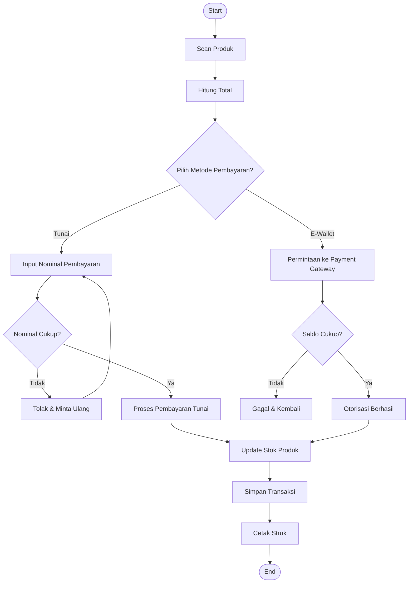

```mermaid
flowchart TD
    A([Start]) --> B[Scan Produk]
    B --> C[Hitung Total]

    C --> D{Pilih Metode Pembayaran?}

    %% TUNAI
    D -->|Tunai| E[Input Nominal Pembayaran]
    E --> F{Nominal Cukup?}
    F -->|Tidak| G[Tolak & Minta Ulang]
    G --> E
    F -->|Ya| H[Proses Pembayaran Tunai]

    %% E-WALLET
    D -->|E-Wallet| I[Permintaan ke Payment Gateway]
    I --> J{Saldo Cukup?}
    J -->|Tidak| K[Gagal & Kembali]
    J -->|Ya| L[Otorisasi Berhasil]

    %% LANJUT
    H --> M[Update Stok Produk]
    L --> M

    M --> N[Simpan Transaksi]
    N --> O[Cetak Struk]
    O --> P([End])
```
