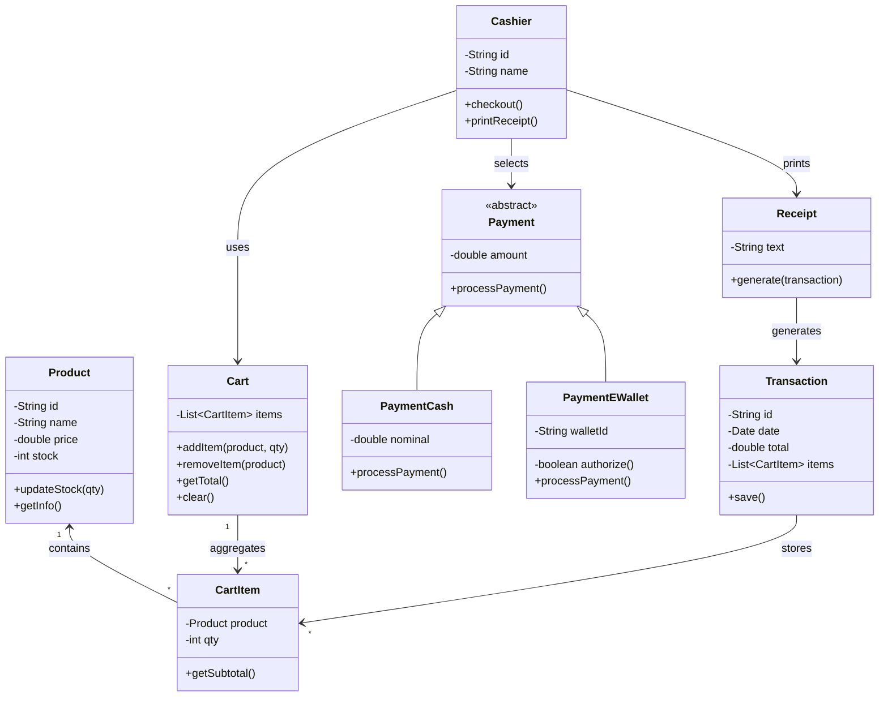

```mermaid
classDiagram

    class Product {
        -String id
        -String name
        -double price
        -int stock
        +updateStock(qty)
        +getInfo()
    }

    class CartItem {
        -Product product
        -int qty
        +getSubtotal()
    }

    class Cart {
        -List~CartItem~ items
        +addItem(product, qty)
        +removeItem(product)
        +getTotal()
        +clear()
    }

    class Payment {
        <<abstract>>
        -double amount
        +processPayment()
    }

    class PaymentCash {
        -double nominal
        +processPayment()
    }

    class PaymentEWallet {
        -String walletId
        -boolean authorize()
        +processPayment()
    }

    class Transaction {
        -String id
        -Date date
        -double total
        -List~CartItem~ items
        +save()
    }

    class Receipt {
        -String text
        +generate(transaction)
    }

    class Cashier {
        -String id
        -String name
        +checkout()
        +printReceipt()
    }

    Product "1" <-- "*" CartItem : contains
    Cart "1" --> "*" CartItem : aggregates
    Payment <|-- PaymentCash
    Payment <|-- PaymentEWallet
    Transaction --> "*" CartItem : stores
    Receipt --> Transaction : generates
    Cashier --> Cart : uses
    Cashier --> Payment : selects
    Cashier --> Receipt : prints
```
