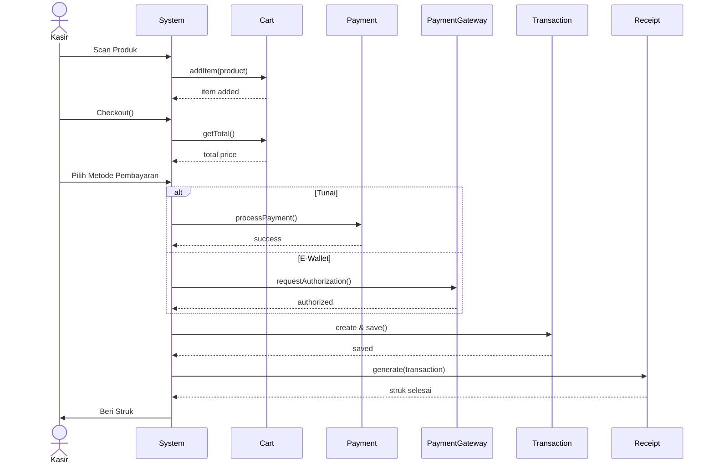

```mermaid
sequenceDiagram
    actor Kasir
    participant System
    participant Cart
    participant Payment
    participant Gateway as PaymentGateway
    participant Transaction
    participant Receipt

    Kasir->>System: Scan Produk
    System->>Cart: addItem(product)
    Cart-->>System: item added

    Kasir->>System: Checkout()
    System->>Cart: getTotal()
    Cart-->>System: total price

    Kasir->>System: Pilih Metode Pembayaran

    alt Tunai
        System->>Payment: processPayment()
        Payment-->>System: success
    else E-Wallet
        System->>Gateway: requestAuthorization()
        Gateway-->>System: authorized
    end

    System->>Transaction: create & save()
    Transaction-->>System: saved

    System->>Receipt: generate(transaction)
    Receipt-->>System: struk selesai

    System->>Kasir: Beri Struk
```
