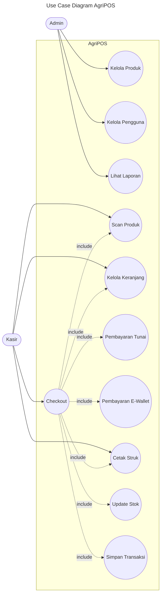

```mermaid
---
title: Use Case Diagram AgriPOS
---

flowchart LR
    actorAdmin([Admin])
    actorKasir([Kasir])

    subgraph AgriPOS
        UC1((Kelola Produk))
        UC2((Kelola Pengguna))
        UC3((Lihat Laporan))
        UC4((Checkout))
        UC5((Scan Produk))
        UC6((Kelola Keranjang))
        UC7((Pembayaran Tunai))
        UC8((Pembayaran E-Wallet))
        UC9((Cetak Struk))
        UC10((Update Stok))
        UC11((Simpan Transaksi))
    end

    %% RELASI AKTOR
    actorAdmin --> UC1
    actorAdmin --> UC2
    actorAdmin --> UC3

    actorKasir --> UC4
    actorKasir --> UC5
    actorKasir --> UC6
    actorKasir --> UC9

    %% INCLUDE RELATION
    UC4 -. include .-> UC5
    UC4 -. include .-> UC6
    UC4 -. include .-> UC7
    UC4 -. include .-> UC8
    UC4 -. include .-> UC10
    UC4 -. include .-> UC11
    UC4 -. include .-> UC9
```
