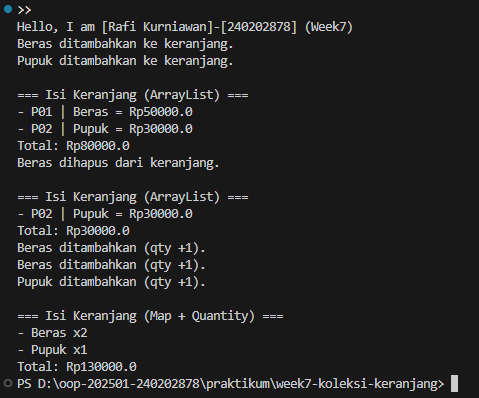

# Laporan Praktikum Minggu 7
Topik: Collections

## Identitas
- Nama  : Rafi Kurniawan
- NIM   : 240202878
- Kelas : 3IKRB

---

## Tujuan
Praktikum minggu ini bertujuan untuk:

1. Memahami perbedaan struktur data Java: List, Map, dan Set.

2. Mengimplementasikan keranjang belanja menggunakan:
   - ArrayList<Product>
   - HashMap<Product, Integer> (dengan quantity)

3. Menggunakan operasi dasar collection: tambah, hapus, dan hitung total.

4. Menjalankan program menggunakan package com.upb.agripos.

---

## Dasar Teori
1. List adalah kumpulan elemen berurutan yang dapat menyimpan data duplikat (contoh: ArrayList).

2. Set adalah koleksi tanpa duplikasi, biasanya menggunakan hashing untuk memastikan nilai unik.

3. Map menyimpan data dalam bentuk key → value, cocok untuk data berpasangan.

4. ArrayList mudah digunakan untuk operasi sederhana seperti menambah dan menghapus elemen.

5. HashMap digunakan ketika ingin menyimpan data unik beserta nilai tambahannya seperti jumlah (qty).

---

## Langkah Praktikum
1. Membuat struktur folder sesuai ketentuan praktikum.

2. Membuat kelas:
   - Product.java
   - ShoppingCart.java
   - ShoppingCartMap.java
   - MainCart.java

3. Mengimplementasikan:

tambahProduk

hapusProduk

hitungTotal

4. Menjalankan program dengan:
```
java -cp src/main/java com.upb.agripos.MainCart
```

5. Mengambil screenshot hasil dan menyimpan di:
screenshots/hasil.png

6. Melakukan commit dengan format:
```
week7-collections: fitur keranjang belanja + map quantity
```

---

## Kode Program
```java
Product.java
package com.upb.agripos;

public class Product {
    private String id;
    private String name;
    private double price;

    public Product(String id, String name, double price) {
        this.id = id;
        this.name = name;
        this.price = price;
    }

    public String getId() { return id; }
    public String getName() { return name; }
    public double getPrice() { return price; }

    @Override
    public String toString() {
        return id + " | " + name + " = Rp" + price;
    }
}
```
```java
ShoppingCart.java (ArrayList)
package com.upb.agripos;

import java.util.ArrayList;

public class ShoppingCart {
    private ArrayList<Product> cart = new ArrayList<>();

    public void addProduct(Product p) {
        cart.add(p);
        System.out.println(p.getName() + " ditambahkan ke keranjang.");
    }

    public void removeProduct(String productName) {
        cart.removeIf(p -> p.getName().equalsIgnoreCase(productName));
        System.out.println(productName + " dihapus dari keranjang.");
    }

    public double getTotal() {
        double total = 0;
        for (Product p : cart) total += p.getPrice();
        return total;
    }

    public void printCart() {
        System.out.println("\n=== Isi Keranjang (ArrayList) ===");
        for (Product p : cart) System.out.println("- " + p);
        System.out.println("Total: Rp" + getTotal());
    }
}
```
```java
ShoppingCartMap.java (Map + Quantity)
package com.upb.agripos;

import java.util.HashMap;

public class ShoppingCartMap {
    private HashMap<Product, Integer> cartMap = new HashMap<>();

    public void addProduct(Product p) {
        cartMap.put(p, cartMap.getOrDefault(p, 0) + 1);
        System.out.println(p.getName() + " ditambahkan (qty +1).");
    }

    public double getTotal() {
        double total = 0;
        for (Product p : cartMap.keySet()) {
            total += p.getPrice() * cartMap.get(p);
        }
        return total;
    }

    public void printCart() {
        System.out.println("\n=== Isi Keranjang (Map + Quantity) ===");
        for (Product p : cartMap.keySet()) {
            System.out.println("- " + p.getName() + " x" + cartMap.get(p));
        }
        System.out.println("Total: Rp" + getTotal());
    }
}
```
```java
MainCart.java
package com.upb.agripos;

public class MainCart {
    public static void main(String[] args) {

        System.out.println("Hello, I am [Rafi Kurniawan]-[240202878] (Week7)");

        Product p1 = new Product("P01", "Beras", 50000);
        Product p2 = new Product("P02", "Pupuk", 30000);

        // ArrayList version
        ShoppingCart cart = new ShoppingCart();
        cart.addProduct(p1);
        cart.addProduct(p2);
        cart.printCart();
        cart.removeProduct("Beras");
        cart.printCart();

        // Map version (with Quantity)
        ShoppingCartMap mapCart = new ShoppingCartMap();
        mapCart.addProduct(p1);
        mapCart.addProduct(p1);
        mapCart.addProduct(p2);
        mapCart.printCart();
    }
}
```
---

## Hasil Eksekusi


---

## Analisis
1. Program pertama menggunakan ArrayList, sehingga setiap penambahan produk akan menambah elemen baru, tanpa menghitung jumlah.

2. Program kedua menggunakan HashMap, sehingga produk yang sama akan menambah qty, bukan ditambahkan ulang.

3. Pendekatan Map lebih efisien untuk keranjang belanja nyata karena mendukung jumlah barang.

4. Kendala:
   - Error ClassNotFoundException saat run → diselesaikan dengan menjalankan:
     java -cp src/main/java com.upb.agripos.MainCart
   - Struktur folder harus benar agar package dapat dikenali.

---

## Kesimpulan
Praktikum minggu ini memperkenalkan penggunaan collections sebagai struktur data penting di Java. Perbedaan antara List, Map, dan Set dapat dilihat jelas dalam implementasi keranjang belanja. List cocok untuk data berurutan, sedangkan Map jauh lebih tepat untuk data yang membutuhkan quantity.

---

## Quiz
1. Jelaskan perbedaan mendasar antara List, Map, dan Set.
   **Jawaban:** …
   - List menyimpan elemen berurutan dan mengizinkan duplikasi.
   - Set menyimpan elemen unik tanpa duplikasi.
   - Map menyimpan pasangan key–value dan key harus unik.

2. Mengapa ArrayList cocok digunakan untuk keranjang belanja sederhana? 
   **Jawaban:** …
   Karena mudah digunakan, mendukung penambahan dan penghapusan elemen secara cepat, dan tidak memerlukan struktur kompleks seperti key–value.

3. Bagaimana struktur Set mencegah duplikasi data?
   **Jawaban:** …
   Karena Set menggunakan mekanisme hashing sehingga elemen yang sama tidak akan dimasukkan jika hash value-nya sudah ada.

4. Kapan sebaiknya menggunakan Map dibandingkan List? Jelaskan dengan contoh.
   **Jawaban:** …
   Map digunakan ketika data membutuhkan pasangan key–value.
   Contoh: keranjang belanja dengan quantity →
   Beras → 2, Pupuk → 1.