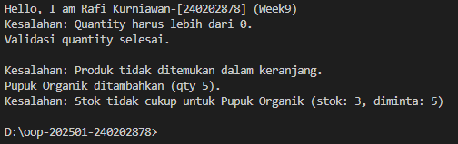

# Laporan Praktikum Minggu 9
Topik: Exception Handling dan Custom Exception pada Sistem Agri-POS

## Identitas
- Nama  : Rafi Kurniawan
- NIM   : 240202878
- Kelas : 3IKRB

---

## Tujuan
Tujuan dari praktikum minggu ke-9 ini adalah agar mahasiswa mampu memahami perbedaan antara error dan exception, mengimplementasikan mekanisme try–catch–finally, membuat custom exception, serta mengintegrasikan exception handling ke dalam aplikasi sederhana berupa sistem keranjang belanja (Agri-POS).

---

## Dasar Teori
1. Error merupakan kesalahan fatal pada sistem yang tidak dapat ditangani oleh program, seperti OutOfMemoryError.  
2. Exception adalah kondisi kesalahan yang masih dapat ditangani oleh program menggunakan mekanisme try–catch.  
3. Try–catch–finally digunakan untuk menangani error runtime agar program tidak berhenti secara tiba-tiba.  
4. Custom exception dibuat untuk merepresentasikan kesalahan spesifik sesuai kebutuhan bisnis aplikasi.  
5. Exception handling membuat program lebih aman, terkontrol, dan mudah dipelihara.

---

## Langkah Praktikum
## Langkah Praktikum
1. Membuat project praktikum minggu ke-9 dengan struktur package `com.upb.agripos`.  
2. Membuat class `Product` yang memiliki atribut kode, nama, harga, dan stok.  
3. Membuat custom exception:
   - `InvalidQuantityException`
   - `ProductNotFoundException`
   - `InsufficientStockException`
4. Mengimplementasikan exception handling pada class `ShoppingCart`.  
5. Menguji program menggunakan class `MainExceptionDemo`.  
6. Menjalankan program dan mengambil screenshot hasil eksekusi.  
7. Melakukan commit dan push ke repository GitHub.

---

## Kode Program
```java
package com.upb.agripos;

public class Product {

    private final String code;
    private final String name;
    private final double price;
    private int stock;

    public Product(String code, String name, double price, int stock) {
        this.code = code;
        this.name = name;
        this.price = price;
        this.stock = stock;
    }

    public String getCode() { return code; }
    public String getName() { return name; }
    public double getPrice() { return price; }
    public int getStock() { return stock; }

    public void reduceStock(int qty) {
        this.stock -= qty;
    }

    // penting untuk Map
    @Override
    public boolean equals(Object o) {
        if (this == o) return true;
        if (!(o instanceof Product)) return false;
        Product p = (Product) o;
        return code.equals(p.code);
    }

    @Override
    public int hashCode() {
        return code.hashCode();
    }
}

```
```java
package com.upb.agripos;

public class InvalidQuantityException extends Exception {
    public InvalidQuantityException(String message) {
        super(message);
    }
}
```
```java
package com.upb.agripos;

public class ProductNotFoundException extends Exception {
    public ProductNotFoundException(String message) {
        super(message);
    }
}
```
```java
package com.upb.agripos;

public class InsufficientStockException extends Exception {
    public InsufficientStockException(String message) {
        super(message);
    }
}
```
```java
package com.upb.agripos;

import java.util.HashMap;
import java.util.Map;

public class ShoppingCart {

    private final Map<Product, Integer> items = new HashMap<>();

    // tambahProduk
    public void addProduct(Product product, int qty)
            throws InvalidQuantityException {

        if (qty <= 0) {
            throw new InvalidQuantityException("Quantity harus lebih dari 0.");
        }

        items.put(product, items.getOrDefault(product, 0) + qty);
        System.out.println(product.getName() + " ditambahkan (qty " + qty + ").");
    }

    // hapusProduk
    public void removeProduct(Product product)
            throws ProductNotFoundException {

        if (!items.containsKey(product)) {
            throw new ProductNotFoundException(
                "Produk tidak ditemukan dalam keranjang."
            );
        }

        items.remove(product);
        System.out.println(product.getName() + " dihapus dari keranjang.");
    }

    // checkout
    public void checkout() throws InsufficientStockException {

        for (Map.Entry<Product, Integer> entry : items.entrySet()) {
            Product p = entry.getKey();
            int qty = entry.getValue();

            if (p.getStock() < qty) {
                throw new InsufficientStockException(
                    "Stok tidak cukup untuk " + p.getName() +
                    " (stok: " + p.getStock() + ", diminta: " + qty + ")"
                );
            }
        }

        // pengurangan stok
        for (Map.Entry<Product, Integer> entry : items.entrySet()) {
            entry.getKey().reduceStock(entry.getValue());
        }

        System.out.println("Checkout berhasil. Stok diperbarui.");
    }
}
```
```java
package com.upb.agripos;

public class MainExceptionDemo {

    public static void main(String[] args) {

        System.out.println("Hello, I am Rafi Kurniawan-[240202878] (Week9)");

        ShoppingCart cart = new ShoppingCart();
        Product pupuk = new Product("P01", "Pupuk Organik", 25000, 3);

        // 1. Invalid quantity
        try {
            cart.addProduct(pupuk, -1);
        } catch (InvalidQuantityException e) {
            System.out.println("Kesalahan: " + e.getMessage());
        } finally {
            System.out.println("Validasi quantity selesai.\n");
        }

        // 2. Remove product not in cart
        try {
            cart.removeProduct(pupuk);
        } catch (ProductNotFoundException e) {
            System.out.println("Kesalahan: " + e.getMessage());
        }

        // 3. Insufficient stock
        try {
            cart.addProduct(pupuk, 5);
            cart.checkout();
        } catch (Exception e) {
            System.out.println("Kesalahan: " + e.getMessage());
        }
    }
}
```
---

## Hasil Eksekusi


---

## Analisis
Pada praktikum ini, program bekerja dengan cara memvalidasi setiap aksi pada keranjang belanja menggunakan custom exception. Jika terjadi kondisi tidak normal, program tidak langsung berhenti, tetapi menampilkan pesan kesalahan yang informatif.
Dibandingkan minggu sebelumnya, pendekatan kali ini lebih fokus pada penanganan kesalahan runtime dan stabilitas aplikasi.
Kendala yang dihadapi adalah error package dan pemanggilan constructor, namun dapat diatasi dengan menyamakan struktur folder dan deklarasi package.

---

## Kesimpulan
Dengan menerapkan exception handling dan custom exception, aplikasi Agri-POS menjadi lebih aman, stabil, dan mampu menangani kesalahan input maupun proses bisnis dengan baik.

---

## Quiz
1. Jelaskan perbedaan error dan exception.
   **Jawaban:** …  
   Error adalah kesalahan fatal yang tidak dapat ditangani program, sedangkan exception adalah kesalahan yang dapat ditangani menggunakan mekanisme try–catch.

2. Apa fungsi finally dalam blok try–catch–finally? 
   **Jawaban:** …  
   Finally berfungsi untuk menjalankan kode yang pasti dieksekusi baik terjadi exception maupun tidak.

3. Mengapa custom exception diperlukan?
   **Jawaban:** …  
   Custom exception diperlukan untuk merepresentasikan kesalahan spesifik sesuai kebutuhan aplikasi sehingga penanganan error menjadi lebih jelas dan terstruktur.

4. Berikan contoh kasus bisnis POS yang membutuhkan custom exception.
   **Jawaban:** …  
   Contohnya adalah saat jumlah pembelian bernilai negatif atau stok barang tidak mencukupi saat proses checkout.
