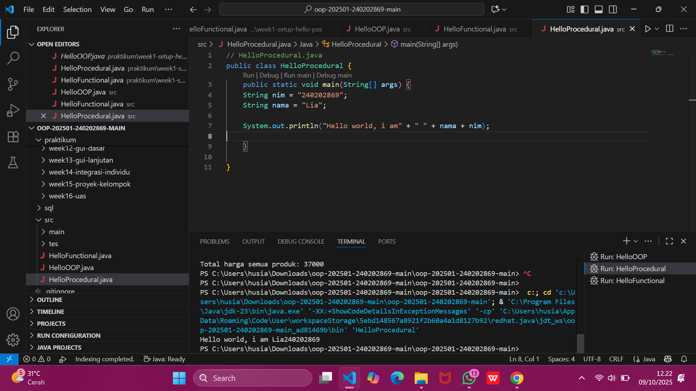
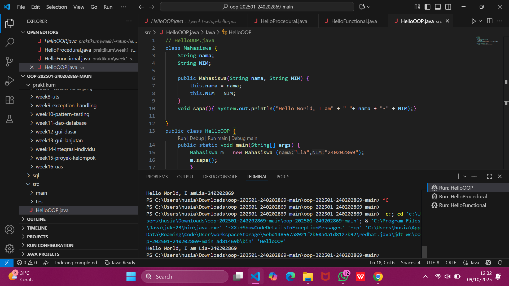

# Laporan Praktikum Minggu 1
Topik: Paradigma dan Setup Proyek
## Identitas
- Nama  : [Lia Lusianti]
- NIM   : [240202869]
- Kelas : [3IKRB]

---

## Tujuan
- Mahasiswa mampu mendefinisikan paradigma prosedural, OOP, dan fungsional.
- Mahasiswa mampu membandingkan kelebihan dan keterbatasan tiap paradigma.
- Mahasiswa mampu memberikan contoh program sederhana untuk masing-masing paradigma.
- Mahasiswa aktif dalam diskusi kelas (bertanya, menjawab, memberi opini).


---

## Dasar Teori
- Prosedural: program dibangun sebagai rangkaian perintah (fungsi/prosedur).
- OOP (Object-Oriented Programming): program dibangun dari objek yang memiliki data (atribut) dan perilaku (method).
- Fungsional: program dipandang sebagai pemetaan fungsi matematika, lebih menekankan ekspresi dan transformasi data.

---

## Langkah Praktikum
1. Setup Project

- Pastikan sudah menginstall JDK (Java Development Kit), IDE (misal: IntelliJ IDEA, VS Code, NetBeans), Git, PostgreSQL, dan JavaFX di komputer.
- Buat folder project oop-pos-<nim>.
- Inisialisasi repositori Git.
- Buat struktur awal src/main/java/com/upb/agripos/.
- Pastikan semua tools dapat berjalan (uji dengan membuat dan menjalankan program Java sederhana).

2. Program Sederhana dalam 3 Paradigma

- Prosedural: program untuk menghitung total harga dua produk.
- OOP: class Produk dengan atribut nama dan harga, buat minimal tiga objek, lalu hitung total.
- Fungsional: gunakan Stream atau lambda untuk menghitung total harga dari minimal tiga objek.

3. Commit dan Push

- Commit dengan pesan: week1-setup-hello-pos.
---

## Kode Program

```java
// HelloProcedural.java
public class HelloProcedural {
    public static void main(String[] args) {
    String nim = "240202869";
    String nama = "Lia";

    System.out.println("Hello world, i am" + " " + nama + nim);

    }
    
} 
```

```java
// HelloOOP.java
class Mahasiswa {
    String nama;
    String NIM;

    public Mahasiswa(String nama, String NIM) {
        this.nama = nama;
        this.NIM = NIM;
    }
    void sapa(){ System.out.println("Hello World, I am" + " "+ nama + "-" + NIM);}
  
}
public class HelloOOP {
    public static void main(String[] args) {
        Mahasiswa m = new Mahasiswa ("Lia","240202869");
        m.sapa();
        }
    }
```

```java
// HelloFunctional.java
public class HelloFunctional {
   public static void main(String[] args) {
      String nim = "240202869";
      String nama = "Lia"; 
      System.out.println("Hello World , I am"+ " " + nama + "-" + nim);
      
   }
}
```
---

## Hasil Eksekusi





---

## Analisis
(
- Program berjalan sesuai paradigma yang digunakan. Pada versi fungsional, kode langsung dijalankan dalam satu fungsi main tanpa class khusus, sehingga semua logika ada di satu tempat. Ketika dijalankan, program membaca variabel nama dan nim, lalu mencetak hasilnya ke terminal. Sedangkan pada versi OOP, kode dibagi menjadi class Mahasiswa yang menyimpan data dan perilaku, serta class HelloOOP yang berisi main sebagai titik masuk program. Objek Mahasiswa dibuat dengan constructor, kemudian method sapa() dipanggil untuk mencetak output. Program tetap menghasilkan keluaran yang sama, tetapi dengan struktur yang lebih terorganisasi dan mudah dikembangkan.  
- belum ada perbedaan karena ini praktikum minggu pertama.
- Kendala yang dihadapi kurang teliti tetapi dibantu teman untuk mengecek ulang.  
)
---

## Kesimpulan
*kedua program menghasilkan output yang sama, tetapi cara kerjanya berbeda sesuai paradigma. Pendekatan fungsional lebih sederhana dan cocok untuk program kecil karena semua logika berada di satu tempat. Sementara itu, pendekatan OOP lebih terstruktur dengan pembagian class dan objek, sehingga lebih mudah dikelola dan dikembangkan ketika program menjadi lebih kompleks.*

---

## Quiz
1. Apakah OOP selalu lebih baik dari prosedural? **Jawaban:** Object-Oriented Programming (OOP) bukan selalu lebih baik daripada Procedural Programming — keunggulannya tergantung tujuan, kompleksitas proyek, dan cara penggunaan.

2. Kapan functional programming lebih cocok digunakan dibanding OOP atau prosedural? **Jawaban:** Saat Butuh Program yang Mudah Diuji & Diprediksi, Saat Pekerjaan Dapat Dipecah ke dalam Transformasi Data, Saat ingin mengurangi bug akibat perubahan state.

3. Bagaimana paradigma (prosedural, OOP, fungsional) memengaruhi maintainability dan scalability aplikasi? **Jawaban:** Paradigma pemrograman sangat memengaruhi kemudahan pemeliharaan dan kemampuan aplikasi untuk berkembang. Prosedural cocok untuk proyek kecil karena alurnya sederhana, tetapi menjadi sulit dipelihara dan diskalakan saat aplikasi membesar akibat ketergantungan fungsi dan variabel global. OOP menawarkan struktur yang lebih rapi melalui objek dan class, sehingga memudahkan pengelolaan dan pengembangan aplikasi besar. Functional programming lebih mudah diuji dan diprediksi karena menggunakan fungsi murni dan data immutable, sehingga sangat mendukung skalabilitas dan paralelisme. Secara umum, prosedural cocok untuk sistem kecil, OOP untuk sistem kompleks dan besar, sedangkan FP unggul dalam keandalan dan skalabilitas tinggi.

4. Mengapa OOP lebih cocok untuk mengembangkan aplikasi POS dibanding prosedural? **Jawaban:** OOP lebih cocok untuk aplikasi POS karena mampu mengelola banyak entitas dan interaksi secara terstruktur melalui objek dan class. Dengan enkapsulasi, perubahan pada satu bagian tidak merusak bagian lain, sehingga lebih mudah dipelihara dan dikembangkan. Struktur OOP juga mendukung penambahan fitur baru dan skalabilitas lebih baik dibanding prosedural.

5. Bagaimana paradigma fungsional dapat membantu mengurangi kode berulang (boilerplate code)? **Jawaban:** Paradigma fungsional dapat mengurangi kode berulang karena menggunakan fungsi murni dan fungsi higher-order seperti map, filter, dan reduce untuk menangani pola logika yang sama. Dengan pendekatan ini, alur pemrosesan data dapat dituliskan sekali dan digunakan kembali tanpa menyalin kode berulang. Selain itu, sifat fungsi yang dapat dikomposisikan memungkinkan pengembang membangun logika kompleks dari potongan kecil kode yang reusable, sehingga kode menjadi lebih ringkas, konsisten, dan mudah dirawat.