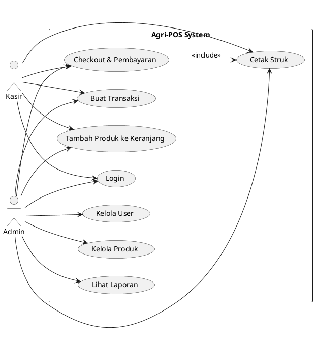
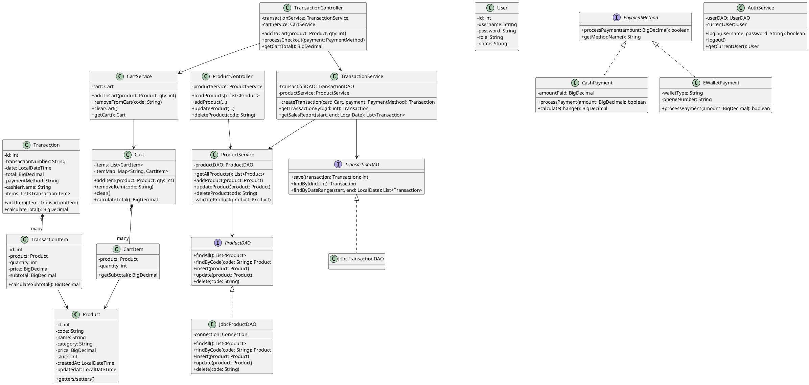
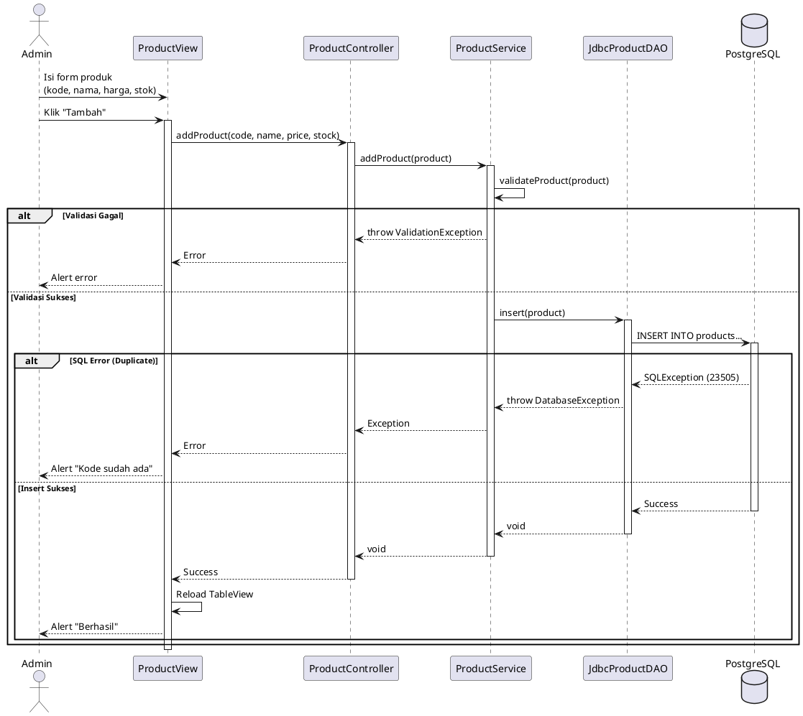
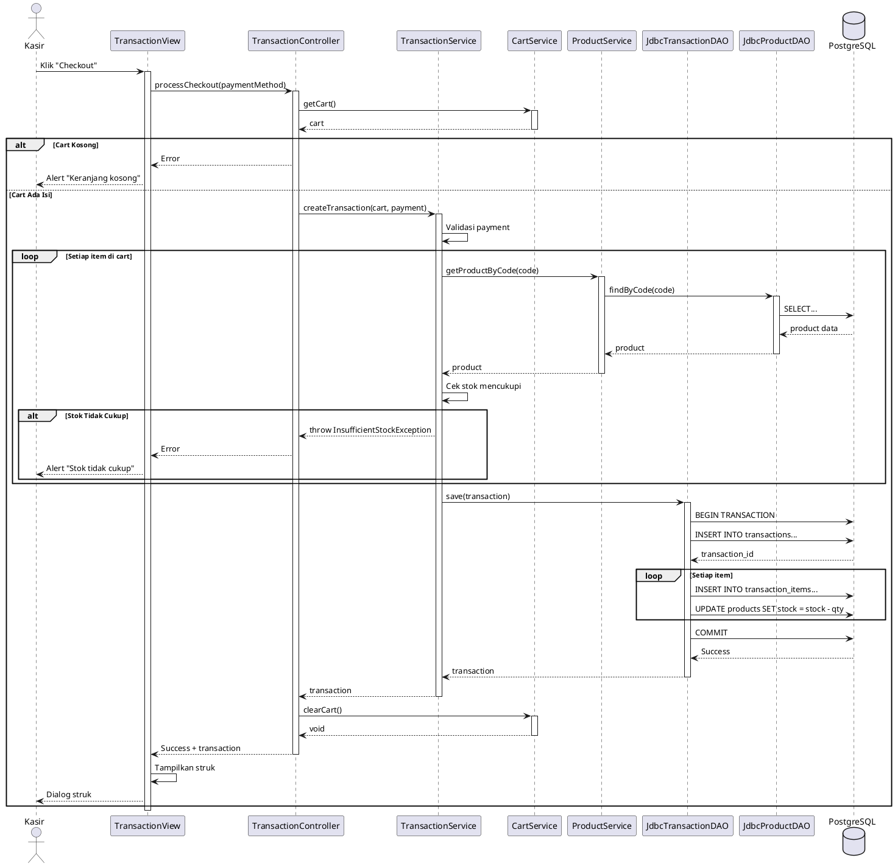
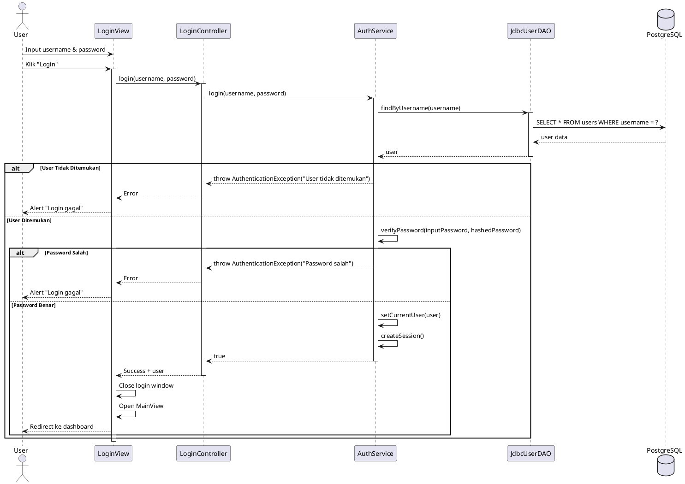

# Laporan Proyek Kelompok - Agri-POS
**Bab 15: Desain Sistem + Implementasi Terintegrasi + Testing + Dokumentasi**

---

## 1. Identitas Kelompok

| Nama | NIM | Peran | Kontribusi Utama |
|------|-----|-------|------------------|
| [Nama Anggota 1] | [NIM] | Project Lead & Backend | Service layer, DAO, Testing |
| [Nama Anggota 2] | [NIM] | Frontend & UI/UX | JavaFX Views, Controllers |
| [Nama Anggota 3] | [NIM] | Database & Integration | Database design, JDBC, Integration |
| [Nama Anggota 4] | [NIM] | Documentation & QA | UML, Test cases, Documentation |
| [Nama Anggota 5] | [NIM] | DevOps & Support | Git workflow, Deployment, Bug fixes |

**Repository Git:** `https://github.com/[kelompok]/agripos-week15`

---

## 2. Ringkasan Sistem

### 2.1 Deskripsi Sistem
**Agri-POS** adalah aplikasi Point of Sale (POS) berbasis desktop untuk toko pertanian yang menyediakan fitur manajemen produk, transaksi penjualan, dan pelaporan. Sistem ini dirancang dengan arsitektur berlapis (layered architecture) mengikuti prinsip SOLID untuk memastikan maintainability dan extensibility.

### 2.2 Tujuan Sistem
- Mempermudah proses transaksi penjualan produk pertanian
- Mengelola inventori produk secara real-time
- Mendukung berbagai metode pembayaran (Tunai, E-Wallet)
- Menyediakan laporan penjualan untuk analisis bisnis
- Menerapkan kontrol akses berbasis peran (Kasir & Admin)

### 2.3 Scope & Batasan

**Functional Requirements (Wajib):**
- FR-1: Manajemen Produk (CRUD)
- FR-2: Transaksi Penjualan (Keranjang)
- FR-3: Metode Pembayaran (Tunai, E-Wallet)
- FR-4: Struk dan Laporan
- FR-5: Login dan Hak Akses (Kasir, Admin)

**Functional Requirements (Opsional - pilih maksimal 3):**
- [ ] OFR-2: Diskon/Promo/Voucher
- [ ] OFR-3: Pelanggan & Loyalty
- [ ] OFR-4: Inventori Lanjutan (Reorder level)

**Non-Functional Requirements:**
- Platform: Desktop (Windows/Linux/Mac)
- Database: PostgreSQL 12+
- Framework: JavaFX 17+
- Response time: < 2 detik untuk transaksi
- Concurrent users: Support multi-kasir (3-5 users)

**Batasan:**
- Tidak mendukung printer fisik (struk tampil di layar)
- Tidak ada fitur online payment gateway real
- Tidak ada fitur multi-cabang/toko

---

## 3. Desain Sistem

### 3.1 Software Requirements Specification (SRS)

#### 3.1.1 Functional Requirements

**FR-1: Manajemen Produk**
- **FR-1.1** Sistem dapat menambah produk baru dengan atribut: kode, nama, kategori, harga, stok
- **FR-1.2** Sistem dapat mengubah data produk yang sudah ada
- **FR-1.3** Sistem dapat menghapus produk (dengan konfirmasi)
- **FR-1.4** Sistem dapat menampilkan daftar semua produk dalam tabel
- **Acceptance Criteria:** 
  - Validasi kode produk unik
  - Validasi harga > 0
  - Validasi stok >= 0
  - Perubahan langsung tersimpan ke database

**FR-2: Transaksi Penjualan**
- **FR-2.1** Sistem dapat membuat transaksi baru
- **FR-2.2** Sistem dapat menambah produk ke keranjang dengan quantity
- **FR-2.3** Sistem dapat mengubah quantity item di keranjang
- **FR-2.4** Sistem dapat menghapus item dari keranjang
- **FR-2.5** Sistem menghitung total belanja otomatis
- **Acceptance Criteria:**
  - Validasi quantity > 0
  - Validasi stok mencukupi
  - Total dihitung: sum(harga × quantity)
  - Keranjang kosong setelah checkout sukses

**FR-3: Metode Pembayaran**
- **FR-3.1** Sistem mendukung pembayaran Tunai
- **FR-3.2** Sistem mendukung pembayaran E-Wallet (GoPay, OVO, DANA)
- **FR-3.3** Sistem dapat diperluas untuk metode pembayaran baru tanpa mengubah kode inti
- **Acceptance Criteria:**
  - Implementasi menggunakan Strategy Pattern
  - Minimal 2 metode pembayaran aktif
  - Validasi kembalian untuk Tunai (uang dibayar >= total)

**FR-4: Struk dan Laporan**
- **FR-4.1** Sistem menampilkan struk transaksi setelah checkout
- **FR-4.2** Struk berisi: nomor transaksi, tanggal, daftar item, total, metode pembayaran
- **FR-4.3** Admin dapat melihat laporan penjualan harian
- **FR-4.4** Admin dapat melihat laporan penjualan periodik (range tanggal)
- **Acceptance Criteria:**
  - Struk tampil dalam dialog/window baru
  - Laporan sortable by date
  - Laporan menampilkan total penjualan dan jumlah transaksi

**FR-5: Login dan Hak Akses**
- **FR-5.1** User login dengan username dan password
- **FR-5.2** Sistem memiliki 2 role: Kasir dan Admin
- **FR-5.3** Kasir hanya bisa akses fitur transaksi
- **FR-5.4** Admin dapat akses semua fitur (produk + laporan + transaksi)
- **Acceptance Criteria:**
  - Session management sederhana
  - Menu disesuaikan dengan role
  - Logout mengembalikan ke halaman login

#### 3.1.2 Non-Functional Requirements

**Performance:**
- Waktu response CRUD produk < 1 detik
- Waktu checkout < 2 detik
- Loading laporan < 3 detik untuk 1000 transaksi

**Usability:**
- Interface intuitif untuk kasir dengan training minimal
- Shortcut keyboard untuk fitur sering dipakai
- Error message jelas dan actionable

**Reliability:**
- Database connection retry mechanism
- Data consistency: rollback jika checkout gagal
- Backup database otomatis (daily)

**Maintainability:**
- Kode mengikuti SOLID principles
- Dokumentasi JavaDoc untuk class/method penting
- Unit test coverage minimal 50% untuk Service layer

### 3.2 Arsitektur Sistem

#### 3.2.1 Layered Architecture

```
┌─────────────────────────────────────────┐
│         PRESENTATION LAYER              │
│  (JavaFX Views + Controllers)           │
│  - ProductView, TransactionView         │
│  - LoginController, PosController       │
└────────────────┬────────────────────────┘
                 │ Events
                 ↓
┌─────────────────────────────────────────┐
│         SERVICE LAYER                   │
│  (Business Logic)                       │
│  - ProductService                       │
│  - TransactionService                   │
│  - CartService                          │
│  - AuthService                          │
│  - PaymentService (Strategy Pattern)    │
└────────────────┬────────────────────────┘
                 │ Domain Objects
                 ↓
┌─────────────────────────────────────────┐
│         DATA ACCESS LAYER (DAO)         │
│  (JDBC + Repository Pattern)            │
│  - ProductDAO                           │
│  - TransactionDAO                       │
│  - UserDAO                              │
└────────────────┬────────────────────────┘
                 │ SQL
                 ↓
┌─────────────────────────────────────────┐
│         DATABASE LAYER                  │
│  (PostgreSQL)                           │
│  - products                             │
│  - transactions, transaction_items      │
│  - users                                │
└─────────────────────────────────────────┘
```

#### 3.2.2 Package Structure

```
com.upb.agripos/
├── model/
│   ├── Product.java
│   ├── Transaction.java
│   ├── TransactionItem.java
│   ├── Cart.java
│   ├── CartItem.java
│   ├── User.java
│   ├── Payment.java (interface)
│   ├── CashPayment.java
│   └── EWalletPayment.java
│
├── dao/
│   ├── ProductDAO.java (interface)
│   ├── JdbcProductDAO.java
│   ├── TransactionDAO.java (interface)
│   ├── JdbcTransactionDAO.java
│   ├── UserDAO.java (interface)
│   └── JdbcUserDAO.java
│
├── service/
│   ├── ProductService.java
│   ├── CartService.java
│   ├── TransactionService.java
│   ├── AuthService.java
│   ├── ReportService.java
│   └── PaymentService.java
│
├── controller/
│   ├── LoginController.java
│   ├── MainController.java
│   ├── ProductController.java
│   └── TransactionController.java
│
├── view/
│   ├── LoginView.java
│   ├── MainView.java
│   ├── ProductManagementView.java
│   ├── TransactionView.java
│   ├── ReportView.java
│   └── components/
│       ├── ProductTableView.java
│       └── CartListView.java
│
├── exception/
│   ├── ValidationException.java
│   ├── DatabaseException.java
│   ├── InsufficientStockException.java
│   ├── AuthenticationException.java
│   └── PaymentException.java
│
├── util/
│   ├── DatabaseConnection.java (Singleton)
│   ├── SessionManager.java (Singleton)
│   └── FormatUtil.java
│
└── AppJavaFX.java (Main)
```

#### 3.2.3 Dependency Rules (DIP)

**Aturan Ketergantungan:**
1. View TIDAK BOLEH akses DAO langsung → harus lewat Controller
2. Controller TIDAK BOLEH akses DAO langsung → harus lewat Service
3. Service bergantung pada interface DAO (bukan implementasi konkret)
4. Semua layer bergantung pada Model (domain objects)

**Contoh Alur (Checkout):**
```
User klik "Checkout"
  → TransactionView.handleCheckout()
    → TransactionController.processCheckout()
      → TransactionService.createTransaction()
        → TransactionDAO.save()
          → PostgreSQL INSERT
```

---

## 4. UML Design

### 4.1 Use Case Diagram



**Deskripsi Use Cases:**

| ID | Use Case | Actor | Deskripsi |
|----|----------|-------|-----------|
| UC-1 | Login | Kasir, Admin | User login dengan username/password |
| UC-2 | Buat Transaksi | Kasir, Admin | Membuat transaksi penjualan baru |
| UC-3 | Tambah Produk ke Keranjang | Kasir, Admin | Menambah item ke keranjang belanja |
| UC-4 | Checkout & Pembayaran | Kasir, Admin | Proses pembayaran (Tunai/E-Wallet) |
| UC-5 | Cetak Struk | Kasir, Admin | Tampilkan struk transaksi |
| UC-6 | Kelola Produk | Admin | CRUD produk (tambah, ubah, hapus) |
| UC-7 | Lihat Laporan | Admin | Laporan penjualan harian/periodik |
| UC-8 | Kelola User | Admin | CRUD user kasir |

### 4.2 Class Diagram



### 4.3 Sequence Diagram

#### 4.3.1 SD-01: Tambah Produk



#### 4.3.2 SD-02: Checkout Transaksi



#### 4.3.3 SD-03: Login



---

## 5. Database Design

### 5.1 Entity Relationship Diagram (ERD)

```
┌──────────────────┐        ┌────────────────────┐
│      users       │        │     products       │
├──────────────────┤        ├────────────────────┤
│ PK id            │        │ PK id              │
│    username      │        │    code (UNIQUE)   │
│    password      │        │    name            │
│    role          │        │    category        │
│    name          │        │    price           │
│    created_at    │        │    stock           │
└──────────────────┘        │    created_at      │
                           │    updated_at      │
                           └─────────┬──────────┘
                                     │
                                     │ 1
                                     │
                                     │ N
                       ┌─────────────┴──────────────┐
                       │   transaction_items        │
                       ├────────────────────────────┤
                       │ PK id                      │
                       │ FK transaction_id          │
                       │ FK product_id              │
                       │    quantity                │
                       │    price                   │
                       │    subtotal                │
                       └──────────┬─────────────────┘
                                  │ N
                                  │
                                  │ 1
┌──────────────────┐      ┌───────┴──────────────────┐
│   payments       │  1:1 │    transactions         │
├──────────────────┤◄─────┤──────────────────────────┤
│ PK id            │      │ PK id                    │
│ FK transaction_id│      │    transaction_number    │
│    method        │      │    date                  │
│    amount_paid   │      │    total                 │
│    change        │      │    cashier_name          │
└──────────────────┘      │    created_at            │
                         └──────────────────────────┘
```

### 5.2 Database Schema (DDL)

```sql
-- Table: users
CREATE TABLE users (
    id SERIAL PRIMARY KEY,
    username VARCHAR(50) UNIQUE NOT NULL,
    password VARCHAR(255) NOT NULL, -- Hashed password
    role VARCHAR(20) NOT NULL CHECK (role IN ('ADMIN', 'KASIR')),
    name VARCHAR(100) NOT NULL,
    created_at TIMESTAMP DEFAULT CURRENT_TIMESTAMP
);

-- Table: products
CREATE TABLE products (
    id SERIAL PRIMARY KEY,
    code VARCHAR(50) UNIQUE NOT NULL,
    name VARCHAR(100) NOT NULL,
    category VARCHAR(50),
    price DECIMAL(10, 2) NOT NULL CHECK (price > 0),
    stock INTEGER NOT NULL DEFAULT 0 CHECK (stock >= 0),
    created_at TIMESTAMP DEFAULT CURRENT_TIMESTAMP,
    updated_at TIMESTAMP DEFAULT CURRENT_TIMESTAMP
);

-- Table: transactions
CREATE TABLE transactions (
    id SERIAL PRIMARY KEY,
    transaction_number VARCHAR(50) UNIQUE NOT NULL,
    date TIMESTAMP NOT NULL DEFAULT CURRENT_TIMESTAMP,
    total DECIMAL(12, 2) NOT NULL CHECK (total >= 0),
    cashier_name VARCHAR(100) NOT NULL,
    created_at TIMESTAMP DEFAULT CURRENT_TIMESTAMP
);

-- Table: transaction_items
CREATE TABLE transaction_items (
    id SERIAL PRIMARY KEY,
    transaction_id INTEGER NOT NULL REFERENCES transactions(id) ON DELETE CASCADE,
    product_id INTEGER NOT NULL REFERENCES products(id),
    quantity INTEGER NOT NULL CHECK (quantity > 0),
    price DECIMAL(10, 2) NOT NULL, -- Harga saat transaksi
    subtotal DECIMAL(12, 2) NOT NULL,
    UNIQUE(transaction_id, product_id)
);

-- Table: payments
CREATE TABLE payments (
    id SERIAL PRIMARY KEY,
    transaction_id INTEGER UNIQUE NOT NULL REFERENCES transactions(id) ON DELETE CASCADE,
    method VARCHAR(20) NOT NULL CHECK (method IN ('CASH', 'EWALLET')),
    amount_paid DECIMAL(12, 2) NOT NULL,
    change_amount DECIMAL(12, 2) DEFAULT 0,
    ewallet_type VARCHAR(20), -- GoPay, OVO, DANA
    created_at TIMESTAMP DEFAULT CURRENT_TIMESTAMP
);

-- Indexes untuk performance
CREATE INDEX idx_products_code ON products(code);
CREATE INDEX idx_transactions_date ON transactions(date);
CREATE INDEX idx_transactions_number ON transactions(transaction_number);
CREATE INDEX idx_transaction_items_transaction ON transaction_items(transaction_id);

-- Trigger untuk update timestamp
CREATE OR REPLACE FUNCTION update_updated_at_column()
RETURNS TRIGGER AS $$
BEGIN
    NEW.updated_at = CURRENT_TIMESTAMP;
    RETURN NEW;
END;
$$ LANGUAGE plpgsql;

CREATE TRIGGER update_products_timestamp
BEFORE UPDATE ON products
FOR EACH ROW
EXECUTE FUNCTION update_updated_at_column();
```

### 5.3 Sample Data (Seed)

```sql
-- Sample users
INSERT INTO users (username, password, role, name) VALUES
('admin', 'admin123', 'ADMIN', 'Administrator'),
('kasir1', 'kasir123', 'KASIR', 'Kasir 1'),
('kasir2', 'kasir123', 'KASIR', 'Kasir 2');

-- Sample products (Produk Pertanian)
INSERT INTO products (code, name, category, price, stock) VALUES
('P001', 'Pupuk Urea 50kg', 'Pupuk', 150000, 100),
('P002', 'Benih Padi Hibrida', 'Benih', 85000, 200),
('P003', 'Pestisida Organik 1L', 'Pestisida', 120000, 50),
('P004', 'Cangkul Besi', 'Alat', 75000, 30),
('P005', 'Sabit Tajam', 'Alat', 45000, 40),
('P006', 'Traktor Mini', 'Mesin', 5000000, 5),
('P007', 'Pompa Air', 'Mesin', 850000, 15),
('P008', 'Pupuk Kompos 20kg', 'Pupuk', 50000, 150),
('P009', 'Selang Air 50m', 'Alat', 125000, 25),
('P010', 'Bibit Jagung Manis', 'Benih', 65000, 180);

-- Sample transaction
INSERT INTO transactions (transaction_number, date, total, cashier_name) VALUES
('TRX-20260114-001', '2026-01-14 10:30:00', 435000, 'Kasir 1');

INSERT INTO transaction_items (transaction_id, product_id, quantity, price, subtotal) VALUES
(1, 1, 2, 150000, 300000),
(1, 3, 1, 120000, 120000),
(1, 5, 1, 45000, 45000);

INSERT INTO payments (transaction_id, method, amount_paid, change_amount) VALUES
(1, 'CASH', 500000, 65000);
```

---

## 6. Test Plan & Test Cases

### 6.1 Test Strategy

**Testing Levels:**
1. **Unit Testing**: Service layer & business logic (JUnit)
2. **Integration Testing**: DAO + Database (manual)
3. **System Testing**: End-to-end flow (manual)
4. **User Acceptance Testing**: User scenarios (manual)

**Testing Tools:**
- JUnit 5 untuk unit testing
- PostgreSQL test database
- Manual testing dengan screenshot

**Coverage Target:**
- Service layer: minimal 60%
- Critical path: 100% (checkout, payment)

### 6.2 Test Cases (Manual)

#### TC-01: Login Success (Admin)
| Field | Detail |
|-------|--------|
| **Test ID** | TC-LOGIN-01 |
| **Requirement** | FR-5.1, FR-5.2 |
| **Precondition** | Database memiliki user admin (username: admin, password: admin123) |
| **Test Steps** | 1. Buka aplikasi<br>2. Input username: "admin"<br>3. Input password: "admin123"<br>4. Klik "Login" |
| **Expected Result** | - Login berhasil<br>- Redirect ke MainView<br>- Menu Admin tampil (Produk + Laporan + Transaksi) |
| **Actual Result** | [Diisi saat testing] |
| **Status** | [PASS/FAIL] |

#### TC-02: Login Failed (Invalid Password)
| Field | Detail |
|-------|--------|
| **Test ID** | TC-LOGIN-02 |
| **Requirement** | FR-5.1 |
| **Precondition** | User admin exists |
| **Test Steps** | 1. Buka aplikasi<br>2. Input username: "admin"<br>3. Input password: "wrongpass"<br>4. Klik "Login" |
| **Expected Result** | - Alert error: "Username atau password salah"<br>- Tetap di halaman login |
| **Actual Result** | [Diisi saat testing] |
| **Status** | [PASS/FAIL] |

#### TC-03: Tambah Produk (Success)
| Field | Detail |
|-------|--------|
| **Test ID** | TC-PRODUCT-01 |
| **Requirement** | FR-1.1 |
| **Precondition** | Login sebagai Admin |
| **Test Steps** | 1. Buka menu "Kelola Produk"<br>2. Input kode: "P011"<br>3. Input nama: "Bibit Cabai"<br>4. Input kategori: "Benih"<br>5. Input harga: 45000<br>6. Input stok: 100<br>7. Klik "Tambah" |
| **Expected Result** | - Alert success: "Produk berhasil ditambahkan"<br>- Produk muncul di TableView<br>- Form ter-clear |
| **Actual Result** | [Diisi saat testing] |
| **Status** | [PASS/FAIL] |

#### TC-04: Tambah Produk (Duplicate Code)
| Field | Detail |
|-------|--------|
| **Test ID** | TC-PRODUCT-02 |
| **Requirement** | FR-1.1 |
| **Precondition** | Produk P001 sudah ada |
| **Test Steps** | 1. Input kode: "P001" (duplicate)<br>2. Input nama: "Test"<br>3. Input harga: 10000<br>4. Input stok: 10<br>5. Klik "Tambah" |
| **Expected Result** | - Alert error: "Kode produk sudah ada: P001"<br>- Produk tidak ditambahkan |
| **Actual Result** | [Diisi saat testing] |
| **Status** | [PASS/FAIL] |

#### TC-05: Tambah Produk (Invalid Price)
| Field | Detail |
|-------|--------|
| **Test ID** | TC-PRODUCT-03 |
| **Requirement** | FR-1.1 |
| **Precondition** | Login sebagai Admin |
| **Test Steps** | 1. Input kode: "P012"<br>2. Input nama: "Test"<br>3. Input harga: -5000<br>4. Input stok: 10<br>5. Klik "Tambah" |
| **Expected Result** | - Alert error: "Harga harus lebih dari 0"<br>- Produk tidak ditambahkan |
| **Actual Result** | [Diisi saat testing] |
| **Status** | [PASS/FAIL] |

#### TC-06: Update Produk
| Field | Detail |
|-------|--------|
| **Test ID** | TC-PRODUCT-04 |
| **Requirement** | FR-1.2 |
| **Precondition** | Produk P001 exists |
| **Test Steps** | 1. Pilih produk P001 dari table<br>2. Ubah harga menjadi 160000<br>3. Ubah stok menjadi 120<br>4. Klik "Update" |
| **Expected Result** | - Alert success: "Produk berhasil diupdate"<br>- Data di table ter-update |
| **Actual Result** | [Diisi saat testing] |
| **Status** | [PASS/FAIL] |

#### TC-07: Hapus Produk
| Field | Detail |
|-------|--------|
| **Test ID** | TC-PRODUCT-05 |
| **Requirement** | FR-1.3 |
| **Precondition** | Produk P010 exists |
| **Test Steps** | 1. Pilih produk P010 dari table<br>2. Klik "Hapus"<br>3. Konfirmasi dialog |
| **Expected Result** | - Dialog konfirmasi muncul<br>- Setelah OK: produk hilang dari table<br>- Alert success |
| **Actual Result** | [Diisi saat testing] |
| **Status** | [PASS/FAIL] |

#### TC-08: Tambah ke Keranjang (Success)
| Field | Detail |
|-------|--------|
| **Test ID** | TC-CART-01 |
| **Requirement** | FR-2.2 |
| **Precondition** | Login sebagai Kasir, produk P001 (stok 100) |
| **Test Steps** | 1. Buka menu "Transaksi"<br>2. Pilih produk P001<br>3. Input quantity: 5<br>4. Klik "Tambah ke Keranjang" |
| **Expected Result** | - Item muncul di ListView keranjang<br>- Total = 750000 (150000 × 5)<br>- Label total ter-update |
| **Actual Result** | [Diisi saat testing] |
| **Status** | [PASS/FAIL] |

#### TC-09: Tambah ke Keranjang (Insufficient Stock)
| Field | Detail |
|-------|--------|
| **Test ID** | TC-CART-02 |
| **Requirement** | FR-2.2 |
| **Precondition** | Produk P001 (stok 100) |
| **Test Steps** | 1. Pilih produk P001<br>2. Input quantity: 150 (lebih dari stok)<br>3. Klik "Tambah ke Keranjang" |
| **Expected Result** | - Alert error: "Stok tidak mencukupi. Stok tersedia: 100"<br>- Item tidak ditambahkan ke keranjang |
| **Actual Result** | [Diisi saat testing] |
| **Status** | [PASS/FAIL] |

#### TC-10: Tambah ke Keranjang (Invalid Quantity)
| Field | Detail |
|-------|--------|
| **Test ID** | TC-CART-03 |
| **Requirement** | FR-2.2 |
| **Precondition** | Produk P001 |
| **Test Steps** | 1. Pilih produk P001<br>2. Input quantity: 0<br>3. Klik "Tambah ke Keranjang" |
| **Expected Result** | - Alert error: "Quantity harus lebih dari 0"<br>- Item tidak ditambahkan |
| **Actual Result** | [Diisi saat testing] |
| **Status** | [PASS/FAIL] |

#### TC-11: Remove Item dari Keranjang
| Field | Detail |
|-------|--------|
| **Test ID** | TC-CART-04 |
| **Requirement** | FR-2.4 |
| **Precondition** | Keranjang berisi 2 item |
| **Test Steps** | 1. Pilih item di keranjang<br>2. Klik "Hapus Item" |
| **Expected Result** | - Item hilang dari keranjang<br>- Total ter-update otomatis |
| **Actual Result** | [Diisi saat testing] |
| **Status** | [PASS/FAIL] |

#### TC-12: Checkout (Cash Payment Success)
| Field | Detail |
|-------|--------|
| **Test ID** | TC-CHECKOUT-01 |
| **Requirement** | FR-2, FR-3.1, FR-4 |
| **Precondition** | Keranjang berisi item (total 300000) |
| **Test Steps** | 1. Klik "Checkout"<br>2. Pilih metode: "Tunai"<br>3. Input uang dibayar: 350000<br>4. Klik "Proses Pembayaran" |
| **Expected Result** | - Alert success dengan kembalian: 50000<br>- Struk tampil (nomor transaksi, items, total, kembalian)<br>- Keranjang ter-clear<br>- Stok produk berkurang di database |
| **Actual Result** | [Diisi saat testing] |
| **Status** | [PASS/FAIL] |

#### TC-13: Checkout (Cash Payment Insufficient)
| Field | Detail |
|-------|--------|
| **Test ID** | TC-CHECKOUT-02 |
| **Requirement** | FR-3.1 |
| **Precondition** | Keranjang total 300000 |
| **Test Steps** | 1. Klik "Checkout"<br>2. Pilih "Tunai"<br>3. Input uang: 200000<br>4. Klik "Proses" |
| **Expected Result** | - Alert error: "Uang tidak cukup"<br>- Transaksi tidak diproses |
| **Actual Result** | [Diisi saat testing] |
| **Status** | [PASS/FAIL] |

#### TC-14: Checkout (E-Wallet Payment)
| Field | Detail |
|-------|--------|
| **Test ID** | TC-CHECKOUT-03 |
| **Requirement** | FR-3.2 |
| **Precondition** | Keranjang total 300000 |
| **Test Steps** | 1. Klik "Checkout"<br>2. Pilih "E-Wallet"<br>3. Pilih jenis: "GoPay"<br>4. Input nomor HP: 081234567890<br>5. Klik "Proses" |
| **Expected Result** | - Alert success: "Pembayaran GoPay berhasil"<br>- Struk tampil<br>- Keranjang clear<br>- Stok berkurang |
| **Actual Result** | [Diisi saat testing] |
| **Status** | [PASS/FAIL] |

#### TC-15: Checkout (Empty Cart)
| Field | Detail |
|-------|--------|
| **Test ID** | TC-CHECKOUT-04 |
| **Requirement** | FR-2 |
| **Precondition** | Keranjang kosong |
| **Test Steps** | 1. Klik "Checkout" |
| **Expected Result** | - Alert error: "Keranjang masih kosong"<br>- Tidak ada dialog pembayaran |
| **Actual Result** | [Diisi saat testing] |
| **Status** | [PASS/FAIL] |

#### TC-16: Laporan Penjualan Harian
| Field | Detail |
|-------|--------|
| **Test ID** | TC-REPORT-01 |
| **Requirement** | FR-4.3 |
| **Precondition** | Login sebagai Admin, ada transaksi hari ini |
| **Test Steps** | 1. Buka menu "Laporan"<br>2. Pilih "Laporan Harian"<br>3. Pilih tanggal: today |
| **Expected Result** | - Tabel laporan menampilkan semua transaksi hari ini<br>- Total penjualan dihitung<br>- Jumlah transaksi ditampilkan |
| **Actual Result** | [Diisi saat testing] |
| **Status** | [PASS/FAIL] |

#### TC-17: Laporan Penjualan Periodik
| Field | Detail |
|-------|--------|
| **Test ID** | TC-REPORT-02 |
| **Requirement** | FR-4.4 |
| **Precondition** | Login sebagai Admin |
| **Test Steps** | 1. Buka menu "Laporan"<br>2. Pilih "Laporan Periodik"<br>3. Input tanggal mulai: 2026-01-01<br>4. Input tanggal akhir: 2026-01-14<br>5. Klik "Tampilkan" |
| **Expected Result** | - Tabel menampilkan transaksi dalam range<br>- Summary total penjualan<br>- Bisa di-export (opsional) |
| **Actual Result** | [Diisi saat testing] |
| **Status** | [PASS/FAIL] |

#### TC-18: Akses Kontrol (Kasir tidak bisa CRUD Produk)
| Field | Detail |
|-------|--------|
| **Test ID** | TC-AUTH-01 |
| **Requirement** | FR-5.3 |
| **Precondition** | Login sebagai Kasir |
| **Test Steps** | 1. Cek menu yang tersedia |
| **Expected Result** | - Menu "Kelola Produk" tidak tampil/disabled<br>- Menu "Laporan" tidak tampil/disabled<br>- Hanya menu "Transaksi" yang aktif |
| **Actual Result** | [Diisi saat testing] |
| **Status** | [PASS/FAIL] |

#### TC-19: Logout
| Field | Detail |
|-------|--------|
| **Test ID** | TC-AUTH-02 |
| **Requirement** | FR-5.4 |
| **Precondition** | User sudah login |
| **Test Steps** | 1. Klik menu "Logout" |
| **Expected Result** | - Dialog konfirmasi<br>- Setelah OK: kembali ke halaman login<br>- Session cleared |
| **Actual Result** | [Diisi saat testing] |
| **Status** | [PASS/FAIL] |

#### TC-20: Struk Transaksi Content
| Field | Detail |
|-------|--------|
| **Test ID** | TC-RECEIPT-01 |
| **Requirement** | FR-4.2 |
| **Precondition** | Transaksi berhasil |
| **Test Steps** | 1. Review struk yang ditampilkan |
| **Expected Result** | Struk berisi:<br>- Nomor transaksi (unique)<br>- Tanggal & waktu<br>- Nama kasir<br>- Daftar item (nama, qty, harga, subtotal)<br>- Total<br>- Metode pembayaran<br>- Uang dibayar & kembalian (jika tunai) |
| **Actual Result** | [Diisi saat testing] |
| **Status** | [PASS/FAIL] |

### 6.3 Unit Test Cases (JUnit)

```java
package com.upb.agripos.service;

import com.upb.agripos.model.*;
import com.upb.agripos.exception.*;
import org.junit.jupiter.api.*;
import static org.junit.jupiter.api.Assertions.*;
import java.math.BigDecimal;

class CartServiceTest {
    
    private CartService cartService;
    private Product testProduct;
    
    @BeforeEach
    void setUp() {
        cartService = new CartService();
        testProduct = new Product();
        testProduct.setCode("TEST001");
        testProduct.setName("Test Product");
        testProduct.setPrice(BigDecimal.valueOf(10000));
        testProduct.setStock(100);
    }
    
    @Test
    @DisplayName("Test tambah produk ke cart sukses")
    void testAddToCart_Success() {
        assertDoesNotThrow(() -> {
            cartService.addToCart(testProduct, 5);
        });
        
        assertEquals(1, cartService.getCart().getItems().size());
        assertEquals(5, cartService.getCart().getTotalItems());
        assertEquals(BigDecimal.valueOf(50000), cartService.getCart().calculateTotal());
    }
    
    @Test
    @DisplayName("Test tambah produk dengan quantity invalid")
    void testAddToCart_InvalidQuantity() {
        ValidationException exception = assertThrows(ValidationException.class, () -> {
            cartService.addToCart(testProduct, 0);
        });
        
        assertTrue(exception.getMessage().contains("Quantity harus lebih dari 0"));
    }
    
    @Test
    @DisplayName("Test tambah produk dengan stok tidak cukup")
    void testAddToCart_InsufficientStock() {
        InsufficientStockException exception = assertThrows(InsufficientStockException.class, () -> {
            cartService.addToCart(testProduct, 150);
        });
        
        assertTrue(exception.getMessage().contains("Stok tidak mencukupi"));
    }
    
    @Test
    @DisplayName("Test tambah produk yang sama (update quantity)")
    void testAddToCart_DuplicateProduct() {
        assertDoesNotThrow(() -> {
            cartService.addToCart(testProduct, 5);
            cartService.addToCart(testProduct, 3);
        });
        
        assertEquals(1, cartService.getCart().getItems().size());
        assertEquals(8, cartService.getCart().getTotalItems());
    }
    
    @Test
    @DisplayName("Test hapus item dari cart")
    void testRemoveFromCart() {
        assertDoesNotThrow(() -> {
            cartService.addToCart(testProduct, 5);
            cartService.removeFromCart("TEST001");
        });
        
        assertTrue(cartService.getCart().isEmpty());
    }
    
    @Test
    @DisplayName("Test clear cart")
    void testClearCart() {
        assertDoesNotThrow(() -> {
            cartService.addToCart(testProduct, 5);
            cartService.clearCart();
        });
        
        assertTrue(cartService.getCart().isEmpty());
        assertEquals(BigDecimal.ZERO, cartService.getCart().calculateTotal());
    }
    
    @Test
    @DisplayName("Test hitung total dengan multiple items")
    void testCalculateTotal_MultipleItems() {
        Product product2 = new Product();
        product2.setCode("TEST002");
        product2.setName("Test Product 2");
        product2.setPrice(BigDecimal.valueOf(15000));
        product2.setStock(50);
        
        assertDoesNotThrow(() -> {
            cartService.addToCart(testProduct, 2);  // 20000
            cartService.addToCart(product2, 3);     // 45000
        });
        
        assertEquals(BigDecimal.valueOf(65000), cartService.getCart().calculateTotal());
    }
}
```

### 6.4 Test Execution Report Template

| Test ID | Test Name | Date | Tester | Result | Notes |
|---------|-----------|------|--------|--------|-------|
| TC-LOGIN-01 | Login Success Admin | 2026-01-14 | [Nama] | PASS | ✓ |
| TC-LOGIN-02 | Login Invalid Password | 2026-01-14 | [Nama] | PASS | ✓ |
| TC-PRODUCT-01 | Tambah Produk Success | 2026-01-14 | [Nama] | PASS | ✓ |
| TC-PRODUCT-02 | Tambah Produk Duplicate | 2026-01-14 | [Nama] | PASS | ✓ |
| TC-CART-01 | Tambah ke Keranjang | 2026-01-14 | [Nama] | PASS | ✓ |
| TC-CHECKOUT-01 | Checkout Cash Success | 2026-01-14 | [Nama] | PASS | ✓ |
| ... | ... | ... | ... | ... | ... |

---

## 7. Traceability Matrix

### 7.1 Requirement → Design → Code → Test

| FR ID | Requirement | Use Case | Class Diagram | Sequence Diagram | Implementation | Test Case | Screenshot |
|-------|-------------|----------|---------------|------------------|----------------|-----------|------------|
| FR-1.1 | Tambah Produk | UC-6 | ProductService, ProductDAO | SD-01 | `ProductService.addProduct()` | TC-PRODUCT-01 | `screenshots/product_add.png` |
| FR-1.2 | Update Produk | UC-6 | ProductService, ProductDAO | - | `ProductService.updateProduct()` | TC-PRODUCT-04 | `screenshots/product_update.png` |
| FR-1.3 | Hapus Produk | UC-6 | ProductService, ProductDAO | - | `ProductService.deleteProduct()` | TC-PRODUCT-05 | `screenshots/product_delete.png` |
| FR-1.4 | Tampil Daftar Produk | UC-6 | ProductService, ProductDAO | - | `ProductService.getAllProducts()` | - | `screenshots/product_list.png` |
| FR-2.1 | Buat Transaksi Baru | UC-2 | TransactionService | - | `TransactionService.createTransaction()` | TC-CHECKOUT-01 | `screenshots/transaction_new.png` |
| FR-2.2 | Tambah Produk ke Keranjang | UC-3 | CartService, Cart | - | `CartService.addToCart()` | TC-CART-01 | `screenshots/cart_add.png` |
| FR-2.3 | Ubah Qty Keranjang | UC-3 | CartService, Cart | - | `Cart.updateQuantity()` | - | `screenshots/cart_update.png` |
| FR-2.4 | Hapus Item Keranjang | UC-3 | CartService, Cart | - | `CartService.removeFromCart()` | TC-CART-04 | `screenshots/cart_remove.png` |
| FR-2.5 | Hitung Total | UC-3 | Cart | - | `Cart.calculateTotal()` | JUnit | - |
| FR-3.1 | Pembayaran Tunai | UC-4 | CashPayment, PaymentService | SD-02 | `CashPayment.processPayment()` | TC-CHECKOUT-01 | `screenshots/payment_cash.png` |
| FR-3.2 | Pembayaran E-Wallet | UC-4 | EWalletPayment, PaymentService | SD-02 | `EWalletPayment.processPayment()` | TC-CHECKOUT-03 | `screenshots/payment_ewallet.png` |
| FR-3.3 | Extensible Payment | UC-4 | PaymentMethod (interface) | - | Strategy Pattern | - | `docs/pattern_strategy.md` |
| FR-4.1 | Tampil Struk | UC-5 | TransactionService | - | `TransactionService.generateReceipt()` | TC-RECEIPT-01 | `screenshots/receipt.png` |
| FR-4.2 | Konten Struk Lengkap | UC-5 | Receipt Model | - | `Receipt.toString()` | TC-RECEIPT-01 | - |
| FR-4.3 | Laporan Harian | UC-7 | ReportService | - | `ReportService.getDailyReport()` | TC-REPORT-01 | `screenshots/report_daily.png` |
| FR-4.4 | Laporan Periodik | UC-7 | ReportService | - | `ReportService.getPeriodicReport()` | TC-REPORT-02 | `screenshots/report_period.png` |
| FR-5.1 | Login | UC-1 | AuthService, UserDAO | SD-03 | `AuthService.login()` | TC-LOGIN-01 | `screenshots/login.png` |
| FR-5.2 | Role (Kasir & Admin) | UC-1 | User Model | - | `User.getRole()` | - | - |
| FR-5.3 | Hak Akses Kasir | UC-1 | MainController | - | `MainController.setupMenuByRole()` | TC-AUTH-01 | `screenshots/kasir_menu.png` |
| FR-5.4 | Logout | UC-1 | AuthService | - | `AuthService.logout()` | TC-AUTH-02 | `screenshots/logout.png` |

### 7.2 Traceability untuk FR Opsional (Contoh: OFR-2 Diskon)

| FR ID | Requirement | Use Case | Class Diagram | Implementation | Test Case | Screenshot |
|-------|-------------|----------|---------------|----------------|-----------|------------|
| OFR-2.1 | Diskon Persentase | UC-4 (extended) | DiscountStrategy (interface) | `PercentageDiscount.apply()` | TC-DISCOUNT-01 | `screenshots/discount_percent.png` |
| OFR-2.2 | Diskon Nominal | UC-4 (extended) | FixedDiscount | `FixedDiscount.apply()` | TC-DISCOUNT-02 | `screenshots/discount_fixed.png` |
| OFR-2.3 | Voucher Code | UC-4 (extended) | VoucherService | `VoucherService.validate()` | TC-DISCOUNT-03 | `screenshots/voucher.png` |

---

## 8. Pembagian Kerja & Kontribusi

### 8.1 Work Breakdown Structure (WBS)

| Task ID | Task Name | Assigned To | Deadline | Status | PR Link |
|---------|-----------|-------------|----------|--------|---------|
| WBS-1 | Setup Project & Git | Anggota 1 | 2026-01-15 | ✅ Done | - |
| WBS-2 | Database Design & DDL | Anggota 3 | 2026-01-16 | ✅ Done | #1 |
| WBS-3 | Model Classes | Anggota 2 | 2026-01-17 | ✅ Done | #2 |
| WBS-4 | Exception Classes | Anggota 4 | 2026-01-17 | ✅ Done | #3 |
| WBS-5 | DAO Layer (Product) | Anggota 3 | 2026-01-18 | ✅ Done | #4 |
| WBS-6 | DAO Layer (Transaction, User) | Anggota 3 | 2026-01-19 | ✅ Done | #5 |
| WBS-7 | Service Layer (Product, Cart) | Anggota 1 | 2026-01-20 | ✅ Done | #6 |
| WBS-8 | Service Layer (Transaction, Auth) | Anggota 1 | 2026-01-21 | ✅ Done | #7 |
| WBS-9 | Payment Strategy Pattern | Anggota 1 | 2026-01-21 | ✅ Done | #8 |
| WBS-10 | Controller Layer | Anggota 2 | 2026-01-22 | ✅ Done | #9 |
| WBS-11 | JavaFX Login View | Anggota 2 | 2026-01-23 | ✅ Done | #10 |
| WBS-12 | JavaFX Product Management View | Anggota 2 | 2026-01-24 | ✅ Done | #11 |
| WBS-13 | JavaFX Transaction View | Anggota 2 | 2026-01-25 | ✅ Done | #12 |
| WBS-14 | JavaFX Report View | Anggota 2 | 2026-01-26 | 🔄 Progress | #13 |
| WBS-15 | Unit Testing (CartService) | Anggota 4 | 2026-01-26 | ✅ Done | #14 |
| WBS-16 | Unit Testing (ProductService) | Anggota 4 | 2026-01-27 | 🔄 Progress | #15 |
| WBS-17 | Integration Testing | Anggota 3,4 | 2026-01-28 | ⏳ Todo | - |
| WBS-18 | Manual Test Execution | Anggota 5 | 2026-01-29 | ⏳ Todo | - |
| WBS-19 | Screenshots & Documentation | Anggota 4,5 | 2026-01-30 | ⏳ Todo | - |
| WBS-20 | UML Diagrams | Anggota 4 | 2026-01-30 | ✅ Done | - |
| WBS-21 | Laporan Final | Semua | 2026-01-31 | ⏳