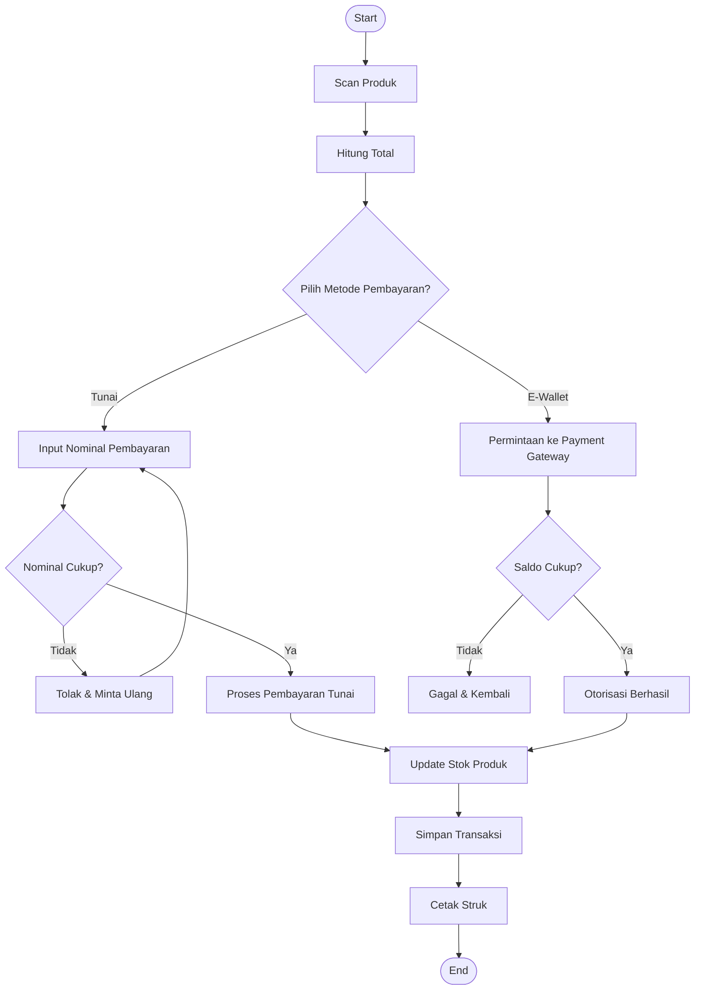
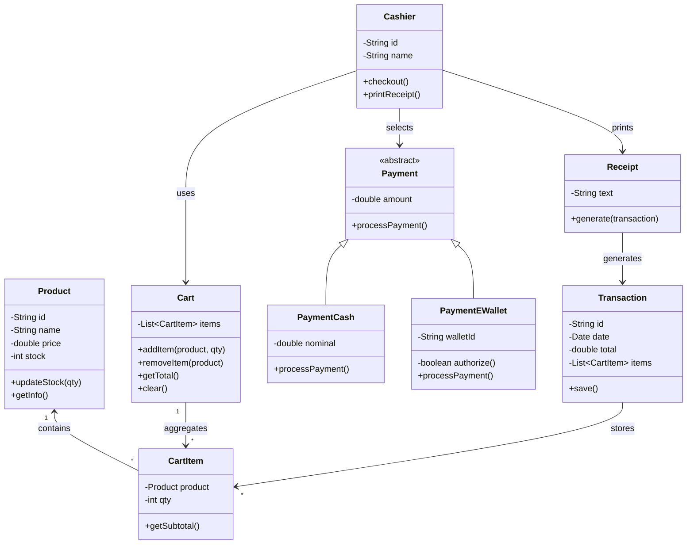
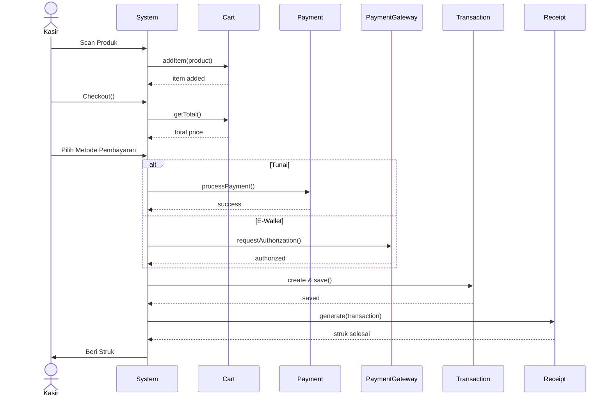
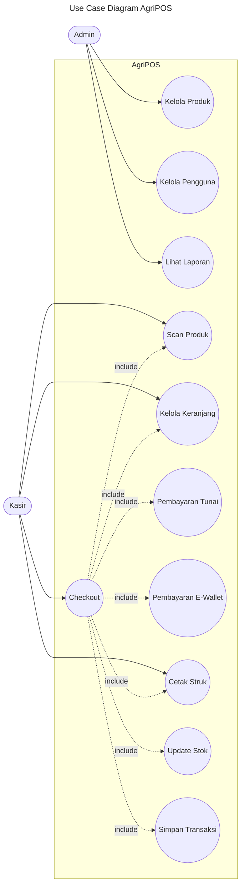

# Laporan Praktikum Minggu 15

## Proyek Kelompok – Aplikasi AgriPOS (Point of Sale)

---

## Topik

**Desain Sistem, Implementasi Terintegrasi, Testing, dan Dokumentasi Aplikasi AgriPOS**

---

## Identitas

| No | Nama Anggota | NIM        | Peran                  |
| -- | ------------ | ---------- | ---------------------- |
| 1  | (Isi Nama)   | (Isi NIM)  | Service & Testing      |
| 2  | (Isi Nama)   | (Isi NIM)  | Controller & Exception |
| 3  | (Isi Nama)   | (Isi NIM)  | Model & Payment        |
| 4  | Rafi Kurniawan   | (Isi NIM)  | DAO, Database & Util   |
| 5  | (Opsional)   | (Opsional) | View (JavaFX)          |

---

## Tujuan

Tujuan praktikum Minggu 15 ini adalah:

1. Mahasiswa mampu bekerja secara kolaboratif dalam pengembangan aplikasi.
2. Mahasiswa mampu menerapkan konsep **Object Oriented Programming (OOP)** secara terintegrasi.
3. Mahasiswa mampu menerapkan **arsitektur berlapis** (View–Controller–Service–DAO).
4. Mahasiswa mampu mendesain sistem menggunakan **UML (Use Case, Class, Sequence Diagram)**.
5. Mahasiswa mampu melakukan **testing dasar** dan menyusun dokumentasi proyek.

---

## Dasar Teori

Dasar teori yang digunakan pada praktikum ini antara lain:

1. **Object Oriented Programming (OOP)** memodelkan sistem dalam bentuk class dan object.
2. **Layered Architecture** memisahkan tanggung jawab setiap bagian sistem.
3. **SOLID Principle**, khususnya Dependency Inversion Principle (DIP), untuk meningkatkan maintainability.
4. **UML (Unified Modeling Language)** sebagai alat bantu perancangan sistem.
5. **DAO Pattern** untuk pemisahan logika akses data.
6. **Strategy Pattern** untuk metode pembayaran yang extensible.

---

## UML Diagram

### 1. Activity Diagram


---

### 2. Class Diagram


---

### 3. Sequence Diagram


---

## 4. Use Case Diagram


---

## Langkah Praktikum

Langkah-langkah yang dilakukan pada praktikum Minggu 15 adalah:

1. Membentuk kelompok dan menentukan pembagian tugas.
2. Menyusun desain sistem menggunakan UML.
3. Menyiapkan struktur folder proyek sesuai ketentuan.
4. Mengimplementasikan layer Service, DAO, dan Controller.
5. Menghubungkan aplikasi dengan PostgreSQL menggunakan JDBC.
6. Menjalankan unit test pada Service layer.
7. Mendokumentasikan hasil implementasi dan pengujian.

**Contoh commit message:**

```
week15-proyek-kelompok: integrasi transaksi dan pembayaran
```

---

## Kode Program

Pada praktikum Minggu 15, fokus utama adalah **integrasi sistem**, sehingga tidak seluruh kode ditampilkan.

Contoh potongan kode utama:

```java
transactionService.checkout(cart, paymentMethod);
receiptService.generate(transaction);
```

Kode lengkap tersedia pada folder `src/main/java/com/upb/agripos/`.

---

## Hasil Eksekusi

Hasil eksekusi menunjukkan bahwa:

* Login berhasil sesuai role (Admin/Kasir).
* Produk dapat ditambahkan ke keranjang.
* Total belanja dihitung dengan benar.
* Pembayaran tunai dan e-wallet berhasil diproses.
* Struk transaksi berhasil ditampilkan.

📸 *Screenshot hasil eksekusi terlampir (transaksi, struk, dan hasil unit test).*

---

## Analisis

### Analisis Program

Program berjalan dengan alur View → Controller → Service → DAO → Database. Pemisahan layer membuat sistem lebih rapi dan mudah dikembangkan.

### Perbedaan dengan Minggu Sebelumnya

* Minggu sebelumnya berfokus pada implementasi individu.
* Minggu ini berfokus pada **integrasi sistem secara menyeluruh**, desain, dan dokumentasi.

### Kendala dan Solusi

* **Kendala**: Error koneksi database → **Solusi**: Singleton DatabaseConnection.
* **Kendala**: Integrasi antar layer → **Solusi**: Penggunaan interface Service.
* **Kendala**: Konsistensi UML dan kode → **Solusi**: Review UML bersama.

---

## Kesimpulan

Dari praktikum Minggu 15 dapat disimpulkan bahwa pengembangan aplikasi secara berkelompok membutuhkan desain yang matang, arsitektur yang rapi, serta dokumentasi dan testing yang baik. Dengan menerapkan OOP, UML, dan arsitektur berlapis, sistem AgriPOS dapat berjalan dengan baik dan mudah dikembangkan di masa depan.

---

**END OF DOCUMENT**
