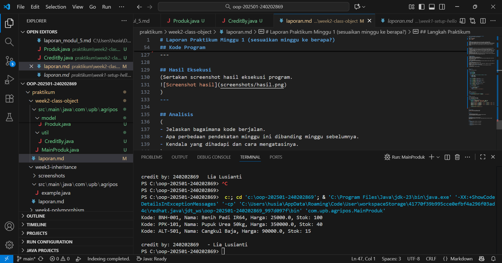

# Laporan Praktikum Minggu 2 
Topik: [Class dan Object (Produk Pertanian)]

## Identitas
- Nama  : [Lia Lusianti]
- NIM   : [240202869]
- Kelas : [3IKRB]

---

## Tujuan
- Mahasiswa mampu menjelaskan konsep class, object, atribut, dan method dalam OOP.
- Mahasiswa mampu menerapkan access modifier dan enkapsulasi dalam pembuatan class.
- Mahasiswa mampu mengimplementasikan class Produk pertanian dengan atribut dan method yang sesuai.
- Mahasiswa mampu mendemonstrasikan instansiasi object serta menampilkan data produk pertanian di console.
- Mahasiswa mampu menyusun laporan praktikum dengan bukti kode, hasil eksekusi, dan analisis sederhana.


---

## Dasar Teori
1. Class merupakan blueprint atau cetak biru untuk membuat objek dalam pemrograman berorientasi objek (OOP).
2. Objek adalah instansiasi dari class yang berisi atribut (data) dan method (perilaku).
3. Enkapsulasi digunakan untuk menyembunyikan data agar tidak dapat diakses langsung dari luar class.
4. Access modifier seperti public, private, dan protected digunakan untuk mengatur tingkat akses suatu atribut atau method.
5. Getter dan Setter digunakan sebagai cara aman untuk mengambil dan mengubah nilai atribut yang dienkapsulasi.
6. Dalam konteks Agri-POS, setiap produk pertanian (seperti benih, pupuk, dan alat pertanian) direpresentasikan sebagai objek.
7. Setiap objek memiliki atribut seperti nama, harga, dan stok, yang dapat dikelola dan dimanipulasi dengan lebih terstruktur dan efisien menggunakan konsep class.

---

## Langkah Praktikum
1. Membuat Class Produk
- Buat file Produk.java pada package model.
- Tambahkan atribut: kode, nama, harga, dan stok.
- Gunakan enkapsulasi dengan menjadikan atribut bersifat private dan membuat getter serta setter untuk masing-masing atribut.

2. Membuat Class CreditBy
- Buat file CreditBy.java pada package util.
- Isi class dengan method statis untuk menampilkan identitas mahasiswa di akhir output: credit by: <NIM> - <Nama>.

3. Membuat Objek Produk dan Menampilkan Credit
- Buat file MainProduk.java.
- Instansiasi minimal tiga objek produk, misalnya "Benih Padi", "Pupuk Urea", dan satu produk alat pertanian.
- Tampilkan informasi produk melalui method getter.
- Panggil CreditBy.print("<NIM>", "<Nama>") di akhir main untuk menampilkan identitas.

4. Commit dan Push
- Commit dengan pesan: week2-class-object.


---

## Kode Program
```java
package com.upb.agripos.model;


public class Produk {
    private String kode;
    private String nama;
    private double harga;
    private int stok;

    public Produk(String kode, String nama, double harga, int stok) {
        this.kode = kode;
        this.nama = nama;
        this.harga = harga;
        this.stok = stok;
    }

    public String getKode() { return kode; }
    public void setKode(String kode) { this.kode = kode; }

    public String getNama() { return nama; }
    public void setNama(String nama) { this.nama = nama; }

    public double getHarga() { return harga; }
    public void setHarga(double harga) { this.harga = harga; }

    public int getStok() { return stok; }
    public void setStok(int stok) { this.stok = stok; }

    public void tambahStok(int jumlah) {
        this.stok += jumlah;
    }

    public void kurangiStok(int jumlah) {
        if (this.stok >= jumlah) {
            this.stok -= jumlah;
        } else {
            System.out.println("Stok tidak mencukupi!");
        }
    }
}
```
```java
package com.upb.agripos.util;

public class CreditBy {
    public static void print(String nim, String nama) {
        System.out.println("\ncredit by: " + 240202869 + "   - Lia Lusianti");
    }
}
```
```java
package com.upb.agripos;

import com.upb.agripos.model.Produk;
import com.upb.agripos.util.CreditBy;

public class MainProduk {
    public static void main(String[] args) {
        Produk p1 = new Produk("BNH-001", "Benih Padi IR64", 25000, 100);
        Produk p2 = new Produk("PPK-101", "Pupuk Urea 50kg", 350000, 40);
        Produk p3 = new Produk("ALT-501", "Cangkul Baja", 90000, 15);

        System.out.println("Kode: " + p1.getKode() + ", Nama: " + p1.getNama() + ", Harga: " + p1.getHarga() + ", Stok: " + p1.getStok());
        System.out.println("Kode: " + p2.getKode() + ", Nama: " + p2.getNama() + ", Harga: " + p2.getHarga() + ", Stok: " + p2.getStok());
        System.out.println("Kode: " + p3.getKode() + ", Nama: " + p3.getNama() + ", Harga: " + p3.getHarga() + ", Stok: " + p3.getStok());

        // Tampilkan identitas mahasiswa
        CreditBy.print("<NIM>", "<Nama Mahasiswa>");
    }
}
```
---

## Hasil Eksekusi
  


---

## Analisis
(
- Program ini berjalan dengan membuat class Produk untuk menyimpan data produk seperti kode, nama, harga, dan stok, serta class CreditBy untuk menampilkan identitas pembuat. Objek-objek produk diinstansiasi di MainProduk, lalu data ditampilkan di console bersama identitas pembuat program.
- Pendekatan minggu ini menggunakan OOP (Object-Oriented Programming), berbeda dengan minggu lalu yang masih prosedural. Dengan OOP, program menjadi lebih terstruktur dan mudah dikembangkan.  
- Kendala yang dihadapi yaitu kesalahan pada penulisan package dan string di class CreditBy, namun dapat diperbaiki dengan menyesuaikan struktur folder dan penggunaan tanda kutip yang benar.
)
---

## Kesimpulan
*Melalui praktikum ini, dapat disimpulkan bahwa penggunaan konsep class dan object dalam pemrograman berorientasi objek (OOP) membuat kode lebih terstruktur, mudah dibaca, dan dapat digunakan kembali. Penerapan class Produk dan CreditBy membantu memahami bagaimana objek dapat merepresentasikan data nyata dan berinteraksi melalui method. Dengan memahami konsep ini, pengelolaan data menjadi lebih efisien dan sistem dapat dikembangkan dengan lebih mudah di tahap selanjutnya.*

---

## Quiz
1. Mengapa atribut sebaiknya dideklarasikan sebagai private dalam class?
   **Jawaban:** Atribut sebaiknya dideklarasikan sebagai private agar data di dalam class tidak dapat diakses atau diubah secara langsung dari luar class. Hal ini melindungi integritas data dan mencegah perubahan yang tidak diinginkan, sesuai dengan prinsip enkapsulasi dalam OOP.

2. Apa fungsi getter dan setter dalam enkapsulasi? 
   **Jawaban:** Fungsi getter adalah untuk mengambil atau membaca nilai dari atribut yang bersifat private, sedangkan setter digunakan untuk mengubah nilainya dengan cara yang terkontrol. Dengan getter dan setter, akses terhadap data menjadi lebih aman karena bisa diberi validasi atau aturan tertentu sebelum nilai diubah. 

3. Bagaimana cara class Produk mendukung pengembangan aplikasi POS yang lebih kompleks? 
   **Jawaban:** Class Produk menjadi dasar dalam pengembangan aplikasi POS karena mewakili entitas utama, yaitu barang atau produk yang dijual. Dengan adanya class ini, sistem dapat mengelola data produk seperti kode, nama, harga, dan stok secara terstruktur. Di aplikasi yang lebih kompleks, class ini dapat dikembangkan untuk menambah fitur seperti perhitungan diskon, manajemen kategori produk, atau integrasi dengan database.